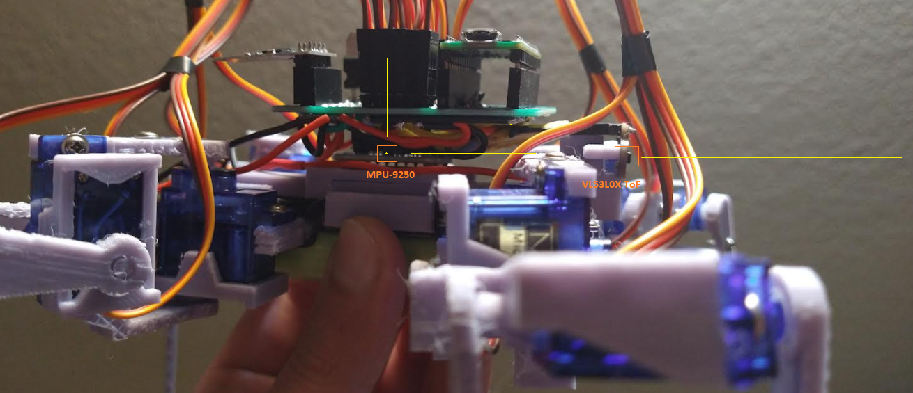
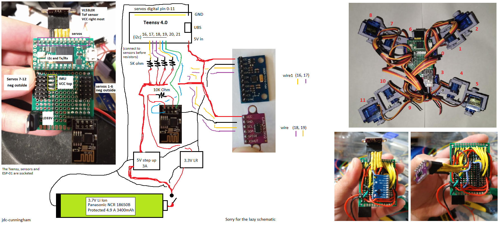

### About this branch
This was the most current branch, main difference other than test code is the devlogs being included in the branch. The devlogs include a a lot of images as in bigger download.

I'm changing the way servo state is kept and how the motions move the servos. Specifically I'm trying to avoid hard coded positions and updating the gaits to include the outer legs in motion to avoid jumping/make the robot move in a more coordinate manner.

### Twerk Lidar Robot
A robot that utilizes onboard IMU and single-point lidar to navigate the world

### Sensors

### Schematic

### Disclaimer
While I have provided everything you need to make this robot, it is not intended to be rebuilt. It is too much of a pain, particularly the board soldering. Also arguable it is a waste of a Teensy 4.0 but I wanted to use one.

### Development environment

This was developed using Teensyduino so all of the libraries need to be installed there in order for the code to compile.
### Libraries used through Teensyduino IDE library search
* IMU MPU9250 (Bolderflight set, check Readme in case more added)
  * MPU9250
  * Eigen
  * Units
* ToF vl53l0x by Pololu

### Related software for this project
* Google SketchUp for the 3D modeling
* Cura for the slicer

### Related hardware
* Ender 3 Pro for the 3D printer

### About printing
The infill of prints are either 20% or 30%. I have sorted them in folders.

Pretty much anything brittle/small will be 30% or a major structural piece like the main chasis.

### Misc
This project borrows from my [first robot](https://github.com/jdc-cunningham/not-quite-an-ant-robot) with regard to how code is written.

### Note
This repo is pretty big due to the media, I will look into not tracking them by default so when you clone it, you only pull down code.