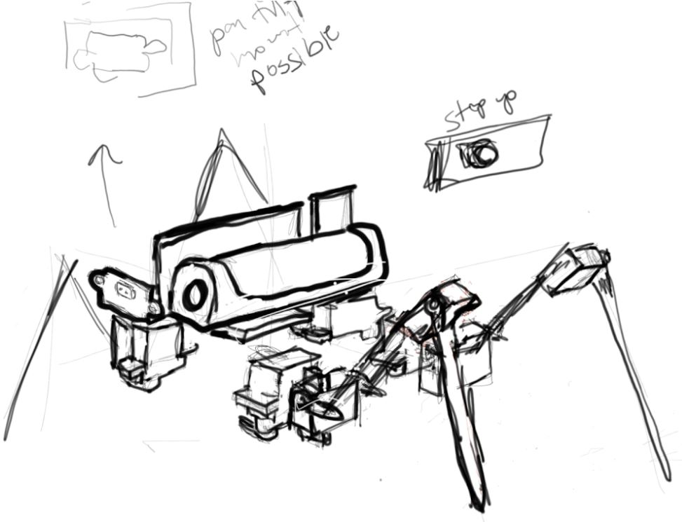

### Twerk Lidar Robot
A robot that utilizes onboard IMU and single-point lidar to navigate the world

### Development environment

This was developed using Teensyduino so all of the libraries need to be installed there in order for the code to compile.

### Libraries used through Teensyduino IDE library search
* IMU MPU9250 (Bolderflight set, check Readme in case more added)
  * MPU9250
  * Eigen
  * Units
* ToF vl53l0x by Pololu

### Related software for this project
* Google SketchUp for the 3D modeling
* Cura for the slicer

### Related hardware
* Ender 3 Pro for the 3D printer