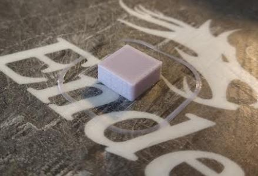
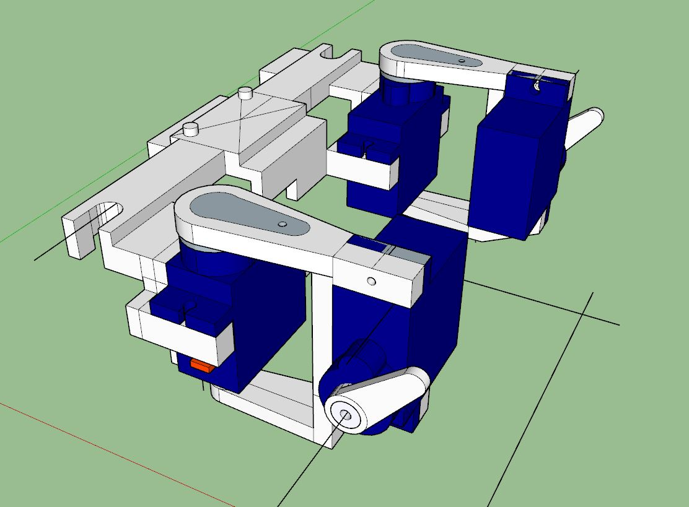

12:32 PM

I'm failing at this thing I'm working on related to day job, so I'll do this for now.
I need to strip that stuff out/work from scratch.

Even though I bought new printing stuff, my printer now still works... I just need to change my design/avoid supports.

I'm going to print a test cube, 1". Changed it to 0.5" by 0.25"

I did lose momentum with this project/context shift.

I actually am glad to change the fans out it makes an annoying sound/not the normal 100% fan speed sound.

At the moment I'm still trying to design the base frame for stuff to get mounted to and make it strong to hold the servos/center the IMU.

Reduced base from rear by 0.2". This design is so bad.

Look at that, it can print a part of a cube.

Ugh... man this thing sucks... I just don't feel it the enthusiasm to do a good job.

By that I mean to simplify this design.