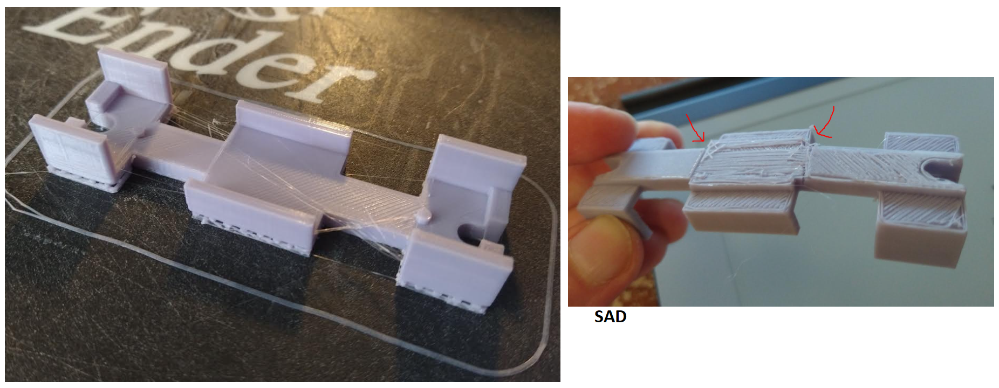

I went ahead and ordered a new mat (really need) and a new hot end.

The hot end unfortunately comes with its own wires so I'll have to disassemble the printer from the base.

Anyway I also got a basic laser thermometer thing to make sure the nozzle is at temp.

I need this printer to work... I don't know what happened I've printed a lot of stuff in the past where I just print and it's good.

This will be a good thing for future projects to get this working again.

Will be a good test to see if with headphones I can work while stuff prints in the background, it's to my left, in peripheral vision.

Not bad Sony MDR-7506 once music is playing at normal volume can barely hear the printer.

I'll also order replacement hot end fans because the ones I have are loud for some reason like a bearing is bad.

This is already a done deal but part of me is like "did I really need that?" The bed definitely. Print's looking good now.

Anyway done deal. Just been annoying to receive ordered things (first world problems), those Amazon lockers are nice though.

Also it snowed and I try to avoid driving when there's snow on the ground.

Yeah... I won't be able to do this lol, have a thing printing in the background while trying to do a 9-5 type day job.

Ultimately a dream of mine is to see a map get updated almost in real time, as this thing crawls around my aptment and navigate.

Then see how good it is with reality.

Well the print looks good, lol I immediately broke it though. I think for this I will print at 40% infill just because it's small and needs to be strong.

Yeah where it broke I had reduced the height so the IMU had like a wall it would sit in. Also there are these pegs for the IMU but they failed to print looks like.

Battery peg fit is good though. I will have to reduce the battery length some as it is not snug. And add a little more material to prevent bending.

Gluing should make it very strong once connected to the original battery holder plastic.