Alright, new day, same me.

Damn it was nice outside, cold just under 20 F but was sunny.

Oh yeah new heating bed.

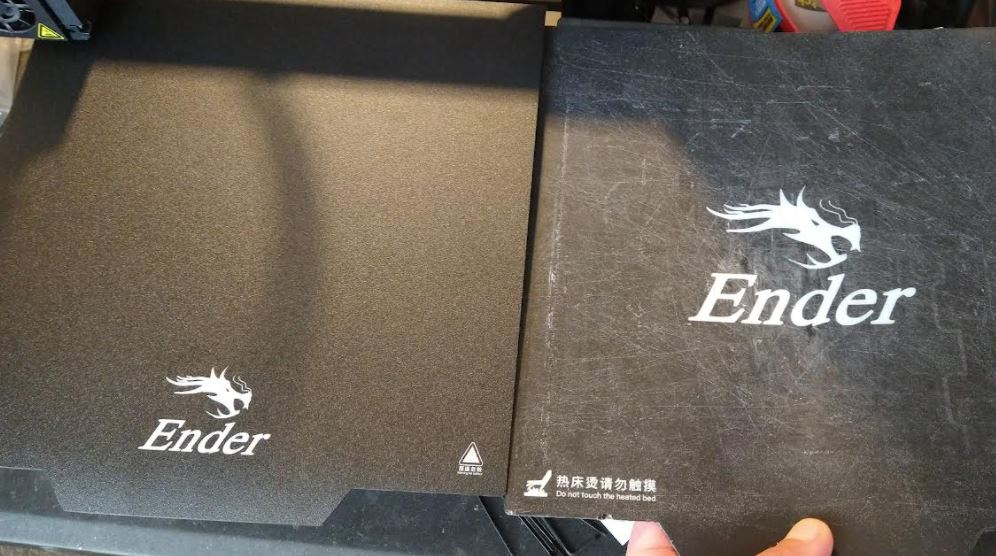

Ooh yeah boi got dat pump... Check My Brain by Alice In Chains.

Got one of these too.

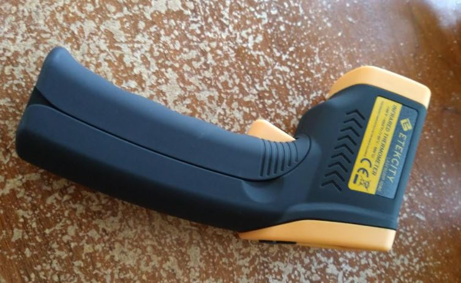

Fantasy of mine, make an app for the Pinephone to control this thing.

It has a nice grip, makes me want to...

### GET ON THE GROUND!!!

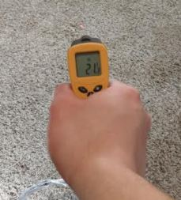

Put the robot waifu on the floor now!

Look at this, what a pro, putting on markers to mark the direction of the legs.

Nope forget it I'm not doing it... this thing is not meant to be reproduced by anyone.

I will label the files at least.

Oh my god the chorus of Would by AIC

Going through this batch of parts I printed last night and fixing what was wrong with them.

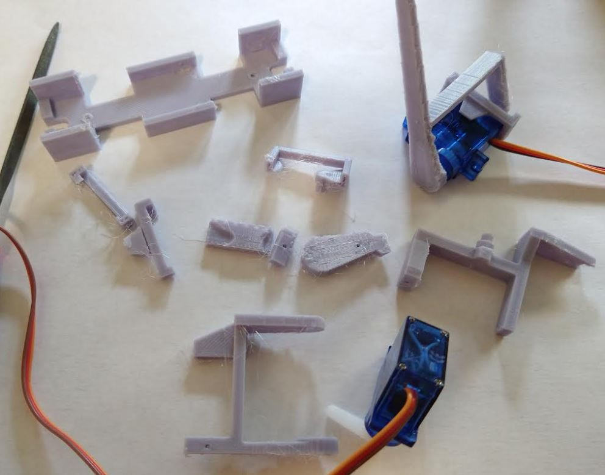

Seems like the magnetism on this mat is less, it's easier to move.

I was tapping off the little initial drip line and yeah, the mat just shifted away underneath ugh... cheap shit man that's what you get.

Ha yeap the reviews say the same thing... tragic. You think a mat... that can't be something you screw up right? Wrong... lol magentized wrong way, not strong enough, peels apart, etc...

Will see how long it lasts.

Ugh these greasy servos.

I'm going hungryyyyyyyyyyy (no I'm not I'm fat currently)

Lol Evenflow song breeeeeeeeeeeeeeaaaathinnnnnnnnnnn a;fjals;kjfasklfjaskfjsd

Pretty accurate how that song goes.

Got the new arm print, going to check if the servo boots are good as is. I'll print at 30% infill see if that's strong enough without changing the design.

Ha the magnetization is the wrong way, I cut the tab off so now looks like this.

Checking out the latest outer arm print.

If possible today I'll get this assembled and maybe take its first step. I'm skeptical because each part takes 30mins to 1hr and there are 20 parts to print.

Well it is a bit early but I think I will start working on the "world coordinate system".

It's funny I actually studied phs/eng in school but I didn't finish, once I got into quantum was like nah... I'm too stupid for that.

One of the main things I should be able to do is move the thing 11" and stop, then see that on a remote display (via live stream telemetry).

Servo boot print done let me check. Ugh immediately broke a side guide, that'll have to grow. The outer arm has to shrink in height. Nope I won't do that, don't need to reprint this arm. I will extend the boot shims.

The inner-most arm is too tight height wise, need to increase it.

Oof 1hr 43min test print still aye...

Some pics from above

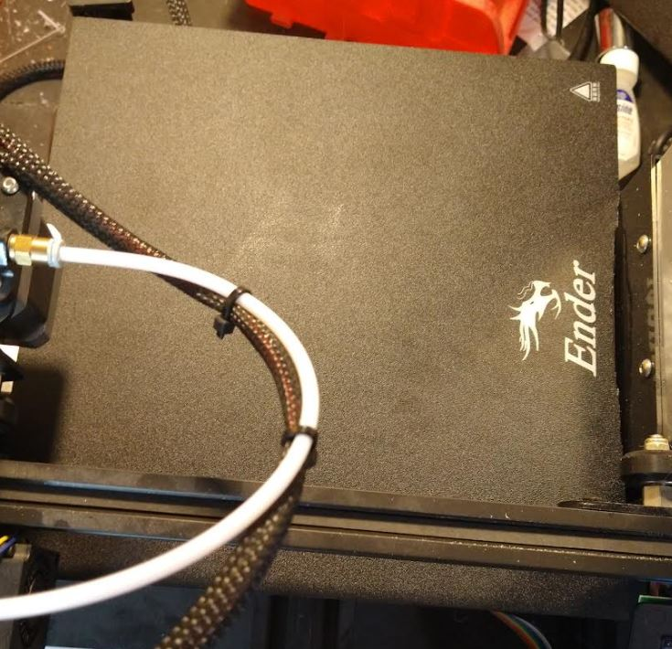

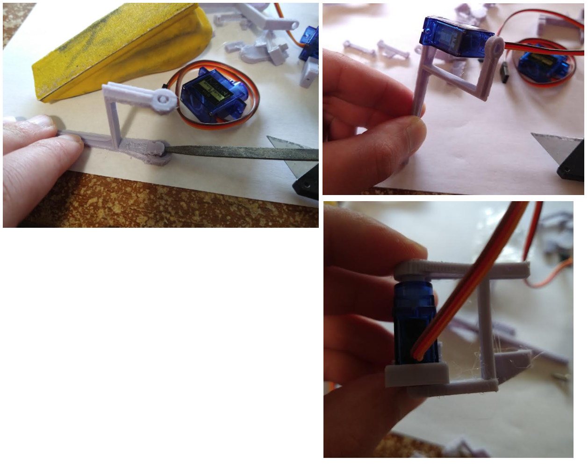

Oh yeah I could extend those servo boots and glue end caps on... hmm. It really only matters for the outer one. Though it's arguable if the wishbone design even does anything there.

See the arm bending on the bottom right pic, that's what I meant by extending the height on that.

Will be interesting, a wheeled vehicle would be easier to estimate position since it's linear/smooth but a legged robot idk.

Lol yeah boi time to learn.

Damn... I was doing this 11 years ago lol.

I think I'm going to switch to programming on the mac, I will do some programming on the ESP and Teensy to get data to a web interface.

From there I can write code in JS to do stuff with the streamed telemetry, I can prototype on that faster than on Arduino.

### Working on telemetry

Will start with 100ms refresh rate. I'm curious how much data I can push out (reliably too).

One of my dreams too is to make a real Windows App that will run on my Win 11 tablet not an ElectronJS app.

My god this coil whine gives me anxiety.

The step-up converter might be my limiter as it supposedly only puts out 2 amps.

This could be bad ha, the servos can pull up to 1.3A each...

Look at this guy what a pro, using an external workbench power supply.

I do have a lot of crap on my desk.

I need to put a shim about the same thickness as the female breadboard wire connector for the ToF sensor, it makes the sensor point up.

I'm not sure if I should be concerned, the board is warm to the touch, the IMU itself in particular.

Ehh... this is not ideal but I'll probably glue the IMU to the body (by the pins).

So far I'm failing to get the poll out of the Teensy.

This is the ToF sensor mount gap I was talking about.

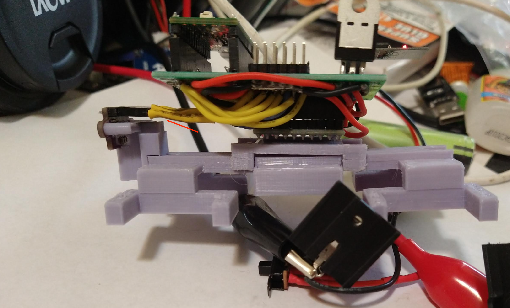

You can also see there where I'll glue the IMU pins to the board it sits on. This is a dry fit still, the gap on the IMU mount won't be there.

Ehh I know I can use pretty serial json print or something but I'll just use comma separated values.

I forgot about this problem the serial isn't cleared.

Also it only sends data once on connection, doesn't keep sending to web.

Alright... I think I understand now why I wrote that internal loop in my previous robot's Arduino websocket code.

I am grateful everytime I turn on the whole circuit the ESP happily boots/connects to wifi.

I don't get it, it runs twice (client websocket receives messages) then it stops.

Seem to be having a problem keeping the connection open.

Maybe it's the read blocking, have to get rid of it to continue.

Frayed ends of sanity playing in the back lol that's fitting.

Almost time to get another print going after I get these latest test parts.

Seems like it won't keep looping unless you close the client hmm...

I think both of these prints are duds... aye... the servo horn doesn't fit.

I stole this arm which was deemed "good" from the outer-most arm.

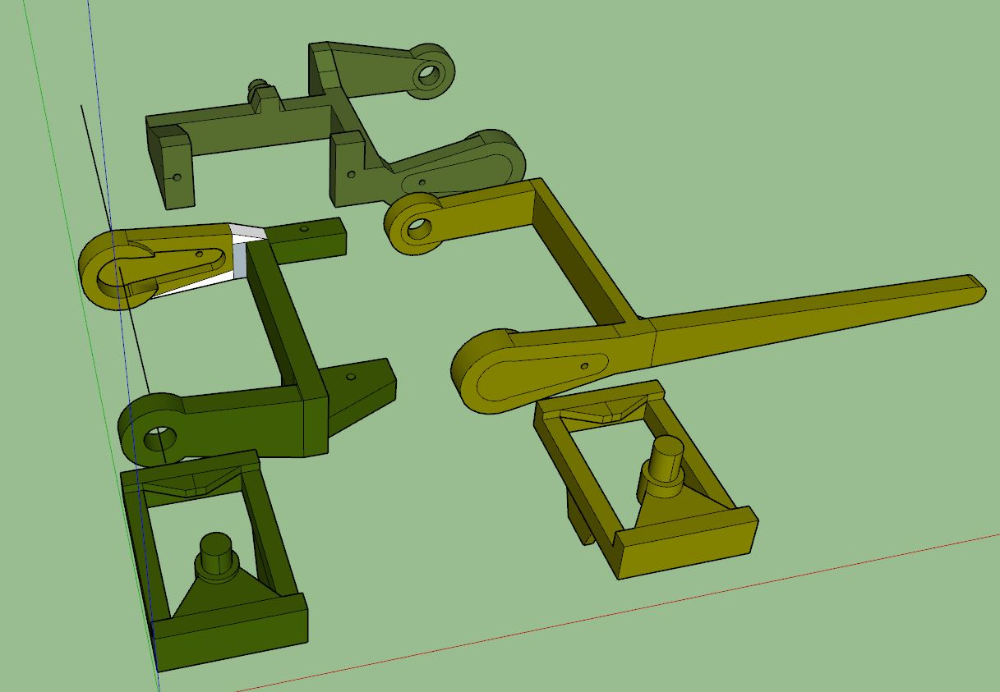

Can see how the parts fit like this:

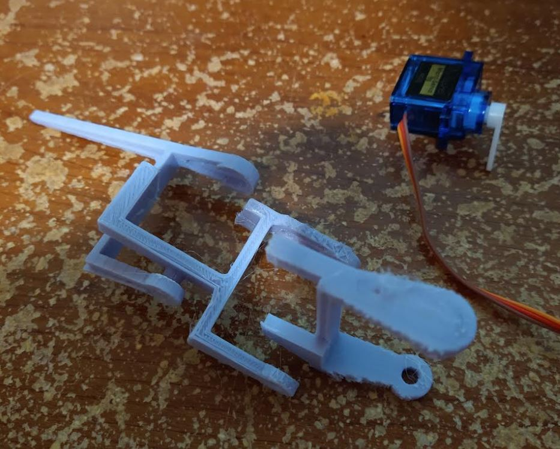

Hoping I have enough material.

Dang the leg plastic weight alone is 0.3oz for one set.

I'm actually now wondering if the ESP should be a client not a server...

Thank goodness I got it, probably a hack but oh well. I also realize this is relying on my wifi as the bridge... the ESP can be an AP/work as WiFi I believe which your phone would connect to but ehh... an ideal thing it would carry its own radio... I looked into it before an Iridium breakout board is like $250 lmao.

Oh dang a minute is too long haha if you exit the connection have to wait till it is ready to accept again.

I'm not getting the Teensy data sent to the client.

Oh yeah I need to make sure I don't glue the IMU in until I know it's good/will work.

Cool it's working there's a double lag... I think it's the different loops between Teensy and ESP anyway, it's sending two copies of data not just one.

I'm going to try and sample on the ESP side half as fast as the Teensy.

This telemetry is throttled too I'm noticing that, the delays are 100ms but the data is coming in like every second. So the data won't be 100% real time other than onboard.

This is cool the STL diffs on github

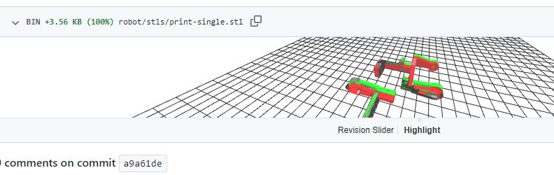

Here's the bridge established pretty cool (random thought the Transformers space bridge was a cool scene)

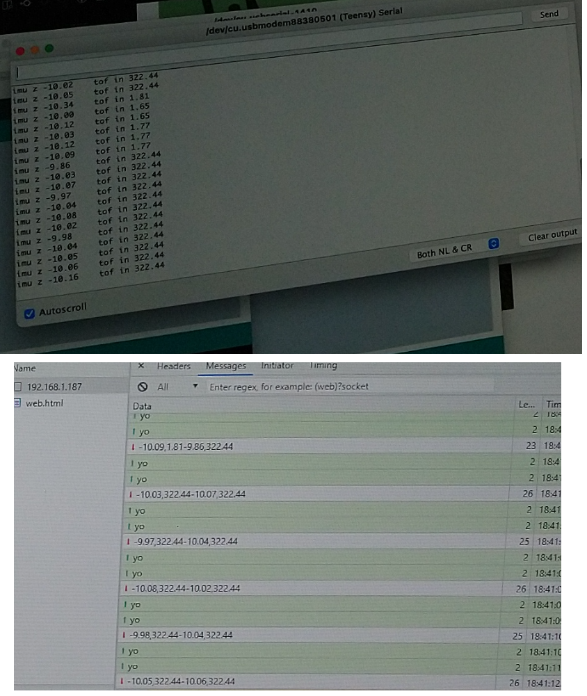

Cool so we have the data... well some of it not all.

I'm going to read some real time data to see max/mins as I move the thing back and forth.

Damn... lol this thing's got a 600MHz clock I'm like "why is it warm?" and the Arduino Nano is just 16MHz.

I think this robot will have a short life haha... although my batteries are 3.4Ah

The acceleration is around 1 or 2m/s^2 depends how hard I move. But for the robot moving around it will be under 1.

I think... I need to think about how this thing works, I will even prototype some stuff with JavaScript.

I'm going to go ahead and print the main chasis at 30% infill, it'll take like 3 hrs... oof.

It's going to be insane when I get the "main loop" thing figured out, regarding how to control the servos and respond to the IMU. Ideally I should be able to put the robot on a board on my hand and roll the board around, the robot would try to stay upright. "inverse kinematics" as they say but I will come to the conclusion the hard way.

God this thing is so bad... lol oh man. The robot's like "kill meeeee..."

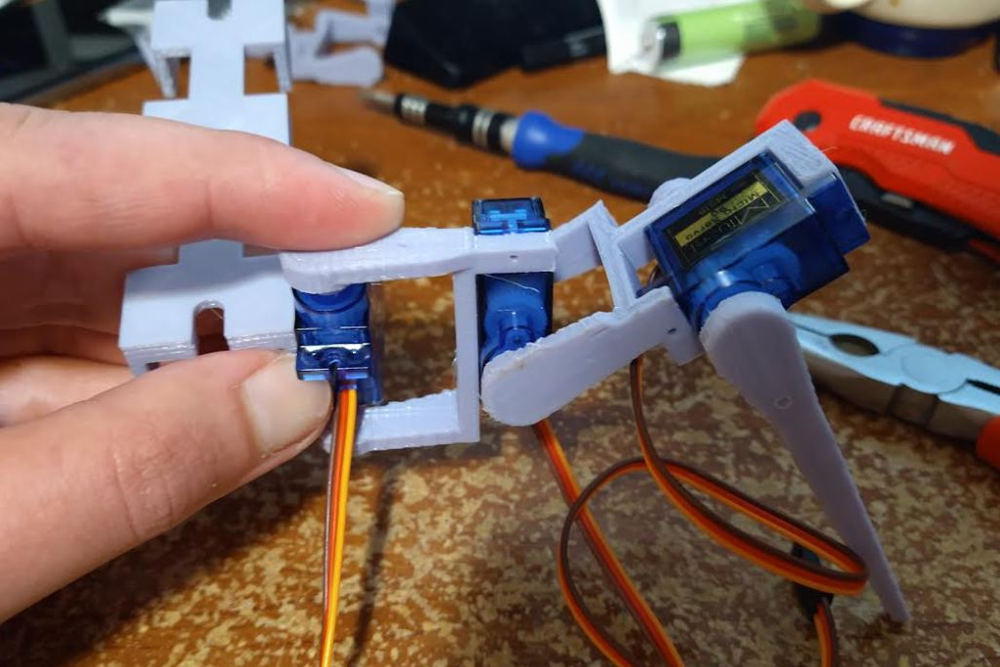

The outer leg is actually a bit tight but I think that's okay since it doesn't have a bushing to stop the loop from popping off the peg.

I will have to zero all the servos and find their midpoint before sealing it all up/programming it.

Also need to log max travel distances so the servos don't strip themselves.

Dang... look at how tall it could stand.

I need to do some FBD analysis based on these current dimensions. I'm really hoping it's not too heavy/underpowered.

There is one cool thing I had in mind is using camera tripods for legs for a really tall robot, that would be something.

Ahh man the ToF mount is a tad high, it's pointing down. At least this is a small part.

Tomorrow I will just print stuff in the background.

Initial robot dimensions:

- 1.9365" from middle of robot to "inner knee"
- 3.126" for outer most distance

These can vary

I referenced these torque numbers from that [Matlab servo 9g video](https://youtu.be/X5KyveL1cWc?t=238)

- 1in 12.42z
- 1.5in 8.5oz (approx)
- 2in 6.2oz
- 3in 3.5oz

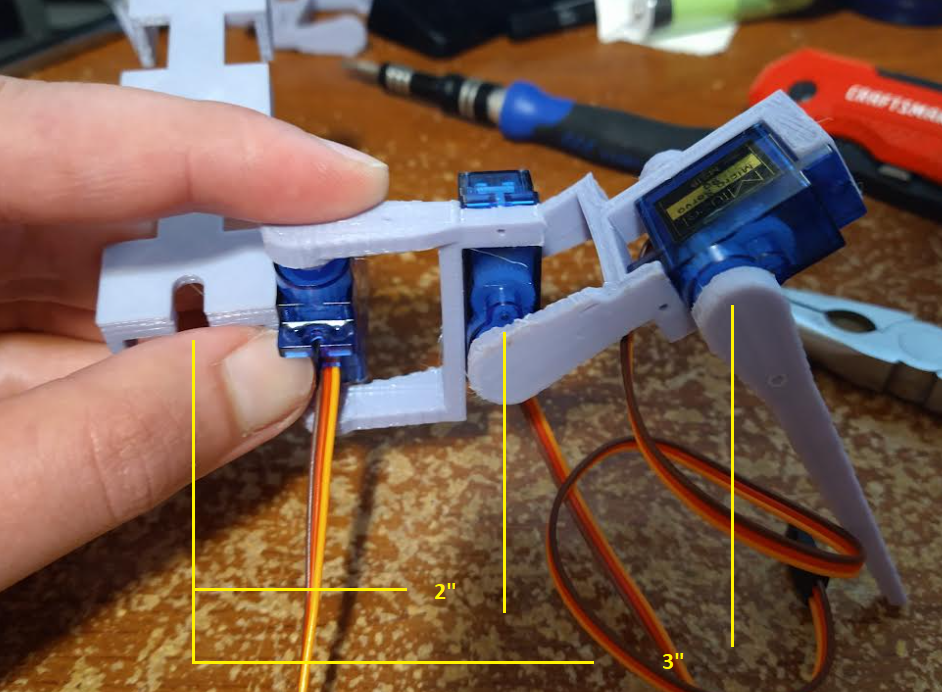

I won't reprint the ToF sensor, I modified the 3D model but I will just sand it down.

When I look at the photo above I'm not sure where the greatest torque is, I mean it seems obvious farthest away but... I think the outer most servo has a working moment arm of like 1 to 1.5in meaning it could rotate about 9oz... which four legs/3 on the ground at a time... that should be plenty?

The middle servo though I think it's using a 1-2.5" moment arm... still around half the robot weight.

lol this graveyard of parts

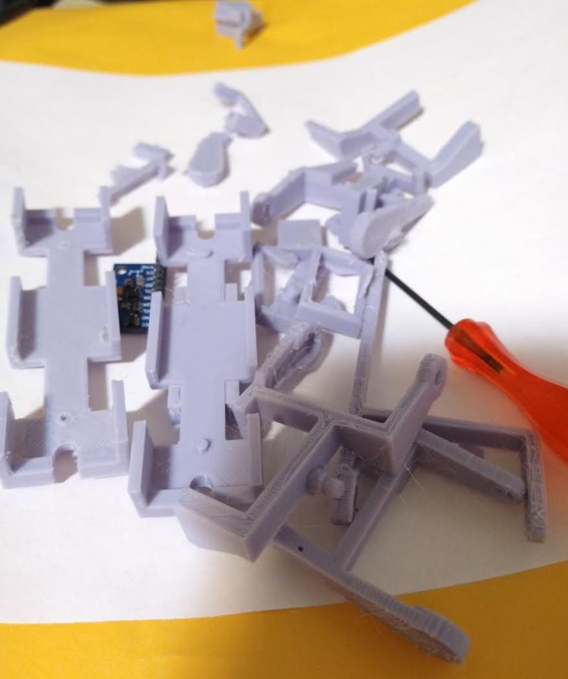

Anyway productive day today, I'm just printing stuff and thinking about the actual kinematics... getting excited.

Oh yeah... when it pulls itself forward that's where the moment arm really matters. In that case the moment arm can exceed 3".

My previous robot it could barely walk, used these dumb middle supports. It kinda just lurched forward as opposed to a real/good insect gait.

It's fun imagining the gaits/how it would work... I know I can just look it up but still I'm a slow boy like that.

I will need a programming stand for this robot so I can move the legs with low resistance.

Oh yeah... except the servo boot having too much room, oddly in reality it fits just right.

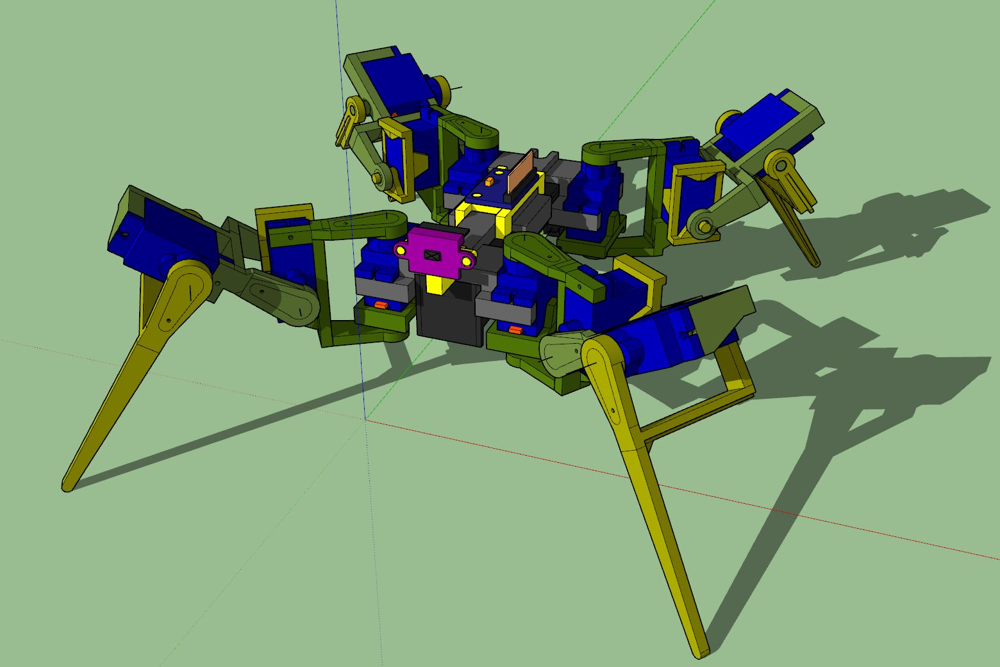

This is the final model for now.

I was imagining the Pi Zero 2 version with a camera instead of the ToF sensor that'll be neat.

