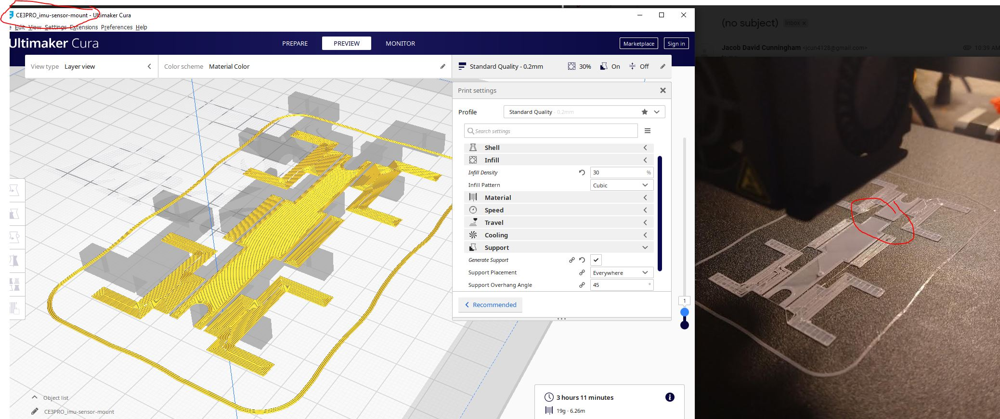
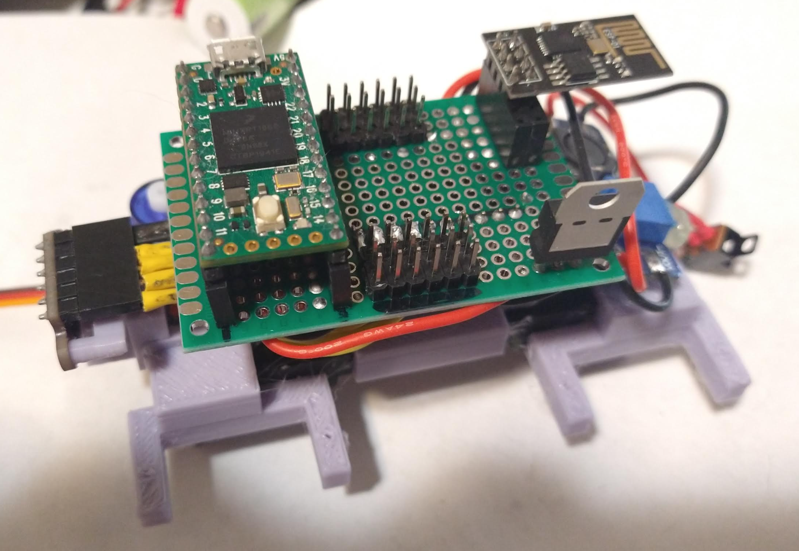

Print the body again, this time it won't be cut in half.

Print servo boots first using old dimensions not extended.

Then print a full set of legs without the boots (should be printed in batch).

I do already see flaws with the current arm design, particularly in maximum throw... the arms run into each other so they can only extend say 70-80% of full servo movement.

Omg why is it not a solid... lmao

Oh... that's great I exported it out as something else.

I'm going to print some stuff, try do some job work for a bit before going into the programming of the gaits.

I should be able to work on the one set of legs I have now.

Lol had super glue on my finger tip, attached to the keyboard like oop nope don't want that.

Did some work, the chasis is almost done so I can start working on the gaits while I print out the rest of the legs... I do need a set of servo boots reprinted at 30% infill though.

Ahh man two servo boots take an hour to print damn.

Ehh... this print did not go that well... two of the four servo mounts had bad layers. At least it'll be in compression from the servo screws.

Ahh man I hate this feeling getting super glue on your skin.

This battery + chasis thing will be super strong though, lots of contact assuming it bonds right.

I need to test these servos before mounting them in case any are broken or stripped.

I did get a little overzealous with the gluing.

Looking CHONK

I'll actually use hot glue on the IMU to keep it down. Does suck, I dont have snap connectors down yet for 3D print design.

I will have to go with whatever values are on this IMU, I deemed it as "good" so I hope it is. Won't be hard to swap since everything is socketed.

Oh that's neat I can see the current draw on the power supply as I move the servos manually and they respond hmm.

What's scary is the servo will spike like 400mA when stalled probably more and my step up power supply can only do 2A hmm...

It's possible I'll have to rework the servos to pull from the battery directly vs. the stepped up voltage.

The servo wants 4.8V+ though... I'll have to see what happens once the servos are connected and powered up, at least I can see the current draw in real time.

Listening to Say it aint so by Weezer. Right now this instant I feel at ease momentarily before I return to my default anxiety state.

Ehh... this outer arm screw hole split, it's also a tad short, I'll have to modify this and re-print it.

I'll keep this one just to save time and fix the others.

