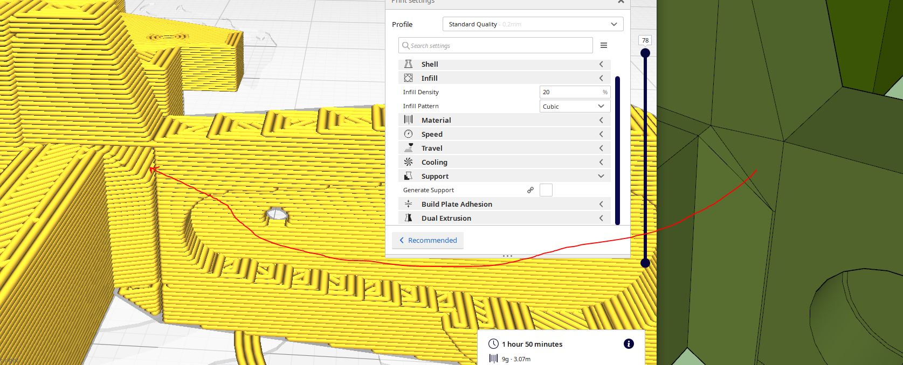
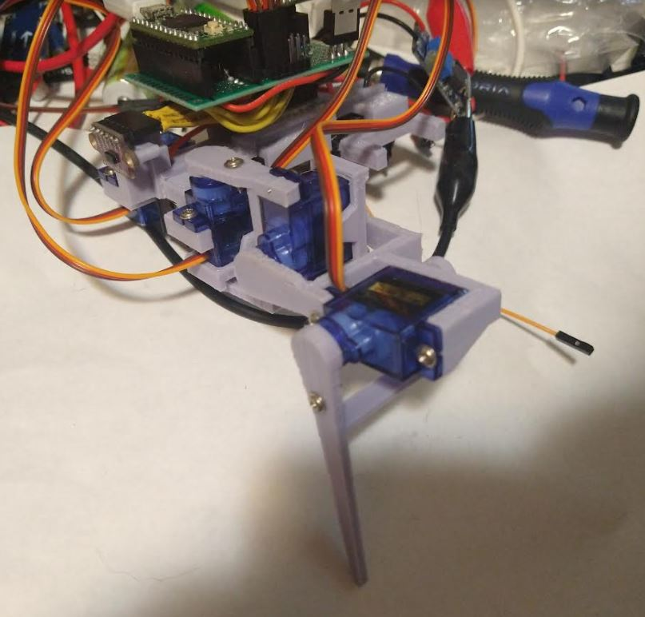
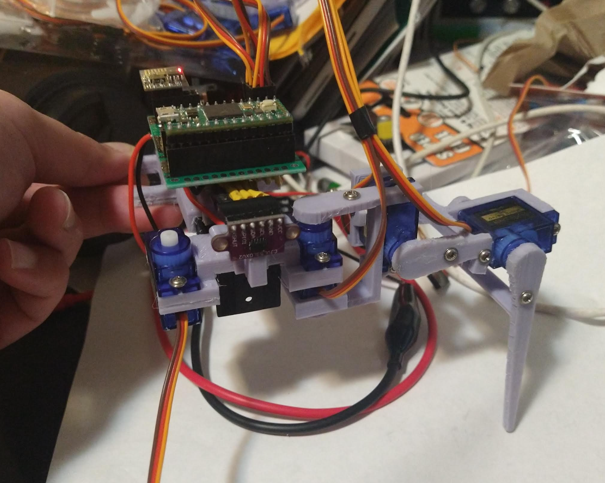

Print the body again, this time it won't be cut in half.

Print servo boots first using old dimensions not extended.

Then print a full set of legs without the boots (should be printed in batch).

I do already see flaws with the current arm design, particularly in maximum throw... the arms run into each other so they can only extend say 70-80% of full servo movement.

Omg why is it not a solid... lmao

Oh... that's great I exported it out as something else.

I'm going to print some stuff, try do some job work for a bit before going into the programming of the gaits.

I should be able to work on the one set of legs I have now.

Lol had super glue on my finger tip, attached to the keyboard like oop nope don't want that.

Did some work, the chasis is almost done so I can start working on the gaits while I print out the rest of the legs... I do need a set of servo boots reprinted at 30% infill though.

Ahh man two servo boots take an hour to print damn.

Ehh... this print did not go that well... two of the four servo mounts had bad layers. At least it'll be in compression from the servo screws.

Ahh man I hate this feeling getting super glue on your skin.

This battery + chasis thing will be super strong though, lots of contact assuming it bonds right.

I need to test these servos before mounting them in case any are broken or stripped.

I did get a little overzealous with the gluing.

Looking CHONK

I'll actually use hot glue on the IMU to keep it down. Does suck, I dont have snap connectors down yet for 3D print design.

I will have to go with whatever values are on this IMU, I deemed it as "good" so I hope it is. Won't be hard to swap since everything is socketed.

Oh that's neat I can see the current draw on the power supply as I move the servos manually and they respond hmm.

What's scary is the servo will spike like 400mA when stalled probably more and my step up power supply can only do 2A hmm...

It's possible I'll have to rework the servos to pull from the battery directly vs. the stepped up voltage.

The servo wants 4.8V+ though... I'll have to see what happens once the servos are connected and powered up, at least I can see the current draw in real time.

Listening to Say it aint so by Weezer. Right now this instant I feel at ease momentarily before I return to my default anxiety state.

Ehh... this outer arm screw hole split, it's also a tad short, I'll have to modify this and re-print it.

I'll keep this one just to save time and fix the others.

Lol I just realized this thing is designed like a crab, it's short but wide.

It is going to take me the entire day to finish printing, each corner takes about 9hrs+ and I have 3 more.

OMG good thing I checked there's a freaking hole again.

The servo boots have to be printed sideways, the pegs just shear off from the 3D print layering.

Oh no I might have cooked the boost up converter somehow. Maybe it shorted hmm.

I won't change the boots, I was just jamming it in there, I think if I print it sideways it'll open new problems.

Right arm set print attempt failed... some chunk just got caught on the nozzle and pulled off hmm.

I think there's a problem with the sliced parts, they don't all start at 0 or something.

Ugh I'm stupid, I didn't have the supports on.

This is cool though full arm assembled and programmed as far as being centered.

So I fixed the step up converter and I also soldered on some taps so it can be powered by the work bench power supply.

I am pretty happy with this so far, the battery fits well, I won't need to tape it.

The design angle I had in mind was 35 degrees for how the legs are pitched. I guess it doesn't really matter but a good starting point. Right now everything is just 90 deg.

Man this sucks... have to wait for the rest of the parts, only have 25% done on the legs.

I want to see the load current draw when it's standing upright on all four legs.

I will tidy up the wires on the legs in the mean time. It's so clean though omg... so much better than my previous robot lmao... was a literal mobile breadboard at one point.

I'm actualy curious how much current the old robot pulled.

I might switch to the math as I wait for stuff to print, can't really do too much until all the legs are there/built out.

