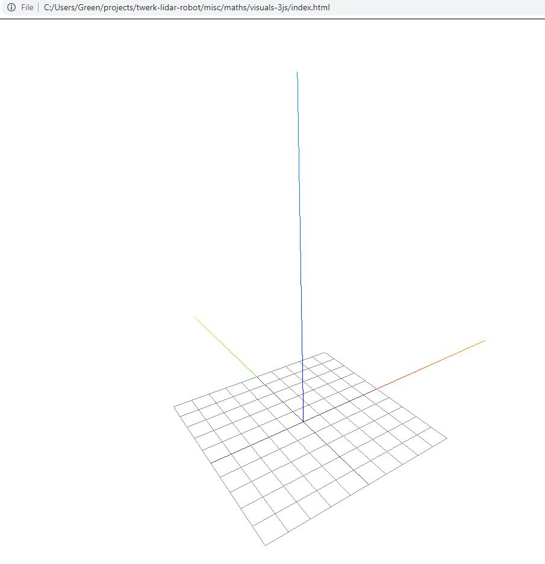
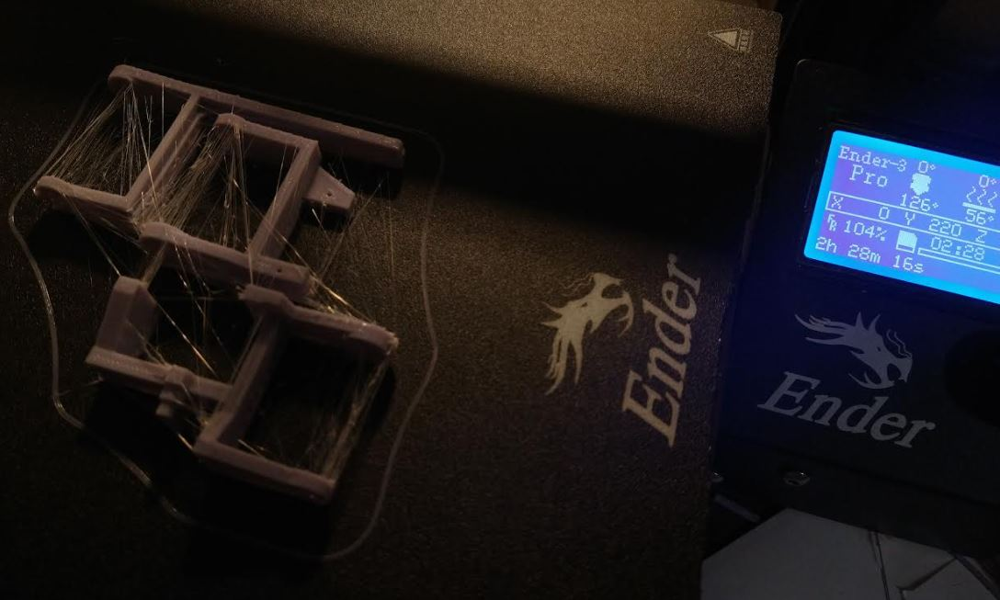
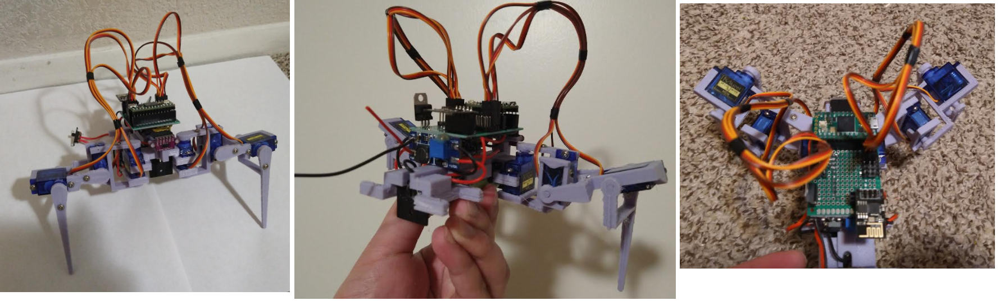

Print the body again, this time it won't be cut in half.

Print servo boots first using old dimensions not extended.

Then print a full set of legs without the boots (should be printed in batch).

I do already see flaws with the current arm design, particularly in maximum throw... the arms run into each other so they can only extend say 70-80% of full servo movement.

Omg why is it not a solid... lmao

Oh... that's great I exported it out as something else.

I'm going to print some stuff, try do some job work for a bit before going into the programming of the gaits.

I should be able to work on the one set of legs I have now.

Lol had super glue on my finger tip, attached to the keyboard like oop nope don't want that.

Did some work, the chasis is almost done so I can start working on the gaits while I print out the rest of the legs... I do need a set of servo boots reprinted at 30% infill though.

Ahh man two servo boots take an hour to print damn.

Ehh... this print did not go that well... two of the four servo mounts had bad layers. At least it'll be in compression from the servo screws.

Ahh man I hate this feeling getting super glue on your skin.

This battery + chasis thing will be super strong though, lots of contact assuming it bonds right.

I need to test these servos before mounting them in case any are broken or stripped.

I did get a little overzealous with the gluing.

Looking CHONK

I'll actually use hot glue on the IMU to keep it down. Does suck, I dont have snap connectors down yet for 3D print design.

I will have to go with whatever values are on this IMU, I deemed it as "good" so I hope it is. Won't be hard to swap since everything is socketed.

Oh that's neat I can see the current draw on the power supply as I move the servos manually and they respond hmm.

What's scary is the servo will spike like 400mA when stalled probably more and my step up power supply can only do 2A hmm...

It's possible I'll have to rework the servos to pull from the battery directly vs. the stepped up voltage.

The servo wants 4.8V+ though... I'll have to see what happens once the servos are connected and powered up, at least I can see the current draw in real time.

Listening to Say it aint so by Weezer. Right now this instant I feel at ease momentarily before I return to my default anxiety state.

Ehh... this outer arm screw hole split, it's also a tad short, I'll have to modify this and re-print it.

I'll keep this one just to save time and fix the others.

Lol I just realized this thing is designed like a crab, it's short but wide.

It is going to take me the entire day to finish printing, each corner takes about 9hrs+ and I have 3 more.

OMG good thing I checked there's a freaking hole again.

The servo boots have to be printed sideways, the pegs just shear off from the 3D print layering.

Oh no I might have cooked the boost up converter somehow. Maybe it shorted hmm.

I won't change the boots, I was just jamming it in there, I think if I print it sideways it'll open new problems.

Right arm set print attempt failed... some chunk just got caught on the nozzle and pulled off hmm.

I think there's a problem with the sliced parts, they don't all start at 0 or something.

Ugh I'm stupid, I didn't have the supports on.

This is cool though full arm assembled and programmed as far as being centered.

So I fixed the step up converter and I also soldered on some taps so it can be powered by the work bench power supply.

I am pretty happy with this so far, the battery fits well, I won't need to tape it.

The design angle I had in mind was 35 degrees for how the legs are pitched. I guess it doesn't really matter but a good starting point. Right now everything is just 90 deg.

Man this sucks... have to wait for the rest of the parts, only have 25% done on the legs.

I want to see the load current draw when it's standing upright on all four legs.

I will tidy up the wires on the legs in the mean time. It's so clean though omg... so much better than my previous robot lmao... was a literal mobile breadboard at one point.

I'm actualy curious how much current the old robot pulled.

I might switch to the math as I wait for stuff to print, can't really do too much until all the legs are there/built out.

5:52 PM eheh (crying sound)

Waiting sucks... 55% on front-right arm set without servo boots.

Song comes to mind "wanna tell you bout the servo I love" Led Zeppelin

It would have t obe these titanium gear DS75K because they're so expensive.

I could buy like 30 9g servos for one of those damn...

Okay... guess I will work on the navigation thing finally.

Will prototype in Javascript cuz I'm a scrub. I briefly was messing around with ThreeJS for basic polygon shapes in 3D space... it might help me to use that for visualizing something.

Actually I will do that, I'll pull that Three.js thing from the SLAM crappy project and use that as a way to visualize rotating a plane and what not.

Have to remember how to make a plane.

uwu the axes are switched damn... I am used to the normal x/y and z being y is odd but that's how the IMU is also 3D printer.

Damn how do you flip axes... Aha SO with [the answer](https://stackoverflow.com/a/57402467/2710227) nice.

Damn... I have no idea how this vector stuff works lmao... uhh 0, 1, 1? Nope... anyway I was able to orient the z-axis vertically and match the grid helper with it.

You know not having a job is nice regarding free time, except for the part where you don't have money.

There's something in my eye it's bothering me.

What does it mean to rotate something... the IMU has values for rotation. I should have gotten a sample. I do have one.

Oh yeah it's gyro but what units, some radian maybe...

Yeah the day I got help how to get the code to compile I grabbed this output, labeled it now from their repo.

Oh yeah the units are radians per second. I at this time don't know how to infer magnetometer data but it's used with a filter for heading or something I forget, but this is intended to work on a 2D plane in a building... don't think I need it with regard to say GPS.

I need a visualizer probably something on the web for radians per second. Oh yeah I'll convert it to degrees because I'm a simple boy.

Angular velocity right god I sucked in dynamics curvilinier deez nuts. Oh wait... I think I can figure out the title by the... oh I still need an angle ha which I don't know.

Lol I've watched [this video](https://www.youtube.com/watch?v=0rlvvYgmTvI) before.

Damn you need both mag and accel hmm... and gyro is icing hmm

Use magnetic field to determine north, not sure if I need that at the moment. It would be nice to know with the coordinate map of its surroundings as it moves.

Oh... that's what these mag numbers are, on a map they're lines I see. That's weird magnetometer angled down hmm.

Next set of parts came out, the area that goes over the servo horns is a little thin/can split if you are too rough getting the support out for this cavity.

I don't think I need this info yet, at 4:26 in

Lol I feel so dumb right now, I'm like this:

What is a cross product? Ugh... I did that stuff so long ago damn.

I think one of the biggest problems is the damn thing has legs.

I need one more servo boot then I can assemble the front right leg and center it.

Each leg set takes 3.5hrs

Actually... I could record data from the robot as it walks around and measures things. Then I can use that recorded data to figure out how to understand it ha without the robot running.

Ehh... I think I'm just gonna print/assemble/chill for now.

Assembling front right arm set... ahh man the second servo boot didn't print right, but it's good enough, the main thing that matters is the peg.

I'm going through servo mounting screws quick.

Well... when I had the robot standing up, on two legs the current draw was under 500mAh it was 300 something... which I don't understand but that's a good thing.

Also I'm no longer powering the robot by the external power supply because it flips out/servos want to strip themselves.

I also will need some kind of guide to hold up the board, vs. just using the IMU pins as a stand/load bearing. It's really only a problem while the USB cable is plugged in.

Oh man I am pumped! Sucks I won't be able to print it all today... I will try I try to have the printer not be running past 12 at night but it is Saturday.

I also can't tell how loud it is, like I barely hear my neighbors/can they hear me?

OMG I'm so pumped for this thing ahhhhh I have like 6 more hours of printing to go before it's fully built.

Also I did have a thought, that the boost converter can just be hot glued partially to the PCB as seen below to add support. I thought about designing another part but ehh. I'm just hoping the wires are out of th way of the servos.

One simple thing I could show on the web 3D interface is the plane of the robot (rotation) as it moves around. Later on the real time motion/trajectory with regard to the sampled points/stored objects in the robot's onboard map.

