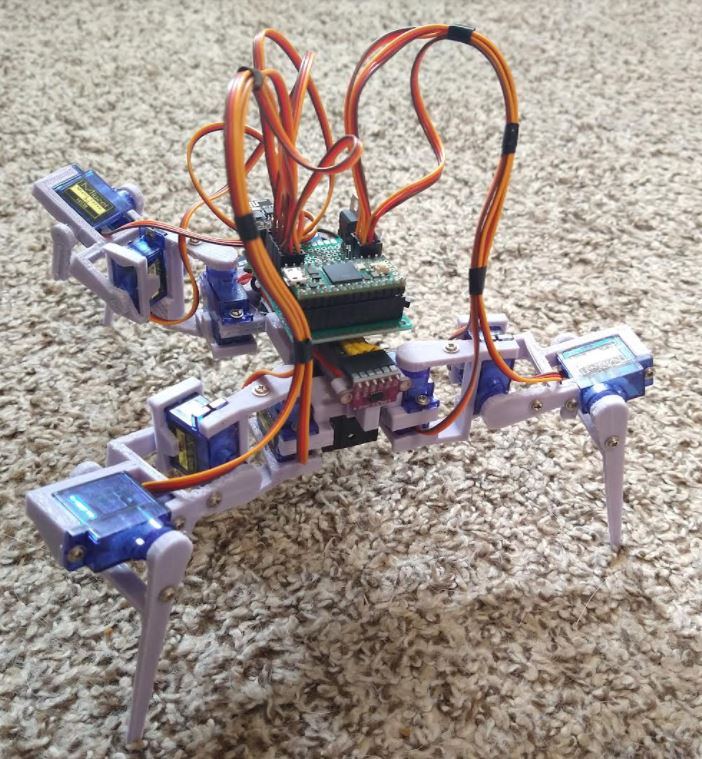
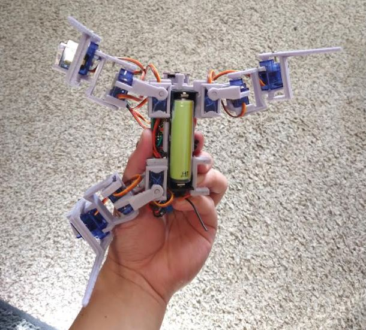
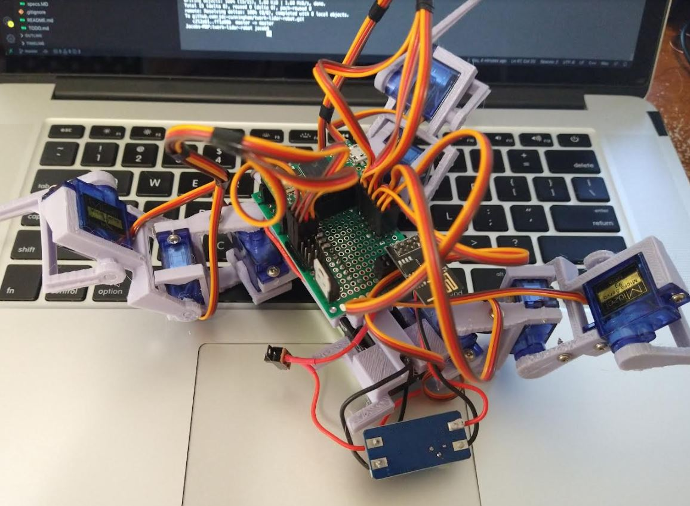
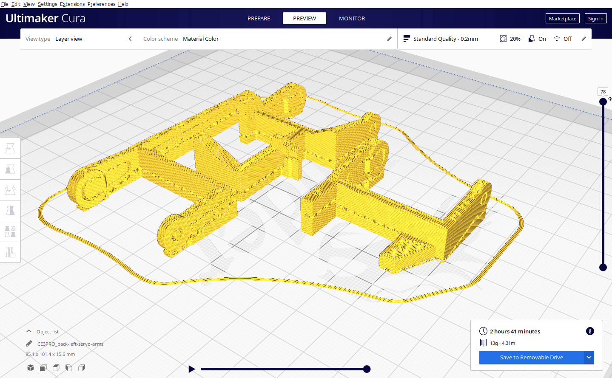
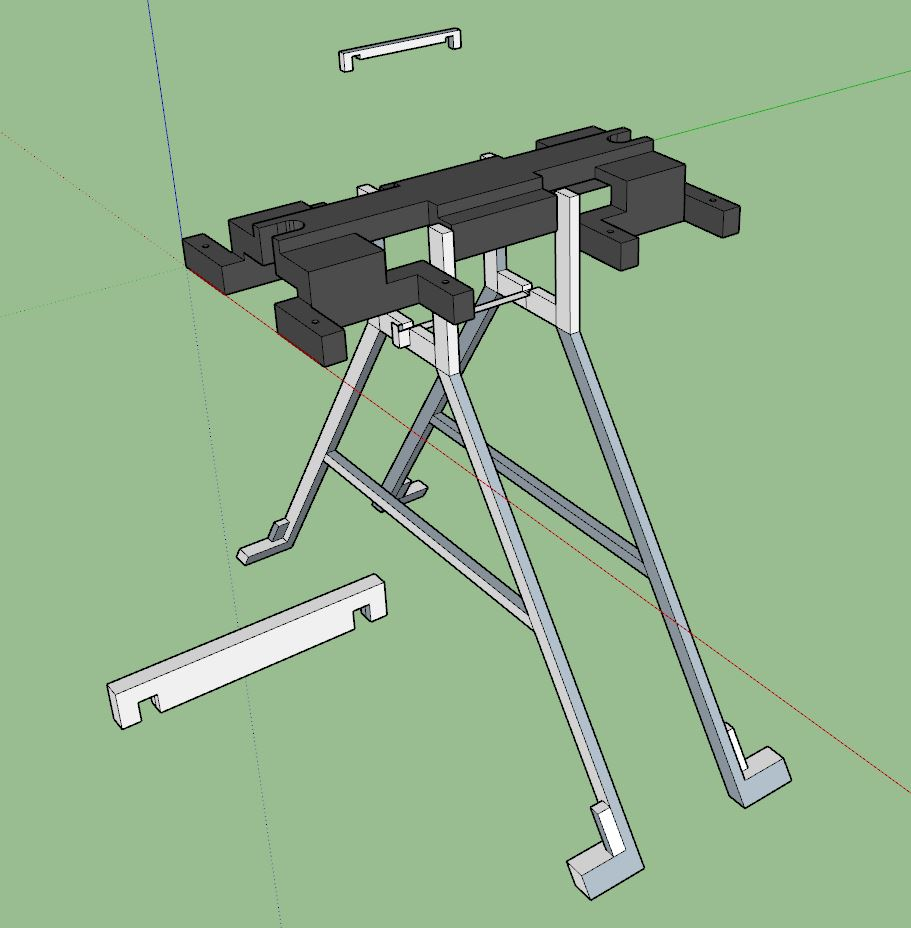
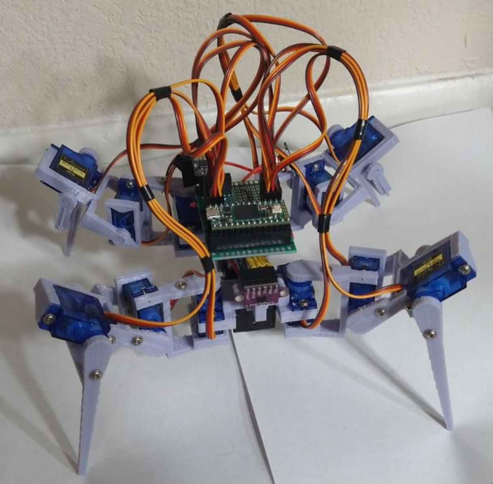

Printing again, I remember on the last robot I had to make this looper thing for moving all the servos together.

Also I had problems with parameters, they had to be specified not passed in on the fly/whatever you wanted.

I'll steal that to work off of, but I imagine it will be modified if the IMU overrides it (like it's falling or something).

I like at my old code and I'm like "oof" but I also don't know how to write it cleaner right now.

Got the middle part reprinted for the back-right arm. Assembling it now.

There are two sides to cheap: cool it's cheap or damn it it's cheap.

I am annoyed with these cheap servos because I just dread the thought of it stripping... but also this robot could cost 2-4x if I bought more expensive stuff.

The servos are twitching and it's freaking me out.

It's a good thing these arms have good flex, I have to stretch the middle one out to go over the boot.

Yes yes yes it's looking good

Hehe be like finally a worthy contender

I'm happy to finally have used an 18650 "for real".

Ooh was just thinking this could have an induction charger on it. It would just find its home and "lay down".

I did put some super glue on the ToF sensor mounts to make sure it doesn't move after being "center".

Making sure this is right, not backwards, weird hole, etc...

After all it takes 2hrs 41 mins to come out. Well I have that much time to kill so I guess I'll go learn/figure some stuff out.

Alright let's go parts done, final leg to assemble.

There is one thing I'm tempted to design/print which is a stand, it'll take a long time/lots of material though. But it would be nice to have for programming.

Ooh... smart boy I just thought of it, make it using like a basic triangle shape, could be fancy with curves too. Yeah I will do it. Will design that real quick/get it printing.

Be a simple... kind of stand...

Hmm it does look flimsy. 2 hrs to print the stand.

I'm going to do something different this time, I will do the servo sweep test, centering before assembling it.

Wow the mac can tell pulling too much current interesting.

Hmm not sure what's up... maybe too much current or something on start up. Going to unplug some servos.

Might be for the servo sweep test the other servos aren't bound, jumping around.

Oof... this is bad it's possible the servos have too high of a start up current together for the 2A max step up converter... hmm.

Ahh man I'm so sad right now because of this.

I might be f'd lol... there's another step up converter that can do 3A.

Well... I'm going to have to wait... till I get another 3A step up power supply.

One way to test, use the bench top power supply.

It started up at 1.3A+ so maybe I could use a capacitor somewhere? hmm...

I wonder if this would work... I will finish building what I have.

OMG it's finally assembled.

Ahh damn... it's a 3.3V super cap so don't think it'll work. Let me check the standing current.

It's hovering just under 0.7A standing. Ugh the right inner servo is twitchy... might have to fix that.

Do a quick scan if the ESP is up, should be. Yeah it is.

Let me check start up current again. Power off robot falls face down lol.

I only see 0.4A on boot... maybe the spike is too fast to see.

I already desoldered the step-up converter dang... I'll try it again.

Nope... it struggles to boot ahh... sadness.

Well I can still program it on the stand in the mean time.

Well... I put the order in, 3 days have to wait. I have some work to do anyway and I can program it on the stand/using bench power supply.

I'm going to finish printing the stand, one of the parts failed. It is super flimsy/sucks so idk might redesign that.

There is a thought, what if I use two of these step ups to power each thing separately... it's kind of late anyway since I already bought the other step-up converter but apparently you want the power to be separate eg. between the servos and microcontroller that controls the servos.

It's not a big deal anymore, I have to program it and I can wait the three days for the higher current step up, plus it's just one thing, don't have to desolder stuff.

I want to check something real quick, not sure if it was a mistake to go from the step up converter (3.9V to 5V back down to 3.3V) when I could do parallel wiring...

I still do need to put everything behind a switch but yeah, just wondering.

ha this is pretty cool, since it's socketed I can just pull the stuff off.

Nope no change... I think that makes sense... waste of energy to step up then down...

Yeah I will have to program this while wired. Oh no it started flipping out.

Hmm one of those servos is dead...