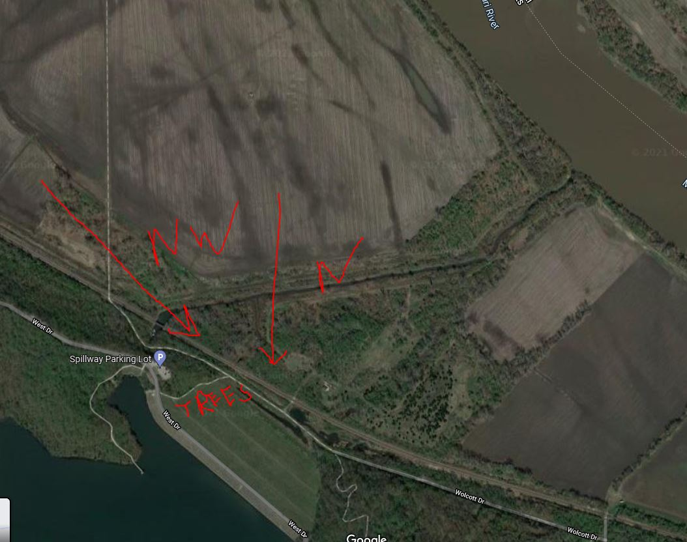
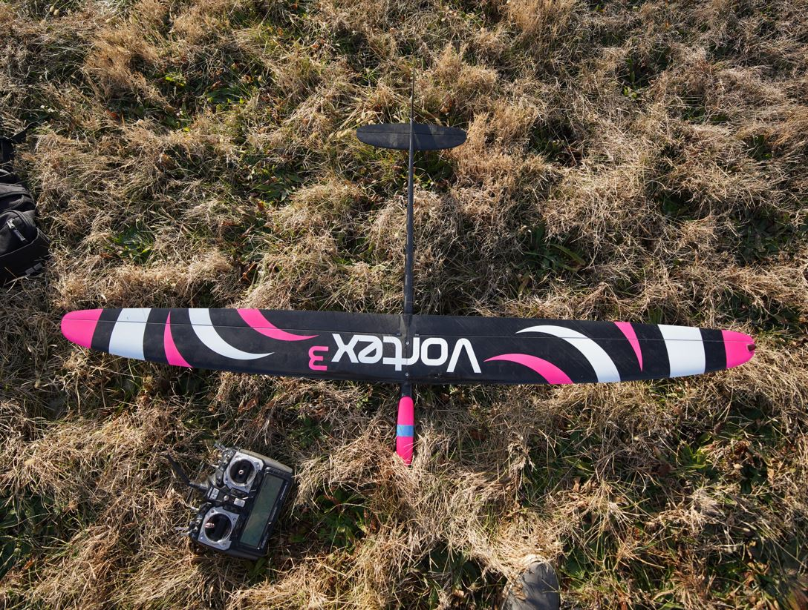
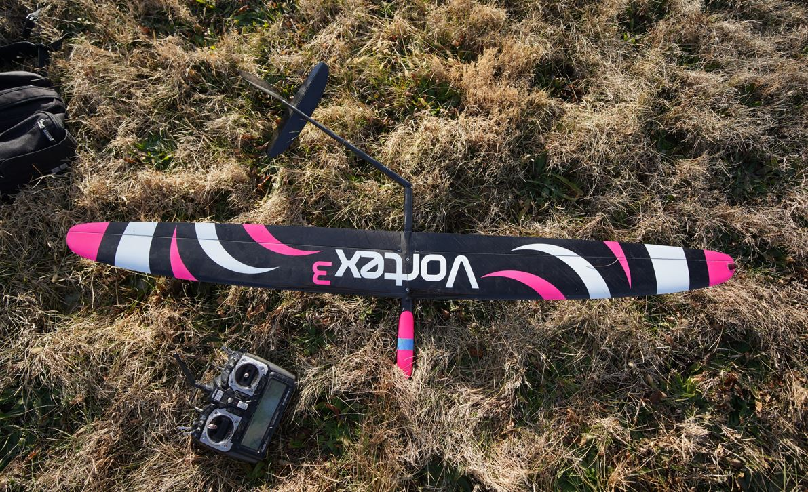
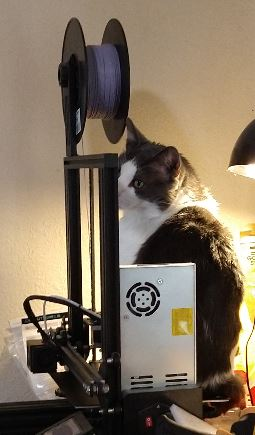

Oh no... I saw the outside, it's a perfectly blue sky day... winds acceptible although coming slightly from the wrong direction. Ideal is north wind.

Ahh... I gotta tell myself it's a bad day, bad day to fly.

See below, the ideal direction is north wind. If it's from the NW as it is now, means I launch towards the trees which isn't terrible but then flying backwards it's hard to look at the plane/see what it's doing.

Also if there are no thermals it just sucks... throwing and throwing... I'm thinking the ground will be wet too.

Nope I'm going to go... lol. Let's see if it's a disappointment. It's also rare, should be winter. I will laugh if the park is closed and I can't get in anyway.

I have to charge batteries though. While it is depressing to see a bunch of dead trees, there is something therapeutic to me about a perfectly blue sky.

I'll get some film recorded too. Unfortunately I operate my life with fear too like I don't want to draw attention to myself in this apt complex.

This is why one day I dream of having a like hangar or not a homestead but you know land somewhere isolated. I have room to fly and make things that roam the land.

I did get the new power supply in so when I come back I'll 3D print a mount for that, it will prevent the PCB from flexing too.

Last tube battery is charging for the DLG. I was supposed to design and 3D print these wing holders that attach to the DLG so that it's easier to carry around but haven't gotten around to it.

Today I will get a twerk sample with the "lidar". Whether or not I can mathematically make sense of it is something else.

Well... I wish I could say that the flight went well. But I broke the plane in half lmao, the boom anyway. I slipped during a launch and the plane hit the ground before I did. I still have to watch the video to see my dumbass falling.

There were three times this plane almost broke. On my way down the hill where I fell because there was still ice on the side of hill under the grass... and then one time when one of the bad batteries just made the plane completely stop responding in mid air. Thankfully I was only like 2 feet off the ground when it stalled and hit the nose... then later on, last battery I immediately fell on the throw.

So yeah... not great... the break is clean, I'll have to fix it. These things are expensive as hell but more than that, it's the time it takes to assemble them, such a PITA.

It was funny earlier I was obsessing over how I made an ass of myself thinking there was a mistake in some payment system, but it was just my remaining PTO being paid out to me.

I did have one decent thermal flight though, although it was brief.

Anyway good news is as I mentioned I have that 3A step up converter now so I can continue with this robot development. I went ahead and ordered some carbon weave to fix the DLG later.

Lol... before

after

Oh noo... the footage is blurry damn it... the auto focus was focused on the ground... still captures the moment though.

Here's the [video](https://www.youtube.com/watch?v=-ijb-kHdBvs).

Oh yeah, whenever I print I have to check the bed because my cat sits on the printer bed.

Anyway I'm going to solder the power supply onto the robot, design a part to hold it up along with the protoboard and get that going. Then will do the sampling programming, the actual "twerking".

Last thing, the Aurora 9 is special to me, this radio. I had it a long time ago but I had to sell it along with my Radian Pro 2... that was when I had money but didn't have the passion to fly these planes... actually I sold them too because I needed the money.

Well first one I could not get it down past 17V... next one from another batch went down to 5V so that's good.

I'm using this XL6009 DC-DC step up. The next test will be does it perform up to 3A because the servos can spike up to 2.5A+.

Man this stuff is sketch, voltage kept climbing up, looks like it's settled at 5.22V

Lol nope... this one is bad too it's going up... then going back down... oh goodness... maybe I need to put a 5V LR to be safe.

Oof 3rd one that's bad... I think the operating voltage is just too high/far away from 5V. They're default around 40V.

Ugh man... I hate this, "it's cheap" well it's also garbage.

Food break

Ugh man... this sucks...I buy a thing for it... and it doesn't work... dang it.

I will buy the real thing, note how it is `$15` for 1, vs. `$9` for 5 of these XL6009

REEEEEEEEEEEEEEEEEEEEEEEEEEEEEEEE I gotta wait

Looks like I'm good, will take a week or so to come in (due to my shipping choice).

I checked the non-isolated bit I think that's fine since it is directly connected to the battery than can do 4A+ output and it has its own internal protection.

Oh well... back to the wires.

The next thing I'll have to look into better parts is the servos... another version of this robot will use an actual vision system eg. a basic 5MP camera that's good enough.

I am a pretty mediocre person and the only real positive thing I have going for me is I have this non-pc-term strength where I am relentless about something, even if I look stupid.

Anyway it also means I would not be working for any big names or whatever, at least in corps from my experience you have rigorous testing and planning, plus your colleagues can hopefully catch your mistake.

Interesting it pulls more than 3A trying to stand up from a flat/sunken position.

Ugh... it does suck when your decisions spoil something, like this robot using cheap parts, of course it will perform poorly.

Going to take a brief break since I binged and I'm going into a coma. Then I will get something done today so today isn't just full of bad news (broken plane and wrong part).

It might be able to get up from flat if it's one leg at a time or something, not all.

Anyway I primarily just needed a physical thing so I can learn the fundamentals, then yeah, a real robot with real motors eg. some kind of OP actuator like what the mini cheetah's use is what a real robot would consist of.

But I am in the monke phase, gotta learn.

Alright let's do it, let's make it spin.

I do wonder if the default state is the wrong shape. Maybe it ought to be more stable where it can just lift a leg up and not tip over in any direction.

Why do I care? Why do it... learning.

I am tempted to just make worded functions... the problem is, ideally you know where the servos are all the time, even without true feedback, just so that you don't jump in "duty cycle" (don't actually know how servos work). Also to avoid over extending in any direction.

I think I have it, both sides have to go in opposite directions of each other then center to turn.

The new Pinephone Pro is out/ready for pre-orders but I won't get one until I program an app for the original that I have.

Oh this is so much cleaner... except hte movements are fixed.

Does it still work after this "refactor"...

Well that's great, one of the servos might have failed, front-left middle.

Also I broke off the IMU support so now it's definitely just flopping around.

Might be a lose connection, seems fine now. No it's twitching.

Going to have to fix this, remount it.

Just checked the sensor interface code, still works, sigh of relief, although the IMU seems questionable oh well.

