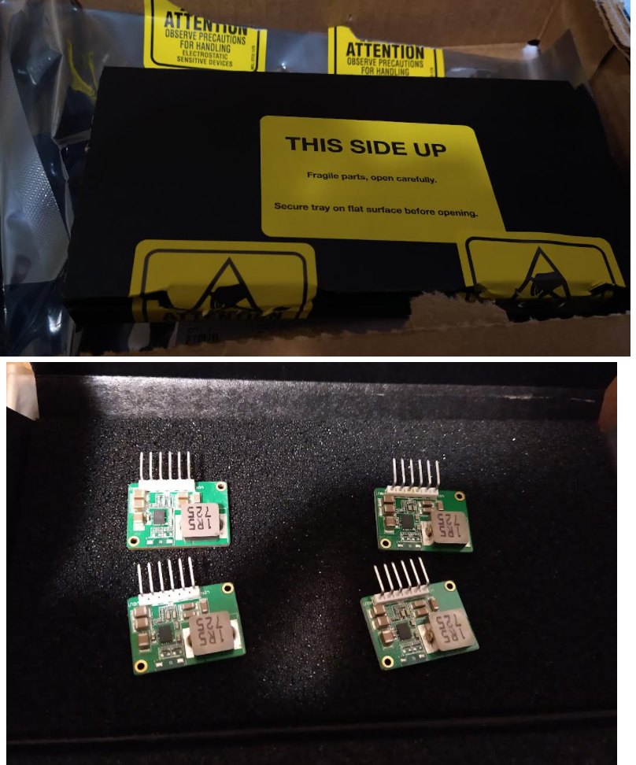
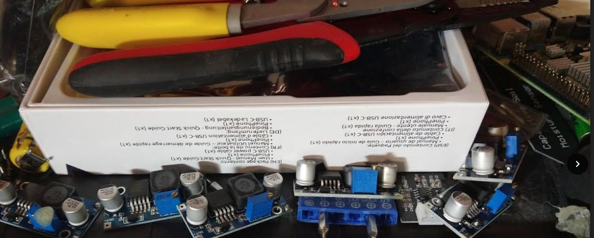
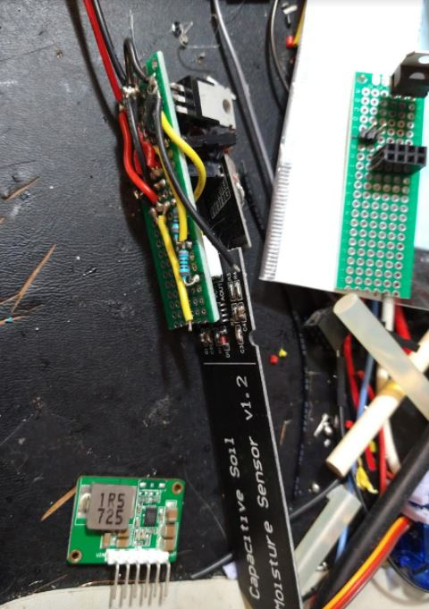
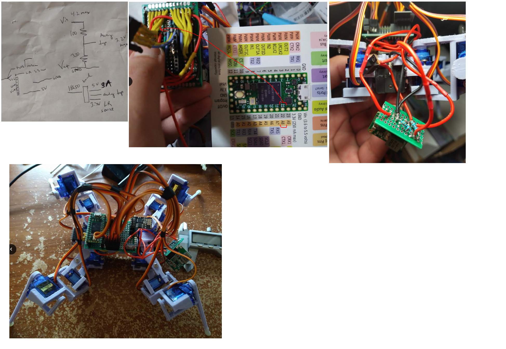

Night before/morning thinking

I have literally not worked on anything for 5+ days. I am feeling antsy, I want to get this thing working.

I'm also excited about the 3D version of it, that has to happen/within reach. I'm using tech I'm familiar with eg. JS kid on the block.

- solder new power supply, verify it works (I damn well hope it does)
  - attach to piece of proto board and then design/3D print support that also holds up the main proto board
  - tap battery with diode divider for real time voltage, max should be 3.3V for 4.2V, maybe a little lower to be safe
- finish remaining gaits for basic 2D control (f, b, l, r)
- develop the sampling cone gait
- use data from above to create first obstacle detection

Those are the primary goals to have a thing that does what at the base this is supposed to do.

The rest will be programming time regarding doing the 3D mapping and real time telemetry in the web.

I'm concerned with how much data can be stored and how much can be transmitted real time via the web socket

There is noticeable delay while transmitting data

I will also later on evaluate better gaits.

2:46 PM

Ahh... taste of NOS. Been too long.

Got the parts in from Mouser yeah boiiii.

OMG how do you open this, this packaging is great.

Wow this is top notch, need to look at these pin outs.

I'm not entirely sure, the pin out from this [datasheet](https://xonstorage.blob.core.windows.net/pdf/3260640link.pdf) is 1,2 VIN, 3,4 GND, 5,6 VOUT but how do you pair it... is it like odds vs. evens sort of deal... I have four tries lol JK these things are $14 each.

Anyway I'm going to use a socket for this one too, why not... the robot's just getting heavier but it's cool.

I used most of my skinny proto boards for this failed water moisture sensor project I obsessed over.

This thing is a bit bigger than I imagined (lol) but not a bad thing. I do like it's form factor.

Gotta find a resistor voltage divider pair to use for the analog tap. Think I got lucky with the servos that the analog pin set is on the opposite side. So I have plenty of options to tap just wish I thought about this in advance so I could have soldered a lead.

I will tap A8 it's closest.

Lol... after I have most of it soldered, I'm trying to see if I should switch to k ohms so my current draw for the voltage tap drops from mili to micro amps.

This is not an energy efficient thing. The main issue is I dont' really have nice 1/3 resistance pairs for the higher K.

Lucky I checked battery voltage it was 2.94 which I don't know why it was still outputting if it was that low.

Oof... I had the wrong pin for ground... no smoke... but let's see if this step up still works.

OMG it's working, I think I got lucky because the ground wasn't actually joined, proto boards.

Anyway the output is 5.05 nice.

Yeah this is a time where I could drop a say 9mA draw to 9micro amps but the thing operates between 0.25 and 3A so that's not really that significant and most of the time it's moving eg. in the whole amp range.

Wiring up everything now with heat shrink (professional).

Damn B.B.K. by Korn is so good.

Ahh... I am sad. After all this time, it doesn't work... I don't understand. I bought the 3A current one.

The battery says it can do 4.9A though capacity is 3.4Ah

I guess the startup current draw is too much.

Unfortunately I already soldered everything to do a bench power supply current draw test.

This also is a bit too big... too many wires. Quick weight check: 9.8oz so it's still within target weight.

Ahh man... I will briefly see about a one-leg at-a-time rising to normal pose.

It's not a complete loss, previously it couldn't boot at all... like where it would operate normally even suspended. So this power supply does its job but trying to support its own weight (with all servos on) from power off is too much.

So... there's way too many wires to fit this external power supply module with the main CG of the body... I will print the proto board support, it'll just be a V thing and then I will think about an overhang support for the power supply.

See the set of XL6009 I was trying, they are for higher voltage application not a small jump from 3.7 to 5.

Anyway this is what I've got... I've learned a bit... the voltage divider stuff I learned about from the [home security Pi Cam project](https://github.com/jdc-cunningham/raspi-home-security-cam/tree/master/ver_1) I did.

See below I used most of the long narrow proto boards for the moisture sensor project which "failed" specifically the ultimate plan where a deep sleep ESP-01 triggers a bigger Seeeduino to run many of these moisture sensors... I learned about mosfets on that project. The problem was the tx/rx lines were steeling power/messing up the boot between the two devices. Eventually it would get out of sync and the Seeeduino would kind of brown out from being kind of on.

The hardware itself worked, the one above is a single-cell lipo type where the ESP-01 is modded to free up an analog pin (this was hard to do/solder not worth it imo). But it had a constant power loss with the step down. The electronic switch (mosfet) was supposed to deal with that. The ESP-01 with a coin cell and deep sleep mode could make it work... anyway yeah. Might look into it again in the future as part of the IoT garden project.

Anyway... the main goal today is to do the actual twerk lidar object detection sampling stuff so... need to get going.

I'm finally able to be me again/work not get wrecked by whatever sickness hit me hard on Friday (5 days ago).

