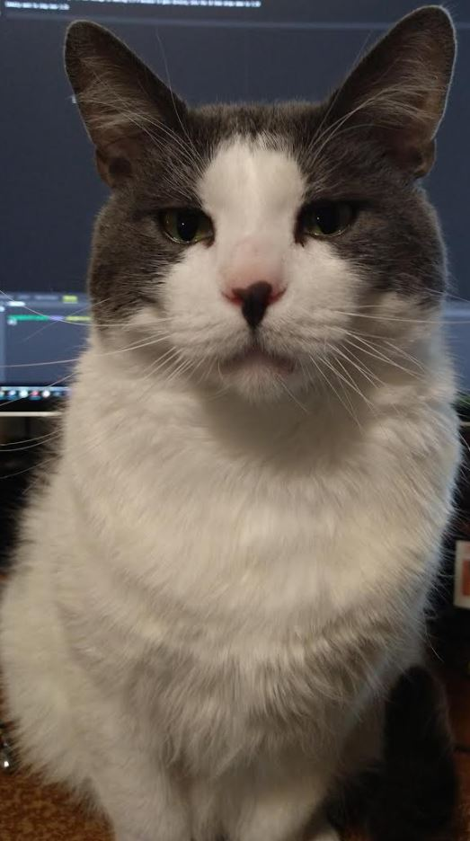

So this is a rare day where I work back to back... my sleep pattern's reversed right now so I need to flip it where I sleep at night and awake in the day time.

I'm currently designing the laser pointer holder that I will print in the morning.

Hehe this is quite a sight.

What will be interesting is the real math where I have to somehow store x,y,z points from the samples... although initially they will just be depth. I don't have real positioning yet until I actually use the IMU.

No... I'm not going to print this, I need to do this now. I will use a wire from a ground flag marker thing.

I have a whole stack of them but I can't find one. Found one

Yeah this will work for an approximation. I'm going to put a delay per command to see it more/exaggerate.

It kinda looks like a tank. Those are cool designs, 86!

Well look at that, two pieces of wire and we're good. This is not that accurate but good visual of what's happening.

Scan dimensions: 19.25" by 8.75" at a distance of 31.5"

One good thing from this is I realized my sensoring area is a wide AR/rectangle as opposed to a square, makes sense, it tilts up less than sweeps.

This is not that accurate because the laser while not perfectly straight, is also sticking far ahead of the center of the robot.

Still... it is supposed to be somewhat right since the beam is going along this line.

Oh yeah... I have a 3D model of this thing because I made every part...

I'm pretty sure this STL is broken but I want to see it on Github.

This will always amaze me... I mean this is what I will do with this project. Except it will be tied to real telemetry data/move.

Well this is a rough idea of what it is... it is weird that the beam doesn't go into the ground. This is what I got from the taped-on laser pointer.

This Tarantula pose looks cool but strains the servos (more current consumption) so I don't use it.

Okay I need to get this done, I can feel myself losing effectiveness as the night goes on. Usually on these sleep-pattern reset days I end up killing time by watching tv/doing mindless stuff as I can't function anymore mentally but I'm awake.

After I do this sampling/basic math/obstacle stuff, I will watch other insect quads and see how they walk.

It's funny you see quad designs all over like in Fallout 76 they have these small dog-size quad robots roaming around and I'm like "how the f does it walk?". But I didn't look at it too much.

Ahh this song is so good That's The Way by Led Zep

One main problem is the legs don't lift high enough/start catching on stuff (like the tape on the floor).

3:14 AM

Well the two things are published. I have not done the full video yet but that'll come later once I have the majority of the software stuff working as envisioned.

I'm glad (self pat on the back) as I've fallen into this thing where I'll post about some idea or whatever but it's not real. So I've been trying to refrain from posting/sharing anything unless it's real/I already did it.

Anyway now I'm back to this.

Oh man I'm feeling burnt though. My mind's spent/blank.

I should probably not drink anymore NOS ha... my head feels weird, I can feel my eye sockets.

I need to do some full speed timings and then estimate how many samples I will get/what angles... expected distances.

I think I will finally understand scalar/vectors with this project hopefully. I should... I mean I was a physics/eng major but it was a long time ago/unused and largely forgotten.

I'm going to eat real quick so I can get some energy to continue.

4:06 AM

I feel so fortunate for my cat heh look at him.

5:51 M

Back  to it

I did realize a flaw with my current plan... the robot would completely miss say something small near itself.
So I think I need to change the sampling distance/pattern/frequency.

Something acceptible but not excessive so the robot still primarily gets by using kinematics.

I have definitely lost the drive... I will be done doing physical testing for now. I will work on some geometry/math stuff with SketchUp and JS in the browser.

I am very happy that my robot is now tether-free and in one piece.

Now only software can save it.

I'm spacing out right now, getting distracted by random stuff.

Maybe the squiggle pattern is ideal.

I'm just trying to think about it from a side profile...

Damn I just noticed it's 6 degrees F lol.

After today I need to take a day or two off to work on something else (work related). Getting that stuff done, this project will be my reward to come back to.

That would be cool to do a simulated propagation of a beam... idk how you would even do that in something like Blender.

It would be cool to see it though, propagate and see this "noodle" go through space ha... probably doesn't make sense regarding speed of light and motion of the servos.

A key thing is this robot is blocky/has dimensions... let me get a measurement.

8" x 9" x 8"

Oh yeah I need to measure the height of the ToF beam at neutral pose.

It's like 3.5"

The other thing I have to figure out is the motion contraints... I think it's time to watch other people's gaits now, see what's wrong with mine.

After I listen to Butter Cup by Jack Stauber.

I have to consider like if it's turning is it a perfect turn or is it sliding some... which makes its target "hit box" a little bigger.

I don't have positional feedback or strain feedback on the servos but I could estimate/gauge if the robot is doing what it's supposed to be doing if the IMU math is checking out or not.

I'm looking at YouTube videos for "quad robot insect"

First one I'm looking at, by Erik Lely damn... thing's insane, servo strength no problem.

This one it can stand on three legs and not fall over... so I have to factor that in.

Next one by Kosmin Dumitru (designed by Regis HSU on Instructables) he walking again it's able to stand on 3 legs.

Haha the guy used SketchUp too to design his robot back in 

Able to lift itself from a flat position with all four servos, impressive.

This thing's amazing like when it moves it's linear. It doesn't go backwards, and also I notice the outer legs do contribute.

I'm trying to study the gait, it's hard/have to do stop frames/jot down leg position notes.

It does sway backwards some for the leg left/swing part, I think as part of shifting the CG, since the 3 other legs in tripod stance don't move on the floor contact.

Then the leg that does move it even swings the outer-most leg outwards to further reach forward.

Then the opposite quadrant leg advances.

Side neighbor moves forward, then opposite quadrant does not move forward, it actually just gets dragged forward... interesting.

Then this leg moves forward to start the next gait cycle.

Oh I see the gait now (lol watching at 0.25x speed), it's moving two sets of leg (by left/right side pairings).

So front left moves forward, then back left moves forward. Then the other right legs do the same.

Yeah this thing was made in 2015 damn.

Anyway I want to look at some other ones, see how they walk.

Watching another Erik Lely design, so clean/all internal

It's definitely a tripod... the thing is it doesn't tip in a direction like mine does, so it's naturally stable as a tripod. That's tough...

It looks like you can use... watching another one this one carries a big camera, damn... these servos are not 9G but I think the main reason it can carry so much weight/be agile is how short the legs are. I think it's a 2-cell design too.

And this one is just a 2-servo per leg design too.

The turning isn't exactly on axis but it's pretty close.

Anyway yeah... so main take away is, has to be stable on 3-legs without tipping. So the robot has to sweep partially to a position where three legs can be stable. Outer leg should be used at least to reach further forward (not too much but some).

Also the legs on mine are in a very pominent x-position where when it moves forward (sweep angle) it's not moving that much... 

The dog design is intriguing, I mean I can see why it's so bouncy/fast compared to an insect design.

I need to get dimensions on the legs.

I need to take a top view image of it resting.

Yeah these legs are like a rhombus/square not a rectangle where it forms a stable triangle with the CG near the middle of the legs points.

So... based on what I learned (stole) by looking at other designs, the three legs that will stay standing have to shift before lifting up the one leg.

Side note I've been listening to this song on loop That's the Way by Led Zep for the past idk 5hrs+

Making some coffee.

Doing some SketchUp image import/line draw measurements I get a 41.6" long wise by 31.2" width... so it's not square that's for sure.

I think the CG has to go in that direction before the back-left leg can move freely/swing forward.

Ahh man... I'm like wondering if my design is bad lol...

Need to look at some pivot top view videos and see if the CG shifts.

