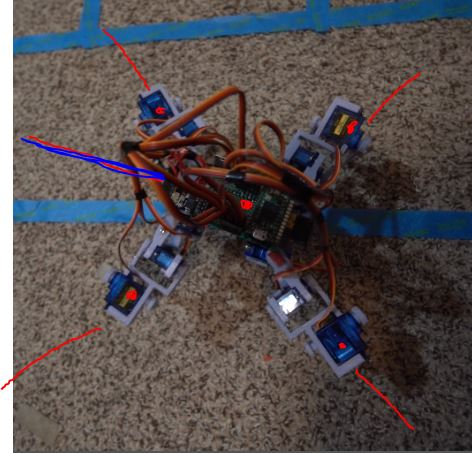

So this is a rare day where I work back to back... my sleep pattern's reversed right now so I need to flip it where I sleep at night and awake in the day time.

I'm currently designing the laser pointer holder that I will print in the morning.

Hehe this is quite a sight.

What will be interesting is the real math where I have to somehow store x,y,z points from the samples... although initially they will just be depth. I don't have real positioning yet until I actually use the IMU.

No... I'm not going to print this, I need to do this now. I will use a wire from a ground flag marker thing.

I have a whole stack of them but I can't find one. Found one

Yeah this will work for an approximation. I'm going to put a delay per command to see it more/exaggerate.

It kinda looks like a tank. Those are cool designs, 86!

Well look at that, two pieces of wire and we're good. This is not that accurate but good visual of what's happening.

Scan dimensions: 19.25" by 8.75" at a distance of 31.5"

One good thing from this is I realized my sensoring area is a wide AR/rectangle as opposed to a square, makes sense, it tilts up less than sweeps.

This is not that accurate because the laser while not perfectly straight, is also sticking far ahead of the center of the robot.

Still... it is supposed to be somewhat right since the beam is going along this line.

Oh yeah... I have a 3D model of this thing because I made every part...

I'm pretty sure this STL is broken but I want to see it on Github.

This will always amaze me... I mean this is what I will do with this project. Except it will be tied to real telemetry data/move.

Well this is a rough idea of what it is... it is weird that the beam doesn't go into the ground. This is what I got from the taped-on laser pointer.

This Tarantula pose looks cool but strains the servos (more current consumption) so I don't use it.

Okay I need to get this done, I can feel myself losing effectiveness as the night goes on. Usually on these sleep-pattern reset days I end up killing time by watching tv/doing mindless stuff as I can't function anymore mentally but I'm awake.

After I do this sampling/basic math/obstacle stuff, I will watch other insect quads and see how they walk.

It's funny you see quad designs all over like in Fallout 76 they have these small dog-size quad robots roaming around and I'm like "how the f does it walk?". But I didn't look at it too much.

Ahh this song is so good That's The Way by Led Zep

One main problem is the legs don't lift high enough/start catching on stuff (like the tape on the floor).

3:14 AM

Well the two things are published. I have not done the full video yet but that'll come later once I have the majority of the software stuff working as envisioned.

I'm glad (self pat on the back) as I've fallen into this thing where I'll post about some idea or whatever but it's not real. So I've been trying to refrain from posting/sharing anything unless it's real/I already did it.

Anyway now I'm back to this.

Oh man I'm feeling burnt though. My mind's spent/blank.

I should probably not drink anymore NOS ha... my head feels weird, I can feel my eye sockets.

I need to do some full speed timings and then estimate how many samples I will get/what angles... expected distances.

I think I will finally understand scalar/vectors with this project hopefully. I should... I mean I was a physics/eng major but it was a long time ago/unused and largely forgotten.

I'm going to eat real quick so I can get some energy to continue.

4:06 AM

I feel so fortunate for my cat heh look at him.

5:51 M

Back  to it

I did realize a flaw with my current plan... the robot would completely miss say something small near itself.
So I think I need to change the sampling distance/pattern/frequency.

Something acceptible but not excessive so the robot still primarily gets by using kinematics.

I have definitely lost the drive... I will be done doing physical testing for now. I will work on some geometry/math stuff with SketchUp and JS in the browser.

I am very happy that my robot is now tether-free and in one piece.

Now only software can save it.

I'm spacing out right now, getting distracted by random stuff.

Maybe the squiggle pattern is ideal.

I'm just trying to think about it from a side profile...

Damn I just noticed it's 6 degrees F lol.

After today I need to take a day or two off to work on something else (work related). Getting that stuff done, this project will be my reward to come back to.

That would be cool to do a simulated propagation of a beam... idk how you would even do that in something like Blender.

It would be cool to see it though, propagate and see this "noodle" go through space ha... probably doesn't make sense regarding speed of light and motion of the servos.

A key thing is this robot is blocky/has dimensions... let me get a measurement.

8" x 9" x 8"

Oh yeah I need to measure the height of the ToF beam at neutral pose.

It's like 3.5"

The other thing I have to figure out is the motion contraints... I think it's time to watch other people's gaits now, see what's wrong with mine.

After I listen to Butter Cup by Jack Stauber.

I have to consider like if it's turning is it a perfect turn or is it sliding some... which makes its target "hit box" a little bigger.

I don't have positional feedback or strain feedback on the servos but I could estimate/gauge if the robot is doing what it's supposed to be doing if the IMU math is checking out or not.

I'm looking at YouTube videos for "quad robot insect"

First one I'm looking at, by Erik Lely damn... thing's insane, servo strength no problem.

This one it can stand on three legs and not fall over... so I have to factor that in.

Next one by Kosmin Dumitru (designed by Regis HSU on Instructables) he walking again it's able to stand on 3 legs.

Haha the guy used SketchUp too to design his robot back in 

Able to lift itself from a flat position with all four servos, impressive.

This thing's amazing like when it moves it's linear. It doesn't go backwards, and also I notice the outer legs do contribute.

I'm trying to study the gait, it's hard/have to do stop frames/jot down leg position notes.

It does sway backwards some for the leg left/swing part, I think as part of shifting the CG, since the 3 other legs in tripod stance don't move on the floor contact.

Then the leg that does move it even swings the outer-most leg outwards to further reach forward.

Then the opposite quadrant leg advances.

Side neighbor moves forward, then opposite quadrant does not move forward, it actually just gets dragged forward... interesting.

Then this leg moves forward to start the next gait cycle.

Oh I see the gait now (lol watching at 0.25x speed), it's moving two sets of leg (by left/right side pairings).

So front left moves forward, then back left moves forward. Then the other right legs do the same.

Yeah this thing was made in 2015 damn.

Anyway I want to look at some other ones, see how they walk.

Watching another Erik Lely design, so clean/all internal

It's definitely a tripod... the thing is it doesn't tip in a direction like mine does, so it's naturally stable as a tripod. That's tough...

It looks like you can use... watching another one this one carries a big camera, damn... these servos are not 9G but I think the main reason it can carry so much weight/be agile is how short the legs are. I think it's a 2-cell design too.

And this one is just a 2-servo per leg design too.

The turning isn't exactly on axis but it's pretty close.

Anyway yeah... so main take away is, has to be stable on 3-legs without tipping. So the robot has to sweep partially to a position where three legs can be stable. Outer leg should be used at least to reach further forward (not too much but some).

Also the legs on mine are in a very pominent x-position where when it moves forward (sweep angle) it's not moving that much... 

The dog design is intriguing, I mean I can see why it's so bouncy/fast compared to an insect design.

I need to get dimensions on the legs.

I need to take a top view image of it resting.

Yeah these legs are like a rhombus/square not a rectangle where it forms a stable triangle with the CG near the middle of the legs points.

So... based on what I learned (stole) by looking at other designs, the three legs that will stay standing have to shift before lifting up the one leg.

Side note I've been listening to this song on loop That's the Way by Led Zep for the past idk 5hrs+

Making some coffee.

Doing some SketchUp image import/line draw measurements I get a 41.6" long wise by 31.2" width... so it's not square that's for sure.

I think the CG has to go in that direction before the back-left leg can move freely/swing forward.

Ahh man... I'm like wondering if my design is bad lol...

Need to look at some pivot top view videos and see if the CG shifts.

Oh my god I forgot I was trying to do this. Added the BOM on the README ha.

I will not fail, I can make all of what I want to make with this project. The telemetry/web interface stuff will be cool to do.

Oh yeah... it's still the same lol

Oh... just watching "Quadruped progress" on Erik Lely's channel.

It shifts backwards to away from the leg that's moving. Shifts as in tilts/rotates... which is what I do actually... hmm...

I'm back to the 4DOF video of Erik's damn... thing's so smooth.

Oh I think I see it for my case. If I wanted to move the back-right leg. I would outer-roll the front-left leg inwards (towards robot center) so that the robot sways forwards... possibly combine pitch control to keep it relatively flat. Then the back-right leg can also roll towards this direction until the CG is shifted enough, to stand on the NW quadrant 3-legs area.

I'm going to try it, I'm getting some energy again, my back is in pain though I'm slumping in my chair that is pretty much a stool due to me snapping the bolts off the back support one time ha. Cheap metal.

I did notice the servo wire bundle may block the ToF sensor, need to be careful about that.

[music stops]

I do need to pay attention real quick.

Coffee re-up, I have a real anxiety of not wanting to step on this robot.

I think I would legitimitely cry if I accidentally stepped on this thing.

It took soooooo long to make it...

Anyway oh yeah, I am thinking how in my head "Twerk lidar" seems like a catchy/gimmicky thing but I also did not really consider the impact of a sexual thing... you know western society... it's understandable... but I don't really know how else you get across the "single-point lidar on robot using imu and motion" thing in a few words.

Oh well... I'm not a "all eggs in one basket" kind of guy, this project will teach me a lot of different topics that I can improve upon going forward.

Random unrelated thought, I'm fortunate that I still have my build despite not working out for like 2 years now. I am fat though right now, working on it. I used to "body build" though like I would be in the gym 4 hours in a day be there at 3 AM in the morning, was whack. Mostly doing compound lifts.

The thing I have always lacked though is the mental aspect eg. confidence and social aptitude. You need that.

Back to this... I've seen footage.

Oh yeah, I want to shift the CG so that it can stand on 3 legs without tilting the body or moving in a different direction than the intended overall motion.

I want to see what happens if I just roll the outer diagonal servos.

Oh damn my cat gave it a test pounce but didn't hit it.

It's actually curious that it's stable when it's shifting the weight forward (towards the leg that's going up) but it doesn't tip that way... not sure.

I do think I have to factor in the up/down joints too.

Yeah it's too front-heavy... the diagonal joints actually could sweigh backwards... let me try it.

Oh I forgot to write this down. A truly OP program would have the robot figure out the best movement. You could ideally cripple it, like make limbs the wrong/random length, servos that are not moving... but the robot would adapt... it would move each servo one by one and figure out its effect on the body with the IMU state... that would be impressive.

I'm feeling some Fleetwood Mac man.

Damn Spotify "we don't need a 64 bit app" crashes.

Damn that intro for Stop Draggin' My Heart Around

Oh man... these worded functions are not gonna fly long term for example `cGsHiFtBaCkRiGhT()` ha.

Ehh... it's moving backwards to go forwards hmm.

I'm going to go back to what I have and see about extending the outer arc.

Nah I'm committed to making a new gait from the observed better gaits.

Yeah right now it shoots backwards, needs to sway backwards.

Eeh... might have dammaged a servo let's see... this manual length is kind of bad, should be pulled from object length so you don't have to type it in.

It might be stable enough to just move up.

Oof... gotta refactor this code... found the answer it's a multidimensional array and can use this [sizeof division thing](https://stackoverflow.com/a/24984668/2710227).

Well I was trying to be cool and turn that into a function but I failed, moving on.

Lol I run it and it doesn't move... goes backwards then forwards to same initial position.

...

I don't know... I'm thinking I have to change this robot's default pose. Something more like a T-shape. It sucks... but if it walks right...

It has to be the roll right... (what I already have currently) why does it suck then to move forward...

Watching old walking footage, the foot contact is moving like half an inch at a time total...

OMG... okay I'm going to dunce mode this and literally frame by frame grab the steps from a top view and compare the shots.

Random thought, the last time I was trying to go to college (2nd time) before finally failing out, I had this English course and you had a maximum days-missed otherwise you just flunked out... I don't know if it was 3 or something but it was not a big number. Anyway... it was pretty hard to get up, drive the ~6 miles (about 15 minutes), find a parking spot, walk to this building, take an elevator up 10 stories...

But part of me misses it... like my "job" was simple, just go to class for the 3hrs a day or whatever and maybe study a similar amount... you're in this bubble and you're free to do whatever. Like partying, just don't let it take over your life/get your stuff done still... make friends. But yeah... idk I kind of imploded. At this time I was not into what I'm doing now. I mean I had to take Java and I could not figure out how to write a nested for loop... I think I got a C- or something in that 101 class.

I had good times though. Good memories. It's just wild, your friend count drops from the 10s/100s to like 5 when you grow up ha.

I'm feeling emotional lol been up just under 24 hrs with 5 hrs of sleep.

Did I make it? Idk... I had a job where I made just under $90K/yr 6 years later after pretty much failing out of school.

Before I got into college I didn't know how a job worked ha... like hey, if you meet your basic needs you can live on your own... but I immediately accepted these debts, tanked my credit cards... $40K at the time was a big number... I was trying to figure out how to escape/just amass that money somehow. That's where I got the idea for building high traffic websites. I had really stupid ideas and was trying to make your cliche stuff like a dating site. That was another cool time when the fraternity house I was living at had cheap rent and I was unemployed. So I just had all the time in the world... despite my finances tanking in the background (default). I improved it later on eg. low 300s back to 750s but still...

Anyway... the feels report is over, back to work.

Good God I keep spacing out lmao... I was trying to map the motion... back to MS Paint.

# IN WAAAVEEEEEESSSSSSS

Lmao just comes to my mind randomly. Great song though.

Here it is, finally... just took a Tourniquet ha got eeemmm Breaking

Trying something else

The something else is changing the default stance so it is a wider x-shape (top view).

This is gonna screw everything up though... hmm.

Oh man I'm seeing things, thought I saw magic smoke from a servo but it may have just been some random 3D printing fiber or hot glue strand floating in the air.

Might be low on battery... I'm not using the tap. 3.52 oh yeah that's low.

Alright continuing on with change in stance.

Actually I think I will just go with the T-design since a different x I think will have the same problem.

Well that did not work, I did notice I have to adjust the back legs down to get it level again.

Pretty cool the voltage doesn't seem to sag while standing anyway.

Or... do you keep the robot asymmetrical on purpose... no... I could have one leg pre-advanced as the stable tripod.

Damn this one by Light Robotics balances on two legs due to its wide soles.

I'm supposed to make a 3D map of the world and I can't even get it to walk lmao.

Looking at this Sparklers: We Are The Makers robot gait.

I will say a common pattern I'm seeing/was suggested to me is to use a 2 cell design... the step down converters I had now would have worked but I was sold on the 18650 design.

Yeah this one is "t-like" as well. Where two legs are a bar and the other is diagonal... that's the stable triangle base.

Yeah... it's slightly offset by default huh.

yeah... when the code is more OP I will factor in the IMU. For now I will follow that static base gait approach by using an offset default stance.

