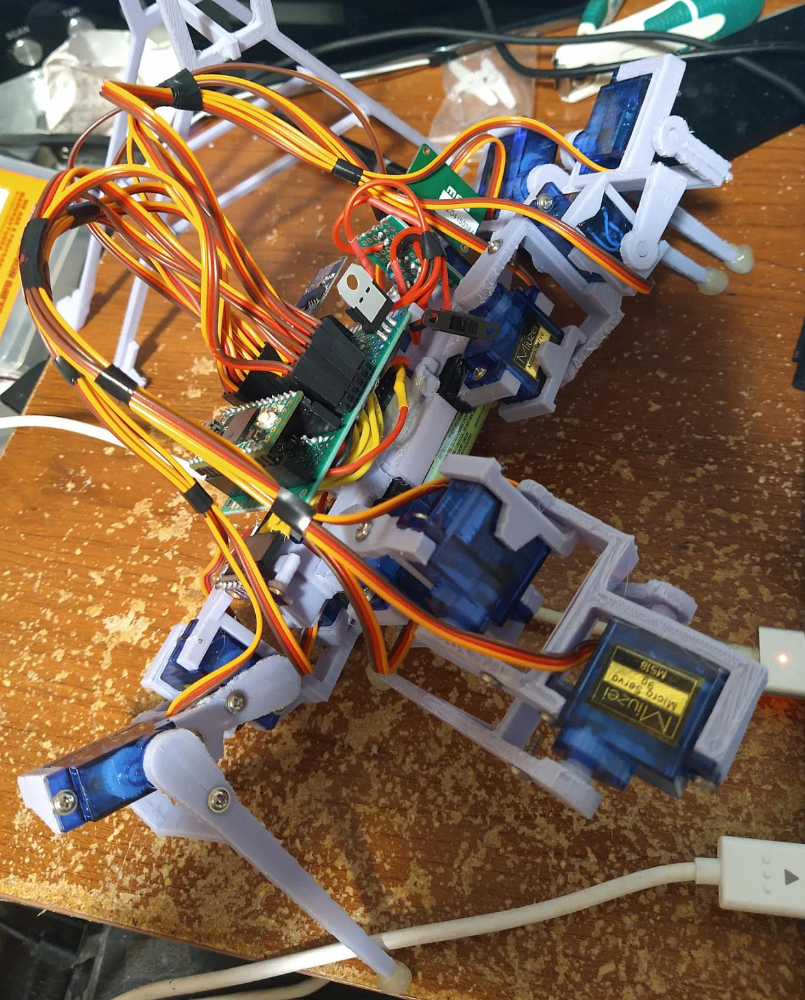

Ahh it's funny when you are fighting against your own code. It sucks... you try to defend against "spaghetti" but it seems to happen inevitably, particularly from the purpose of the code changing from the original intent.

I'm pretty spent already, put in 8 hrs to my "day gig", could have been faster but yeah as mentioned, fighting bad code = takes longer.

Right now I really want to get a sweep sample stored.

I was thinking about it, this isn't JS where you can just throw whatever you want into an array. The types have to be known/specified on initialization it seems to me.

Anyway I want to use the basic sweep, store angle, time-distance-sample pairs.

Then I think I should be able to take that "matrix" or whatever and make a depth map with it. Eventually I should be able to form a polygon thing again in ThreeJS that I did before. In that case though I only had 9 sample points.

Well I don't know how to use a clock in Arduino so I'll just use incrementing (part of the servo move all stuff).

It'll be easier for me not to mix array contents and just use separate arrays eg. an array of signed angle values for pos/neg and then matching those array indices the samples which would be a collection of floats... actually I'll just use the array count, no need for iterator thing.

I don't know the size I want but the sweep is either 30 left or 30 right so I guess I can go with 60.

Haha... online C++ sandboxes nice.

I don't get it... the sensor is supposed to consume no more than 19 mA... peak current 40mA...

And yet when the sensor tries to run with sweep gaits it just falls over/dies.

It just curls over and dies.

Is it running out of memory or something... I don't understand. I did see that I had the wrong data type on the multidimensional array value.

I think I stripped some servos.

Whoa this is weird... using serial print to read out hte values in real time... I think this is a max value
48322.48322

322.48 is the max value... okay

Oof man... I might have stripped some of these servos... I might have severely underestimated how much memory I have to work with, what I'm trying to do needs...

This is a real mystery not sure what is going on let me commit this.

I don't know if it's like I'm overwriting memory or something...

the float and int types are 4 bytes... 60 * 3 -> 180 * 4 -> 720 bytes... I think have like 1,000,000 bytes to work with so it shouldn't be that... but maybe my type mulplication is wrong? idk

I don't think it's a power issue, it say 20mA max pull from the sensor and we have up to 3A of power...

It is the scanning not the writing... huh...

Whatever is happening it just messes up the servos bad... like they jerk/and want to strip themselves. Let me see if it can still walk.

Oh man I got scared, using old move forward command.

It looks like a good robot now how it walks... thank goodness at least that part works.

Looks like single and double quotes matter in c++

The range seems to be within 180.

One thing I do see, if I'm trying to increment based on total sample I should not sample in both sides. Just one. I was doing in the incremnet/decrement servo write which when I was dumping the increments it was using both during a sweep...

It's odd... the sweep is slowed down by the sensor read.

I think the robot is dying too because it's staying too long in high torque situations... not sure.

Could it be this interrupt call in the ToF sensor read... hmm.

Hmm largest value I see is 120

Crap... I wonder if this is a major oversight on my part that makes this whole idea stupid.

The clock interrupt or something is affecting the servos...

I could try the timed sampling but I don't know how long it will take to sweep.

I am using the wrong sampling I think... should use single instead of continuous since I know exactly when to sample.

Whoa there's a sample limit on the sensor.

My servos move at 6ms or faster... and the sensor is configured to run at 20ms... wonder if I can get it faster... let me check the speed of the servos if this is what's happening.

"timing budget" 33 ms

Yeah that looks teh same speed okay... so it's stopping the servo movements per measurement by that speed interesting.

I can't see in the code what's the [fastest it can go](https://github.com/pololu/vl53l0x-arduino/blob/master/examples/Single/Single.ino#L56).

I don't know if I can drop it down to 6ms but if I can then I can swap the delay... nope looks like it's still slow.

Oh no... looks like I have to use 20ms at least.... hmmm

Oh no... omg... my project might be screwed because of this.

I mean... it does work. It's not the end of the world that it's this slow... idk why before it was literally curling up into a ball and the servos almost stripping themselves. I did switch to single sampling vs. continous and updated the speed from 33 to 20ms.

Time to ask someone. No actually I think it makes sense.

It's syncrhonous so it's not like I could parallelize it somehow and also the times don't match... the sensor takes a minimum of 20ms to sample a single point.

Let me see how it does scanning over and over.

Man that is painful to see how slowly it's grinding through those gears ha.

I'm half tempted to make a pan-tilt assembly thing but... that'll be heavy and it will still be slow... just less things moving.

I also realize that without coordinating the outer legs, the robot skips/hops around and that shifts the IMU position.

If nothing else I guess my values will be very accurate since it's so slow.

Oh... instead of sampling every degree it could average.

Yeah just threw a mod 5 in there and I can see it operate faster.

The problem now is I don't know how to group/center this data.

This is kind of cool, these are in inches cuz I'm an imperial scrub

322.48 is measuring the sky/large empty space. I believe it's at least 6 ft away as this sensor's range is 6 ft.

The last bit at the bottom is it pointing at the ground.

3.81
322.48
322.48
322.48
322.48
322.48
322.48
322.48
322.48
322.48
322.48
322.48
322.48
322.48
322.48
322.48
322.48
322.48
322.48
322.48
322.48
2.28
2.72
4.69
322.48
322.48
322.48
322.48
322.48
322.48
322.48
322.48
322.48
31.77
322.48
14.09
13.43
12.48
10.51
11.85
11.50
6.06
2.95
2.40
1.93
2.48
4.29
4.49
2.17
1.97
2.28
3.74
8.43
10.43
0.0

I got it, if it's a sweep servo, use that value. Inner most servo.

I need to look at the moveServos code some more and figure out how to group these points. I actually could try and work with these numbers. The ones above.

Oh yeah the points are supposed to be from the IMU not the servos... how accurate those IMU angles are is something else.

But I could combine/check agains the servo angles maybe.

Just chillin before I sleep.

Just thinking how I'm looking forward to figuring out how to use the IMU.

For example to get the angle, can I just use trig from the gravity measurements per axes? idk

10:00 AM well... let's continue the party, can't sleep, need to try again to reset my sleep pattern that I failed to do last time.

I am going to step through the moveServos function that takes in an array of servos and their start/end positions.

I will use that for the horizontal angle starting out. I should ideally be using the IMU but I don't know yet how to get angle from it... is it that simple?

Look at this ha Imma glance through [this](https://stanford.edu/class/ee267/lectures/lecture10.pdf).

Oh no they use Y as their Z axis... hmm.

Man this is brutal, I got to a point in physics where a problem would take 7 pages to prove. I'm just looking at this page of symbols like an idiot.

This is what I want this "Orientation Tracking in Flatland"

wtf... this link [here](https://www.digikey.com/en/articles/using-an-accelerometer-for-inclination-sensing) literally says to use trig... huh.

Crap, I could get pitch I couldn't get sweep... there's no constant reference like gravity.

Lol Accel [says](https://docs.sewio.net/docs/spatial-rotation-determination-1018325.html) "impossible to calculate rotation around vertical axis"

I don't even get how you would integrate... well I guess you need time and then plot the values you have... idk.

> unit quaternion

Oh man there it is.

So you want all three which I have a 9-axis one so that's good.

Lol it's like "can I just skip 30 pages of a [paper](https://arxiv.org/pdf/1704.06053.pdf) and know the answer?" no...

Ahh man... well I think for now since I'm spent, I'll just do a dumber task (more gait programming).

I think I will try and read through this paper though and really understand what I'm trying to do.

It will be my goal to simplifiy that. Actually I'll put that somewhere.

Yeah so made a file under "world". Will fill that out when I can answer it after learning.

Well I found out how to move sideways ha.

Damn it takes huge steps moving forward lol.

11:05 AM

Still stuck trying to make it turn left. I've tried many combinations of which leg goes up then what, problem is the balance.

Well this was a fail... I'm just looking at it stupidly ha... why no turn.