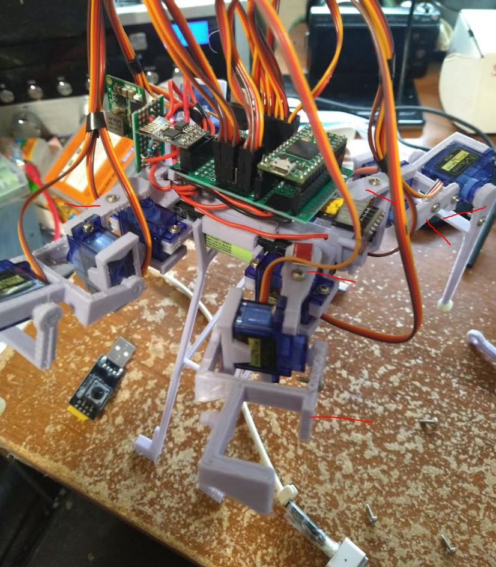

Quick mod idea, only start sending data to ESP from Teensy after web client has pinged it.

Also need to investigate speed to send bytes.

My intent is to speed up the web refresh so I can film/demonstrate it.

The usb disconnected means no messages from Teensy is still a thing, no response on my question, no solution yet.

[Where I'm at](https://www.youtube.com/watch?v=zFNvpdsRMnY)

The data stream is better after some updates on the ESP

Yeah... I'm not sure if my math is not 100% right or something, like if I need to negate the gravity vector...

I could try it. Let me try serial write instead of print on the ESP side

The Teensy when writing to the ESP, esp doesn't get it.

Esp can't write to Teensy...

I checked they are electronically connected.

Let me check ground... it should all be grounded but checking.

Everything's grounded.

Tried 9600 no change

I don't really want to do this, but I'll do it (risk of desoldering something).

I'll just make sure gnd is definitely connected.

Well that didn't do anything... sadness

Dang... I can't figure out what makes it start working with USB plugged in.

I'm not even using serial for USB on the monitor now and it still works somehow.

I'll try this define thing instead of calling it directly.

Oh man... I dropped the robot oof... not too far but it definitely messed a servo up or two.

Thankfully it's fine I think it just came off from the top of the servo hoop thing...

Oh damn it's Mando... well taking a break.

Yeap I definitely stripped that outer servo where I dropped it, I can move it freely no resistance.

Man these legs need to be thicker regarding the screws trying to split the material.

Not too bad of a leg swap.

The areas in red are the places that split.

Made some progress on the comms issues... still happening but have some ideas.

Not a comm issue just serial buffer build up.

