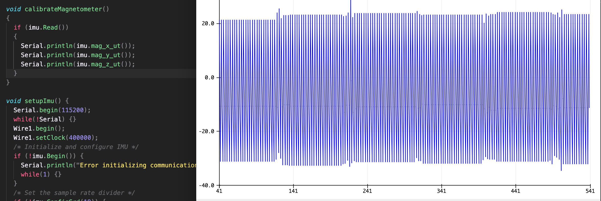
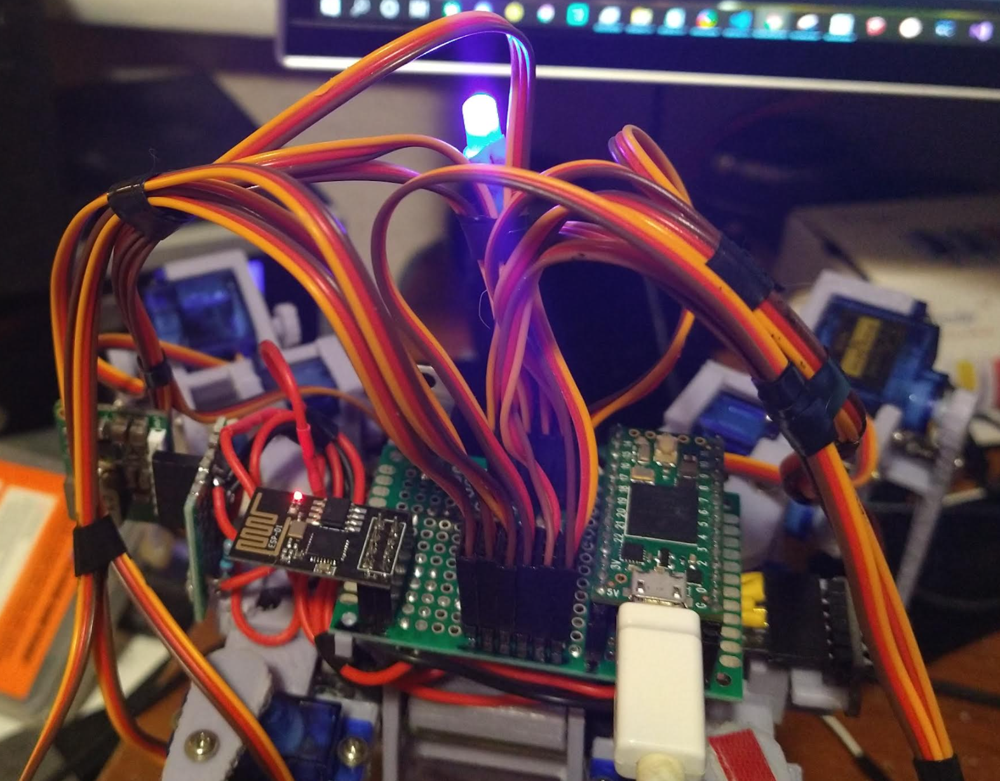
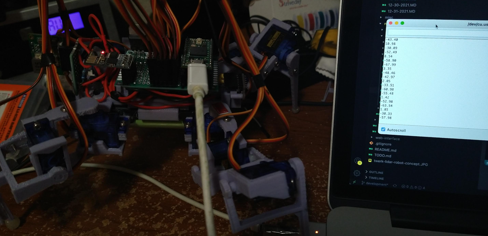
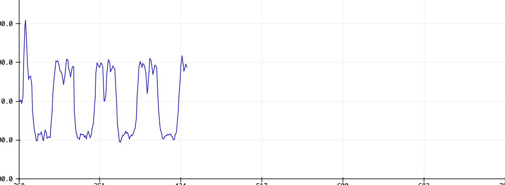

The word is yes...

I've watched this video so many times "in this video..."

In the video the axis pointing at the ground is whatever is the correct one.

It just doesn't make sense/match with what I've plotted where DEN is plotted but somehow the North line (should be horizontal) is down (green axis).

I've been working a lot lately which is good so I put this aside briefly. It's the weekend now though.

I unfortunately fell asleep early at 8PM and woke up recently it's 3:22 AM now.

I changed the NED result so it's outputting NED vs. DEN.

Then I'll match the axes colors I've set before eg. x red, y green, z blue

Okay I did notice his viewer has axes labels, Down would be my Z, North would be Y and East is X.

But right now down is green (Y), then blue and red are on the same plane.

I made my coordinate frame in ThreeJS to use x, y, z where Z is vertical to match the IMU axes.

What's interesting is if I only plot the N and E outputs, I don't have a vertical blue line.

Omg I got it, it was my material colors being called after plotting.

The rotational axes don't match though... if gravitry is down, I can rotate it away/towards me (robot front facing to my right) and it will appropriately tilt the gravity axes. But if I pitch they're flipped... not sure what that means.

Well let me continue on

I think I'm good, it looks like it generally follows it where the axes pointing into the ground matches what is plotted EXCEPT the North axes, that is not 100% pointing at the ground when I point it at the ground.

Problems with this implementation

Magnetometer problem

Dang this library does not have calibration, I'll have to add that.

I'm tempted to add a visual LED to indicate what the robot is doing like "blink blue to calibrate gyro" kind of thing.

Maybe I can use the Arduino Serial Plotter to do the calibration visually.

Will watch [this serial plotter video](https://www.youtube.com/watch?v=N3hiSV-B4v0) once I know what to do.

Actually I'm going to try and plot the mag x, y, z values real quick I should see three lines.

"perfect sphere centered at origin" what does that look like on a 2D graph?

I've seen something before where they just aligned all the lines on a 2D approach.

"Spin it around in all directions"

Watching plotting video now

Well this is interesting... trying to figure out how to get separate lines

So when I plot them individually the

x axis is around -31, -32

y axis is around 23, 24

z axis is around -11, -12 

Oh yeah this is sitting still, I need to rotate it about the axis

I'm looking at this [site](https://makersportal.com/blog/calibration-of-a-magnetometer-with-raspberry-pi)'s visuals

"need to be rotated 360 deg in at least two directions"

I don't understand what it means to "calibrate"

I mean visually I see it on a circular/sphere plot "get the center to be 0" but if the value is -12, am I supposed to add 12 so it's 0 or no...

or do I get the maximas and find the average, that's my offset depending on direction?

Ahh man I keep unplugging the Teensy as I rotate it due to the loose USB connection.

I am going to take some big strides even if they're not 100% right just so I can get the overall project completed. Then I can go back and improve on specific details for the next version that will be even more expensive so I use better parts.

I guess if I'm looking at this graph, (makersportal link above) of making the offset circles all concentric... how do you do that?

For the red circle its max vertical values are 35 and 5... to get it to have a 0 axes at 15 and -15 you had to... that's 40 wide, subtract 20?

So I'll use that approach, find the min/max of each sample set and then I either add or subtract that offset value of whatever is read.

Not sure how many samples I need though. 60hz is 16ms I could try that...

Not sure what 60hz would mean

I think I need at least 360 points, maybe do it twice in that axes

Takes like 1.5-2 seconds to do a 360 rotation "normal speed by hand"

5ms for 180 samples per second

I can't calibrate this without seeing a visual... the USB is too loose.

I might have to solder on an LED. Something simple like "flashing means get ready" then solid means rotate and it just goes in order, I don't have an RGB led.

Man... I have to solder onto the board.

Looks like a 220ohm resistor will be enough for an LED.

I'll see what pins I have.

Looks like I'll use pin 23, right next to the analog battery tap

I gotta find an LED that works.

Cool... it kinda gives the robot life having a little LED I'm using blue.

Oh yeah I did later on think I could just use the blink LED on the Teensy or whatever oh well.

Now it has more character a little blue LED. Now to test.

Haha yay I did it so stupid

I had to take the board off/solder under the servo wires but yeah it works.

It is cool assembling a system out of many parts.

Ha that's cool, I added the light to indicate when to rotate.

Let me try it

It's X then Y then Z rotations

So... pitch, roll and then yaw

Alright I'm going to move on assume this NED and mag is good.

What I'm missing still is accurate yaw for the sweep

This estimated linear acceleraiton by input is not gonna happen... these servos have no feedback and it slips... can't tell accurately if it's moving right.

Adding gyro

angular rate * time, compare against previous

Dead reckoning

Integrating gyro measurement

Need to know initial position and bias issues

integration deals with noise

Oh okay so NED is attitude "where is down"

Use mag field and gravity to correct gyro drift

Gyro for rotation and linear acceleration

So... I need starting position and then as I sample the IMU and it rotates I track the change in angle...

Need to look into the angular rate more what it means.

Default error rate is +/- 2000 deg/s (referencing Bolderflight readme)

Although mine is using radps, first thing I'll do is convert that

So it looks like it is positive when rotating to the right... which is interesting as that's opposite of right hand rule.

Makes sense for clockwise/anti-clockwise.

Numbers get bigger faster you turn, makes sense steeper graph, steeper area under the curve, bigger rotation

The trick is... this has to be sampled "in real time" as the servos move. The servo delay is 6ms.

So if I sweep left I should measure like a 20deg angle or something/be back to zero.

At least the IMU is not as bad as the ToF where it's capped to 20ms sampling range.

The sensor read has to happen in the servo motion call

Yeah this will work

See as it does the sweep it's reading the sweep angle

So I think a goal for me this weekend is to be able to put a box in front of this robot and it will create a plane of the intersected points that's visible in ThreeJS.

Of course that's just visual, this "scanned world" will have to exist in the Teensy's state as it moves around and decides where it can go.

And then I will definitely know what's wrong with it if it completely doesn't track. I won't expect it to be perfect after all it's not like it's producing a point cloud using an i7 or something and also I barely understand what I'm doing/bad at math.

Oh actually I could serial plot the sweep... and see it make a sine wave hopefully.

It makes a W shape for one "period" which is the S pattern

The graph above is two sweep runs

Then I will have to combine forward acceleration/backwards, etc...

I should be able to move the robot based on the plotted things in 3D world to show where it is roughly

Oh yeah... the ToF will govern how fast the IMU samples anyway as the ToF has to get a measurement for every position traveled. Which I was considering halving/reducing so it's not so slow.

Still... it might be good to keep it because of how few data points I have...

Going to see how bad/slow it is with ToF on

Can see how slow it is (15 seconds) for a full sample

[video](https://youtu.be/1mwHDsSzAXE)

Anyway I have to go buy food first time in not sure how many weeks but need to do it today. I try to go early when there are less people.

Note: need to charge current battery at 3.7V