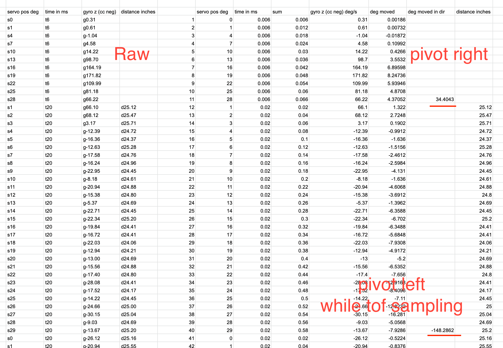

Well that was interesting. Yesterday I laid down and passed out for 12 hours, guess I was tired.

I've been up for 7hrs or so already, did some other work. Now back to this.

I did have a thought (ooh good job) I could sum the directions eg. positive/negative (left/right sweep) for the cummulative angle based on the rate times elapsed time.

Will be interesting to see how accurate it is.

For example the sweep pattern pivot right moves 30 degrees right then 30 back, then 30 more the other way.

It is unfortunate that is kind of a waste of measurements/double sampling.

I need to only sample in one direction.

Alright music off, this is time for some serious thinking.

Drawing pad out.

Oh yeah there is a difference between the ToF sample and the IMU sample for measuring change in rotation

They do have to be paired together eventually.

At the moment I just want to see that I can get a decent "elapsed rotation" kind of deal

I think I will start sampling from the middle, then going backwards I won't and then continue sampling the other way. Only because I am starting from the middle from the initial position. That will then get added on to determine where the robot is in the future.

For now I will work with the sweep tests to reproduce covered arc.

I also wonder if I've measured one arc can I assume the rest are the same except for the pitch angle.

I think my common ground is the servo positions, those will line up

Interesting overflow on some accel measurements

It does suck that robot skips/jumps due to the outer legs not rotating

Man... think I'll use 0.0001 precision that's apparently human scale according to this decimal degrees thing which is probably not related but

Not sure why this is happening apparently ovf is 4294967040.0 + or -

So how am I getting that from accel values, 10 digits long

The largest value I see is 3.16 rad per sec which is 181.054728 deg/s

That is 10 digits long but decimal is on the left/not signed under 4... idk

I'll just keep the values in radians

Now the values are too small hmm

Well... if there's an overflow I'll just chuck it right? ha...

Oh yeah I'll check if truncating the serial print output fixes it, it did interesting

Yeah one of the values is insane,  like wtf is this 196153008.00

Anyway I'm going to line these up and see if I can make sense of them in a spreadsheet

IN WAAAAAVEEEEEESSSSSSS that's how my tears flow as I work on this project

Ugh I keep getting 0.00 on the accel vals even after upping the decimal points to 4 digit precision

This is bad I keep getting 0.00 for gyro rotation

Okay I think I was just printing the vector stuff out wrong

There's actually no guarantee it returns to the exact same spot so I could keep measuring gyro the whole time it's moving

I'll be able to tell where it switches direction based on sign change

And I could add flags

The IMU doesn't slow the robot down unlike the ToF sensor so cleaning up duplicate passes is just math

Looks like I am missing data, will update heirarchy to check imu.Read() first

It looks like it drops data when it's moving fast eg. 6ms

I might have done this math wrong

Unfortunately these numbers don't make sense

I'll brb going to cook some food

