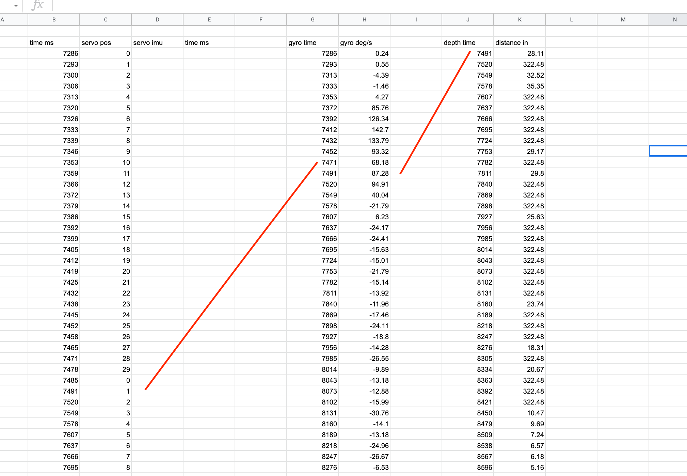

Well that was interesting. Yesterday I laid down and passed out for 12 hours, guess I was tired.

I've been up for 7hrs or so already, did some other work. Now back to this.

I did have a thought (ooh good job) I could sum the directions eg. positive/negative (left/right sweep) for the cummulative angle based on the rate times elapsed time.

Will be interesting to see how accurate it is.

For example the sweep pattern pivot right moves 30 degrees right then 30 back, then 30 more the other way.

It is unfortunate that is kind of a waste of measurements/double sampling.

I need to only sample in one direction.

Alright music off, this is time for some serious thinking.

Drawing pad out.

Oh yeah there is a difference between the ToF sample and the IMU sample for measuring change in rotation

They do have to be paired together eventually.

At the moment I just want to see that I can get a decent "elapsed rotation" kind of deal

I think I will start sampling from the middle, then going backwards I won't and then continue sampling the other way. Only because I am starting from the middle from the initial position. That will then get added on to determine where the robot is in the future.

For now I will work with the sweep tests to reproduce covered arc.

I also wonder if I've measured one arc can I assume the rest are the same except for the pitch angle.

I think my common ground is the servo positions, those will line up

Interesting overflow on some accel measurements

It does suck that robot skips/jumps due to the outer legs not rotating

Man... think I'll use 0.0001 precision that's apparently human scale according to this decimal degrees thing which is probably not related but

Not sure why this is happening apparently ovf is 4294967040.0 + or -

So how am I getting that from accel values, 10 digits long

The largest value I see is 3.16 rad per sec which is 181.054728 deg/s

That is 10 digits long but decimal is on the left/not signed under 4... idk

I'll just keep the values in radians

Now the values are too small hmm

Well... if there's an overflow I'll just chuck it right? ha...

Oh yeah I'll check if truncating the serial print output fixes it, it did interesting

Yeah one of the values is insane,  like wtf is this 196153008.00

Anyway I'm going to line these up and see if I can make sense of them in a spreadsheet

IN WAAAAAVEEEEEESSSSSSS that's how my tears flow as I work on this project

Ugh I keep getting 0.00 on the accel vals even after upping the decimal points to 4 digit precision

This is bad I keep getting 0.00 for gyro rotation

Okay I think I was just printing the vector stuff out wrong

There's actually no guarantee it returns to the exact same spot so I could keep measuring gyro the whole time it's moving

I'll be able to tell where it switches direction based on sign change

And I could add flags

The IMU doesn't slow the robot down unlike the ToF sensor so cleaning up duplicate passes is just math

Looks like I am missing data, will update heirarchy to check imu.Read() first

It looks like it drops data when it's moving fast eg. 6ms

I might have done this math wrong

Unfortunately these numbers don't make sense

I'll brb going to cook some food

I wonder if it's related to sliding, I'll get another sample where it's on the floor and work that out

I also have not calibrated this

I wonder if I need to use an external clock vs. just adding on 20ms or whatever

Going to try using `millis()` for counting time

I am worried that this is not good enough to work... like the accuracy of the sensor/math

Okay so w is angular frequency, Omega symbol, angular velocity

Let me see with calibration if it's any better

Have to remember the axes to rotate when calibrating by the blue light

x, y, z -> pitch, roll, yaw

Well... after doing the "calibration" the values seem better as in near each other however I'm still only getting maximum of near 15 which I could naively say "well that's half of 30" but it should have moved 30 degrees.

I wonder if it would have been better to use a pan-tilt system and track the body itself

I'm going to print out the offsets and fix them

I will also do a sample where the robot does a sweep without pausing

I will see if the angular velocity * elapsed time matches 30 deg

lmao 0.00 no

Oh... this calibration isn't even relevant actually it's for mag dang it

Well I think I said this before but the faster rate has lower data points probably due to the if imu.Read() check

Maybe I could try and "fit the curve" or something for the missing lines

I mean the slower one is what matters

This time I'm measuring all servo positions against the millis clock

Ahh crap I already screwed this up, I need to log the servo pos of measured imu as well to line them up

Ooh... I can go super op, use the millis() as a key for all the maps and then sync them that way

Yeah... I have to do that, going to confim some things on the online sandbox

Oh man... yeah the samples don't line up at all

I'll definitely have to approximate

I'm tempted to "port" this code to JavaScript as it's easier to do stuff there for me.

See below

Yeah with JS I can line these numbers up and then dump them/copy paste into excel

Yeah I can split the data by line break and then iterate over it

I started to do it but I might just be lazy and do it visually/through excel I'm feeling spent already.

I was trying see [here](https://jsfiddle.net/khs5nt2d/2/)

Oh yeah the offset in the image above is primarily due to not sampling on the first motion (pivot to the right) since it backtracks and does a "full sweep" to the left (counter-clockwise rotation from the top view).

Oh nvm it does match just fine crap, going in circles

Yeah see the crappy samples which it's not supposed to here

Oh okay yeah the way to fix it then is to double sample so it moves slowly the full arc, it's particularly important because this is the 0 position/starting point

Ahh man I gotta do another sample

Yeah all the values line up

Yeah... it seems to be 15 deg is one way... am I missing something here?

Granted this thing does not rotate perfectly and it actually jumps around/introduces shock

I still don't get the 15 deg though if the servos move 30deg

I will do a visual check

Don't have that protractor...

I'm going to see if I can print one

Awe dang somehow the color cartridge exploded

Dang it printers usually always have a problems don't know why

I'm going to film it, and take before after/measure angle in SketchUp lol

Unfortunately this is pretty much it for today/spent. Starting to get busy day job wise too.

Making progress though

