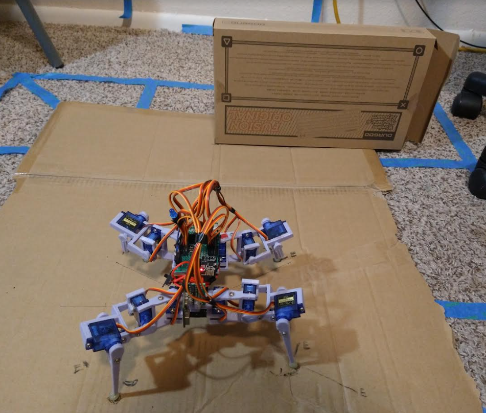

To recap from yesterday, I was able to prove the angular velocity sum measured by the robot in a sweep phase visually.

The robot when sweeping moves 30 degrees but for some reason it was only moving 15... I'm going to check today the walking gait default stance how it aligns with the sweep command's initial servo positions.

Then assuming those are not aligned/I update it, I should get the full 30 degrees.

Then I'll be able to do the pitch as well, and do a sample/map it.

The mapping I am concerned about from a data-transfer perspective.

It seems that my current design is bad/the two devices eg. Teensy and ESP get out of sync and the serial builds up/fails to get to the web interface.

It's possible (I don't want to do this) I may need to swap how it works where the ESP is a websocket client and the web is websocket server.

On the mac now going to update the servo positions.

It looks better now it doesn't jump

Now to process and see if it moves 30 deg... well I'm still getting 15 degrees of turn huh..

I'll have to verify it again externally

Well... idk how to make sense of that. But at least I can pretty reasonably trust the IMU values

The error seems to be between 0.0045 to 2.015 to 1.63...

So at worst it is 2 deg off.

Which means what? there is this 322.48 max value in inches which is 16 ft?!

But the sensor is rated for 6 ft... really the only thing I care about is the rough dimensions of the robot.

The robot is about 8.5" cubed, which that's a tight measurement, that's when not in motion, in default center walking gait stance (not a mirrored x, trailing leg)

I will probably have to do the initial web plotting (ThreeJS) manually in steps eg. I'll do pitch up, sweep, center sweep, then down sweep... make a mesh out of that and check it against a box/3D in SketchUp

I'll turn off the legs and get max dimensions. It's 10" in this position

This is a cool look but it'll never be like this because the servos are too weak/pull too much current to get up from this position.

Alright let's continue

So the robot is at most a square foot, that's really an over estimation more like 75" of that.

Oh man that' so cool, like I designed that

I'll do 24" (2 ft) scans for now

15 deg is not good enough of a scanning width

I will have to update the sweep to move more

Unless I got farther eg. scan 3ft away

Looks like I can get 10 more degrees (max 180) let me see how that looks.

Oh yeah that looks better

I just want to know that if I scan directly ahead I won't hit anything.

I did have a concern of height, will check that eg. overhead.

That might be overkill to go 25 degrees up.

Ha at 15 deg up it's almost exactly 8.5" nice

The down tilt will be interesting since it's close to the ground already

Hmm if it tilts 15 deg down it'll scan about 7.5" in front of it

I'm getting distracted need to keep going. I did work already today need to use this time, will be busy again most of tomorrow.

Wow the amount it moves now is nuts, let me do another visual confirmation of the rotation

WTF now it's 30 degrees lol

I just added 20 deg to the ending position thinking that's 10 more deg eg. 25

I can check on the spreadsheet

I wanted 30 deg to begin with but I'm just not able to explain it with the servo positions

I have it moving 50 deg right now.

Using another image though it is moving 25 degrees as expected.

Another image as in the right-most position

I'll check in the spreadsheet now

Hmm... it's still just calculating 15 deg not 25...

The samples have not increased, they should have

Awe wtf... my changes were overwritten from pulling down hmm

Almost looks like the farthest sweep angles might measure the distance from the arm itself

Wow went from 90 to 150 points yeap...

Man these values are not great: 26.84, -22.95, -30.14

That's for pivtoRight, pivotCenterFromRight and pivotLeft

Anyway I need to get going, need to do pitch angle still and then use sample data to plot

Is it bad for me to ignore the pitch up measurements it's just a single dimension/slice.

Really I'm approximating a plane from 3, 2D lines

Ugh... I already feel spent. I've been on a normal sleep pattern lately eg. got up near 9AM

I have to think about how this data is stored as it collects the data.

There will be 450 data points per scan. Probably less once I remove the parts that don't matter eg. first pan to the right.

I also can't help but think this thing has some gaping holes in the scan pattern.

A complex irregular shape like the bottom of an office chair where you see two points of a V pointing towards the robot... if it doesn't see it height wise it'll just think it's not there... to which the linear acceleration check would tell the robot "you ran into something" and then put a box here/back away from it.

The lazy way to do it is to have three vectors. A slightly better way is a matrix/vector of vectors.

I can see what I want to achieve, something like this:

This is a simple example

Then the plotted area in ThreeJS would show the green area as a deformation to the expected plane pattern if there was nothing in front of the robot.

Ugh... I just feel beat damn it... too early

I will get those measurements today even if I manually step through it. I'm taking a quick food break but it's not really like I have to figure anything hard out, I just have to do it.

5:59 PM

Reeeeeeeeeeeeeeeeeeeeeeeeeeeee

Let's go renewed energy ahhhhhhhhhhhhhhhhhhhhhhhhhhh forcing myself to do this

I need an ego boost, will post a project update video once I get that scan down

What I'm going to do is get this data one plane at a time, there are three to get

Then I'll put them in excel to work with manually.

All of this will be held in the robot's world state.

It would ideally be reduced/chunked down somehow.

So yeah, I will put the robot in a fixed location, it shouldn't move too badly, since it's no longer jumping around.

Actually I'll put holes in the cardboard I'm using.

Then I'll do the measurements in three separate goes (what).

Hmm... it actually would be tough to do discontinuous runs due to the robot having to support its weight.

When it's programming the servos go dead/move under gravity.

Oof... 7 sets of data does that make sense

up, sweep, down, sweep, down, sweep, up

Then I would have to subtract where it backtracks (servo pos flips back to 0)

I think I'm just going to do this a dumb way

This is what I'm going to do, the performScan() method has bene broken down, every step has a data capture/dump step

I'll put a very long delay, enough for me to copy/paste the 6 cols of data then I'll continue with each step

I'm going to do a full run just to see it

Actually it'll be smarter to just copy the entire serial dump and sort it later

So here's the test setup, a box is a foot away, at midpoint

box face dimensions are 13.25" by 8"

First run is full speed, will have it on video

Oh crap I forgot to catchup the other sweep commands, lucky the motions weren't too far apart

Hmm there are only four that I already modified why did the legs go into a weird position

Oh okay that's normal because of the pitch motions and the outer servo arms not moving

Hoo man that was intense capturing that data alright I will process it on a bigger screen

I did have a thought (ooh) the bottom angle should be shallow enough that it's looking out at least a robot length ahead.

I'll have to check what that is.

It's possible I'll do more slices or do that true s-shape scan that's continuous just harder on math/data storage.

Hmm the tilt up measurements don't exactly match

It looks like it's 20 degrees roughly for tilt up/down, unfortunately the number is not even on all servos, some are 15

Oh... it's because the ToF sensor wasn't sampling dang

I can do it again... lmao

Ahh man my hands are so dry ick, feels bad typing

Oh man there are 900 lines of data per sample haha crazy

It's redundant but still the fact that it outputs that on serial monitor

What's interesting too is since the outer legs don't move and it slides around the start and stop positions are off

The one thing that's good is this robot has all the time in the world (until it dies) so it's okay if the sampling is slow.

I mean it moves slow too so yeah. As the "algorithm" gets faster it can move faster, but that'll be for a future robot where it's not using servos/slow as hell.

I have an idea for a robot that's a tall quad and uses a camera-tripod's legs for its legs. Little rack and pinion type gear to lift/lower the legs.

These numbers are bad, it says it pitched up 2.5 degrees vs. say 7deg min out of 15-20 degrees up.

Again this could be reality due to the problems with sliding legs, I'll have to do a photo comparison to check.

I'll do that it won't be too hard.

I'll get horizontal, up, and then down

Hmm 3.9 deg up

Down is 9.2 deg

Oh man... 3.8 down cool

Hmm 2.5 to 4 deg

I'd be curious how it differs on carpet where it slips less

Oh damn... I did the analysis wrong on the pitch too it's supposed to be on the line of the ToF sensor not some random line... I mean they are all parallel but offsets.

I think the rotation point is the battery line, as that's where the servo pivot points are roughly

Revised measurements, 4.3 deg up, 9.2 deg down

Oh it could be because of the asymmetric leg position

I'm looking at this datasheet from [Invensense](https://invensense.tdk.com/wp-content/uploads/2015/02/PS-MPU-9250A-01-v1.1.pdf)

Left or counter clockwise is positive for Z (yaw)

Up or counter clockwise is positive for X (pitch)

The gyro values are not negative when going down/clockwise.

I think I'm going to have to check the pitch controls and try to minimize other movements other than the intended.

It's probably the pitch angles weren't updated after the walking gait was done.

Sweep is looking good though, particularly after I updated it... so it could be that, the servo positions don't match

Anyway, this is going to need more work, the data I have now is probably crap but I'm getting there

