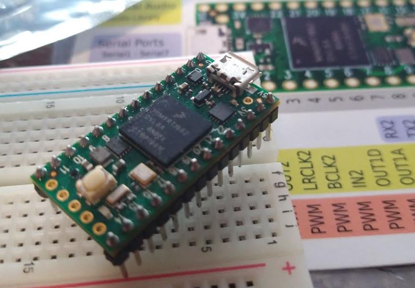

### First thoughts
So... I'm pretty beat. I haven't done much of my own stuff for a bit as I've been working two jobs. My own choice, more money but yeah.

This is a project I've had in mind for a while. After the first robot I made which sucked because it was mechanically weak and stupid (runs into obstacles); I wanted to make this one which will probably also suck... it's why you see Lidar systems that are spinning to cover more area. The gimmick of this thing is that it "twerks" to move the beam around. Really it would generate something like a conical/spiral pattern in front of it and using the onboard IMU for tracking, it should know where things are. An ideal thing is to use an onboard camera with basic image processing... I'm using a Teensy 4 for this and I don't know how strong it is but this thing is nuts. I've also never used one before so it's a first for me.

I am also trying to stick with a single language/stack eg. C++/Arduino only not Python (RPi) on top. That's what I was working with for the Slam Crappy project which I have not finished, the vision part was hard, who knew.

Maybe after this project I'll know what a quaternion is. I purchased all the parts for  this robot a long time ago... just been sicking on my workbench.

I am going to solder pins on this chip... probably poor idea but will do it anyway where I solder the sides downwards so they can stick into a breadboard and then the smaller one will be pointing upwards.

Damn it is insane how much stuff is on this board. Yeah I'll solder the side pins down and the top ones up.

I'll keep the top pins off actually see if I need them later.

Crap I thought it would fit on a breadboard but it seems to be a squeeze. We'll start with the cliche blink.

In the past I have just used digital pins for servos but I think this time I will go with PWM.

I think today a good goal would be to move a servo.

I have a 5V output from a 2S LiPo from a previous failed project lying around so I'll use that for temporary/testing power for the servo.

Teensyduino interesting.

