Trying again, going to see if I can get this IMU to work.

Been a bit don't remember what I was doing.

Looks like I was trying to connect the IMU to the Teensy 4 using `SCL` and `SDA` which are...

`SCL` - serial clock

`SDA` - serial data

There are two different `Arduino` programmers? `Teensyduino`... huh.

Well that uploaded fine so that's good.

It's funny like I don't really know what to do, somehow I need to get data off this `IMU` into the `Teensy`.

I'm following this page here, not sure yet if I want to use i2c or spi, I've used i2c before

https://github.com/bolderflight/mpu9250/blob/main/examples/arduino/i2c/i2c.ino

I'm just going to run their code as is and then understand how it works/how I can turn it into a module.

Quick reading on i2c vs. spi

I see i2c uses the SDA and SCK lines, SPI needs 4 lines and can save wires for other devices.

The speed not sure when I'll know enough to tell.

Well let's just run it and see what happens.

Ha that's neat, this `eigen.h` was added 2 weeks ago, need to add it.

I'm using full paths to these places for now, won't be tracked since I'm not tracking the libraries folder (other people's repos)

`undefined reference read` wonder if it needs to be on. Nope something else.

Need to check if I'm using the right pins. Nope using wrong ones.

I'll be using the outer most set (have two) `17 -> SDA1` and `16 -> SCL1`

I had a thought that I'll use one of these proto boards with a socket setup for the Teensy 4. Then the actual stuff like sensor(s), servos, etc will be soldered to the outer board.

Hmm not working... I will just try and use the example file directly vs. re-making it with imported stuff.

Same issue `undefined reference to `bfs::Mpu9250::Read()`

IMU is getting power... checking wires again maybe wrong pings.

Well the connection check in setup doesn't fire so I guess it's good.

It's failing in the loop. Lol I've looked at this SO link before for `ld returned 1 exit status`

Yuck... typing on a keyboard + flux from soldering is nasty.

Oh... no I'm stuck at the setup lol, imu is not defined somehow

Seems like I might be missing some resistors huh.

I should note I have a box of shame of dead rpis lol learning is hard

I'm sorry little one as this Teensy explodes

Well that did not help attaching those pull up resistors.

Hmm I am using 5V to power the IMU wonder if that matters.

I'm about to be like reeeee and use an Arduino instead just to get going.

I'll leave those resistors unplugged for now till I can get past this undefined software problem.

Ahh... sadness.

Crying meme

Ahh... man this sucks. Soy tonto. Why doesn't it just work man Javascript.

So I'm taking apart the example code, `bfs::Mpu9250` does exist, gets imported right. I think it's the mapping from the function calls in the header that I'm importing and the `CPP` file the header uses to define those functions.

[Gondor calls for aid](https://stackoverflow.com/questions/70543385/functions-defined-in-cpp-file-not-available-when-called-from-header-file)! I always feel like a dunce asking for help ahh...

Well that's SO for you, instantly closed. Leaves such distaste I feel like I'm in trouble or something.

Not like I didn't try.

 

Oh well history has been written down votes are in. This is why hardware is hard (no pun).

I don't know what `imu` is here. Is it a random word?

`bfs::Mpu9250 imu(&Wire, 0x68);`

I thought it's a function or instantiation of that class but where does the word `imu` come from.

Alright I'm going to ask the actual makers/people of Teensy lol to help me. There is so much to do for this project I can't get stuck on how to use an IMU.

Anyway worst case, I will use these other things I bought. I bought STM32, beagle bone, blue pill... I also have another Arduino Nano somewhere.

At this time I'm not super concerned with the hardware itself I am more concerned with writing the software that will build a 3D world/track and navigate itself.

Oh yeah blue pill is STM32 I see.

I think I just had a case of not RTFM

I don't know why I tried to use CMAKE before (3 months ago) and not just go with the Arduino route.

I guess it's just been too easy regarding `$npm install small-loan-of-a-million-dollars`

We're back on track, I got [help](https://forum.pjrc.com/threads/69120-Another-Teensy-4-0-and-MPU9250-thread?p=296684), from the library creator himself too crazy.

Now I have to remember which of these 9-axis sensors I have isn't crap where G is stuck at -7 or whatever.

I'm feeling it... I'm free. FREE!!! Momentarily anyway.

Next thing I have to do is interface with that small cheal single point lidar.

Then I'll start designing the body/"circuit board".

I will use math for the lever arm on the legs and what not, make sure it doesn't suck.

I also was thinking about making the legs modular so I can swap them out/do stuff.

Fire up the 3D printer that my cat uses to toast his buns.

I have to find that single point lidar actually. I bought them months ago.

Crap I don't know what these units are I was just looking for 1 for 1G

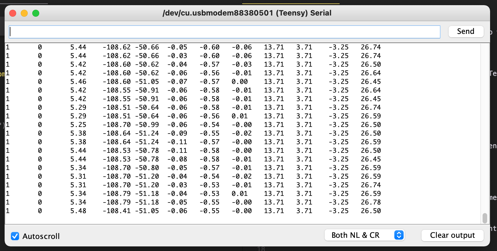

Well it looks like the good ones I have just judging from moving/responding columns are: 2B (orange cap) and 1B

I do have some 6050's and I don't know if magnetometer will help me at this time, just a ground insect robot working in an apt, just need velocity/accel and roll.

Interesting accel is in m/s^2

Lol 8m/s^2 yeah that's not right... wonder if there is a calibration thing.

-81 lol that's even worse

Recompiling seems to help.

WTF 156 what is this...

2B doesn't work

1B is good at -10
2B orange cap, -8

I think actually a few ground pins are bad on my breadboard

Or they're just super bad like the 156 one

Oh man my fingers are nasty... this flux...

I found my orders, I have one new 9250 let's see how that does.

I have to solder these parts.

I'm feeling it. I'm pumped to make this thing.

-7 lol you have failed me!

I'm also getting progressively f'd up. I'm #3 in which isn't much but yeah.

Anyway I know hardware isn't perfect and software should adapt.

Trying to interface with the Lidar module now, who will I cry to next.

Interesting, I should connect with both devices at the same time after I try it out, as I do want to save pins.

This is great though, also I2C same pins... going with the Pololu library.

Will this just work? Let's see

Freaking metric man, but it works so cool.

Oh no it says 2 meters max sensing distance but it's only seeing 2 inches away what... hmm

Lol it's like "you're angry because you bought cheap crap?"

Hmm it got better readings pointing at something other than the flab on my body.

Yeah I'm pretty satisfied with this.

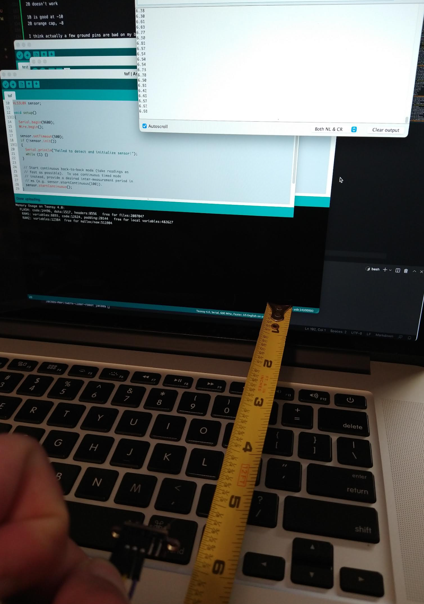

I'm going to model some more parts and start designing this thing physically.

One of the things I've dealt with that really annoyed me is fake batteries. OMG

Anyway I finally bought real 18650 batteries from a place other than Amazon.

Look at these beauties.

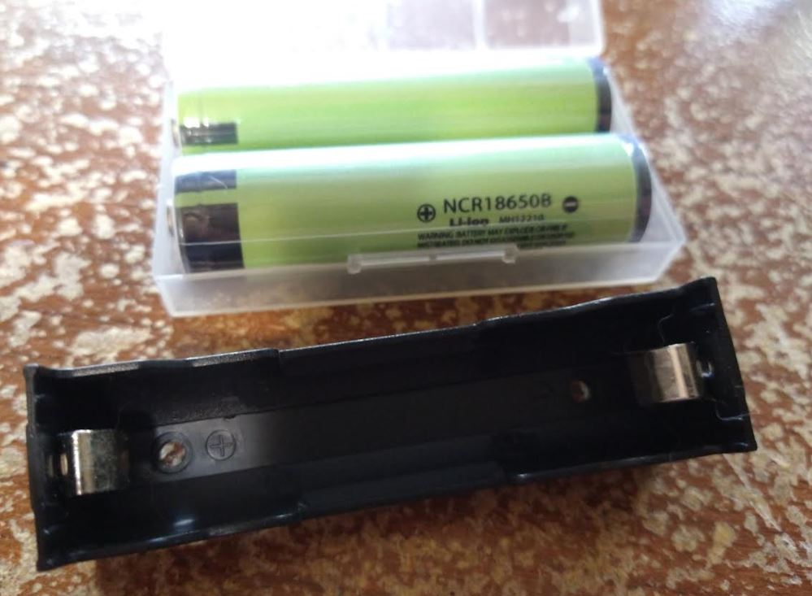

It's not just 18650's it's the replacement batteries... usually it's a piece of crap. I got got 3 times in a row, different sellers.

So going forward if I have a choice anytime I buy like a laptop it will be new just because of batteries.

I know... a single point is stupid for fidelity/knowing what something is. Imagine trying to navigate through a brush/plant and you'd just keep running into it.

It's a gimmick for sure, but it's neat a limited sensor, dumb bot but can sense itself.

This battery holder is too short for this battery so I have to saw the plastic in half and then solder it to a board.

Been spending most our lives living in Github paradise (not true Gitlab)

Just think, these parts will soon be like a stray dog suffering from a stroke

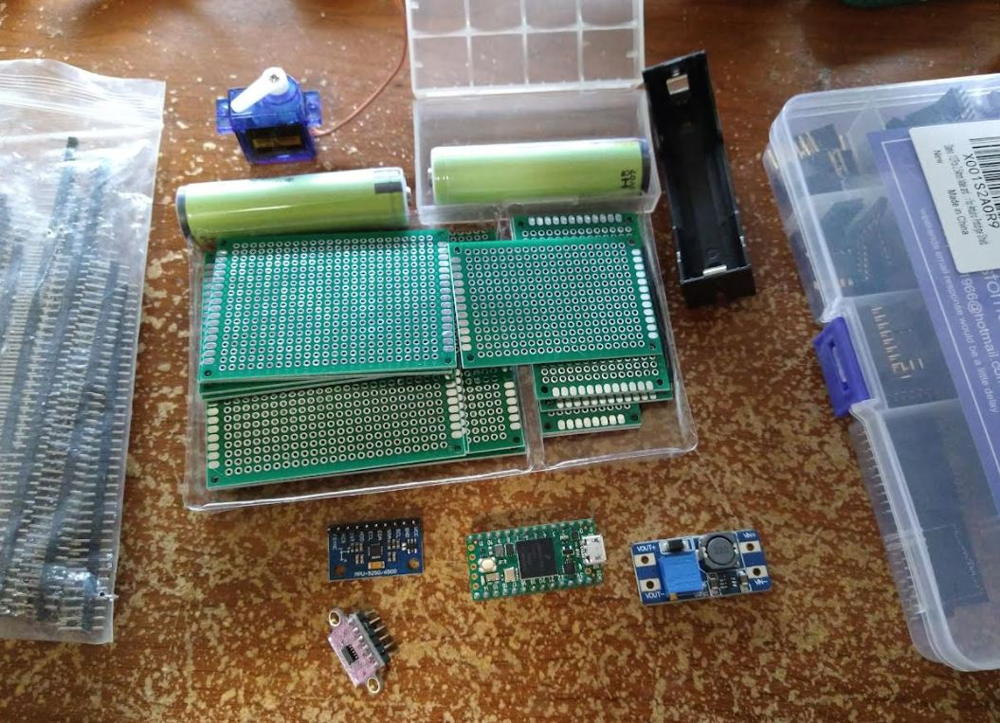

Yeah I think it'll look like this. The ESP-01 can stick wherever. I have a vague idea stuff should stay away from the IMU.

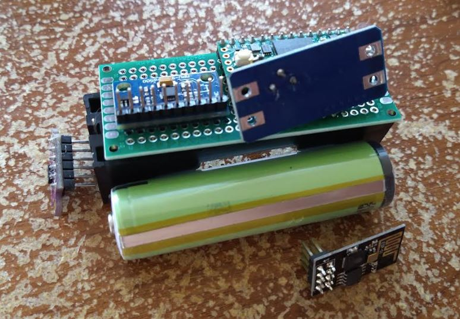

The ToF sensor will be aligned in planes 2/3 just for simpler math.

Lol I bought a skill saw or whatever like a year or more ago, just used it now.

The ideal version of this is one with a vision system, aside from the difficulty in computer vision, I'm concerned of a thing running around with a camera/connected to the wifi that I don't know where it is. I'm still going to try and make it with the Pi Zero 2 but yeah.

I have an IR camera that's pretty cool for the Pi.

Making good progress, made basic models of almost everything.

The battery I imagine if I used mm I would get the 18650 numbers but ehh imperial unit scrub.

So... the design will be the board sandwich, stuff oriented around it, plastic chasis between it.

Servos mounted to this. The I will think about trying to socket most things.

Dripping dripping dripping dripping dripping Steve Aoki/Lovefoxxx song ha

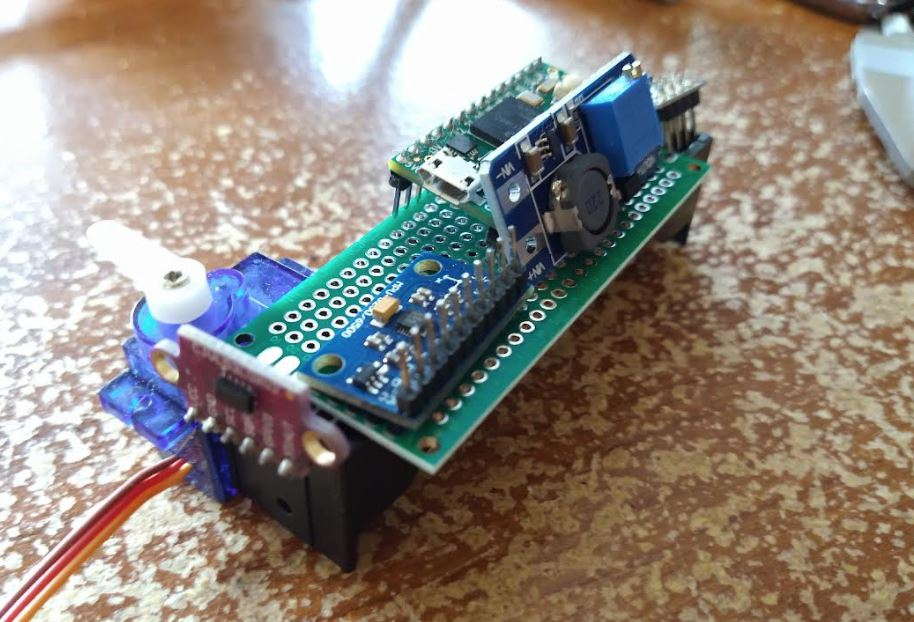

Ahh man this thing will be ugly as hell unlike my initial fantasy.

Oh no I touched this nasty servo yuck... the grease on it my fingers.

Thing is I want the tof kinda near the ground... so I may stack the battery on top of the sandwiched electronics.

That'll make the robot positively stable.

Reeeeee. I forgot how this app freezes when you pan with "many" components rendered. I need to put time down into Fusion.

What sucks is my 3D printer filament broke, half to preheat/pull it out, snake it through...

No way... it says 1.3kg * cm -> 116oz/in stall torque? what... since when I thought it was 30

What... the website says 17oz/in lol... wtf lol further down the page it says 2kg per cm omg...

Oh here we go [real data](https://www.youtube.com/watch?v=X5KyveL1cWc).

Beer #4 baby

Lol Uebok Gotta Run shit slaps, song's too short though

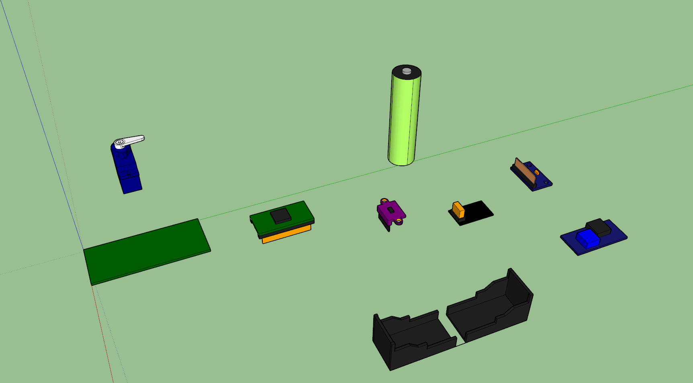

Random parts, assemble!

Oh... I messed up with this design, the IMU has to be like in the exact middle of this thing to reduce complexity in math.

Awe... I'm sad at the moment, thinking about the design.

Ehh... it's not as small of a foot print as the other one but this I think will work.

The MPU is under the PCB.

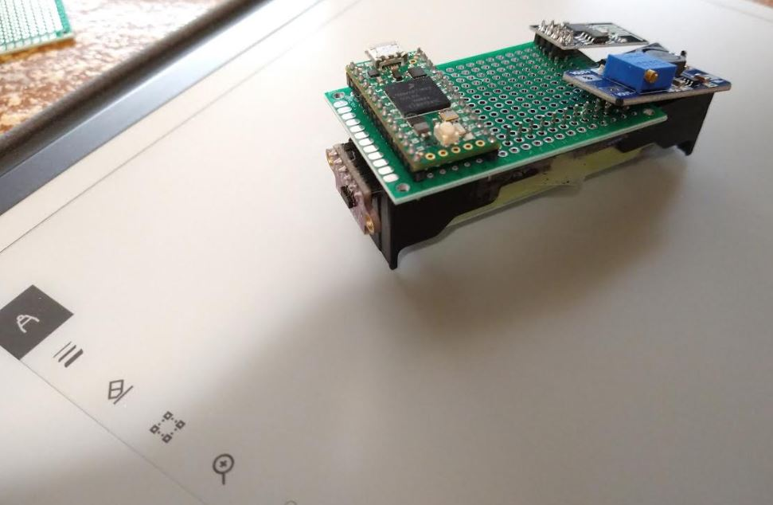

I also noticed these two holes at the bottom of the battery holder, so I'll 3D print a thing for those to snap into.

Ehh.. makes stuff bigger but if I socket everything I can theoretically just pop it out if it craps the bed.

Oh yeah these two holes are great at the base of battery holder, I can form the chasis around that, start printing stuff for sizing too. Been a long time since I printed something dang. The cool thing about this robot is there's not a lot to print. I like the insect design robots more than the dog ones.

Yeah the plastic chasis can be glued to the battery cell and that'll keep it from separating due to the springs. MPU attaches to this "spine". ToF sensor slightly raised to align with IMU sesnor. Servo mounts equidistently positioned around the IMU sensor.

There's a printer tolerance I forget where it fits just right. Will try 0.01". Oh and min thickness strength.

I'm just going to go ahead and print this to get something solid in ma hands (heh).

Man I have not used Cura in so long feels good.

Had a panic, can design in inches but need to export in mm binary.

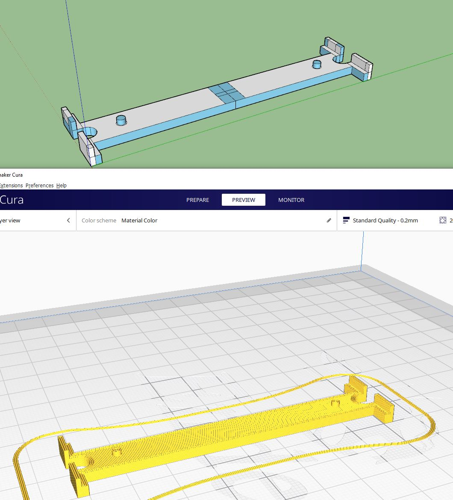

Steppers sound so cool.

I don't know might be insane but I would not mind finishing the body of this robot over this weekend.

Omg it snapped in the feed gear thing ahhh....

Lol my lights are flickering from the desktop/3D printer.

Oh no I didn't assemble the heating head right.

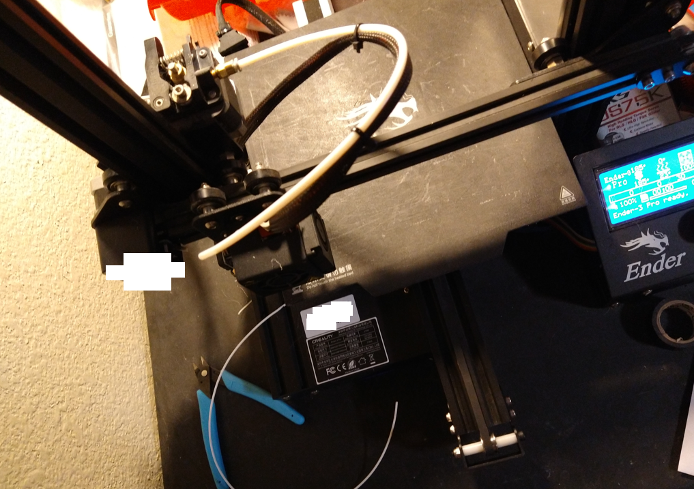

This has put a dampener on things... not sure if I needed to unscrew that thing that attaches to the filament guide.

Whenever I kneel down the pain between my knees/back wow.

The guide broke inside the threaded metal thing. Also I forgot how the middle of my printer bed sags so I've had the nozzle run into the pad to compensate ehh...

Ahh... losing it the momentum. Pretty good progress though something tangible.

Oh I can use that empty area in the middle of the board for the servo bus.

I am realizing too like how dumb of an idea this is the single point lidar.

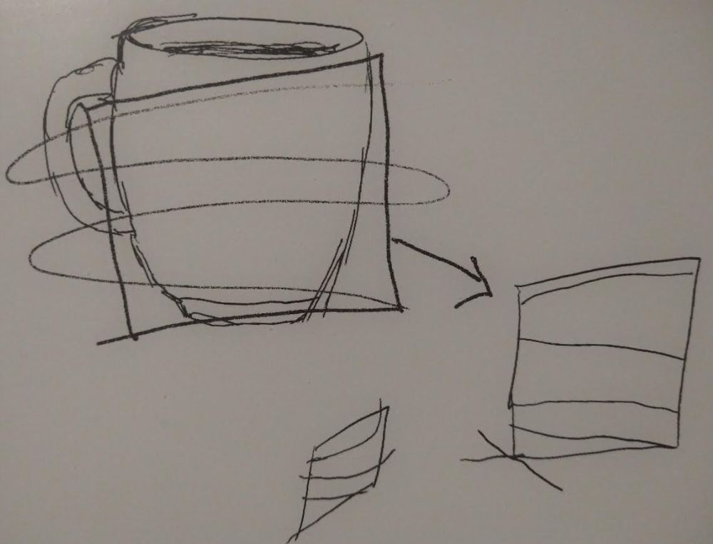

Like if you have a 3D cup like above and you only have that squiggle to profile it... how can you tell what it is.

Also the main reason I mentioned before this is a bad idea is so many of the servos have to move to do this scan... but pros and cons right, it doesn't have vision processing of a computer with a full blown OS.

Oof that infill is not enough. Ahh crap, I need some sheer grip, so I'll probably glue to the sides of the battery case. Have to redesign the base chasis.

Doing a fit test:

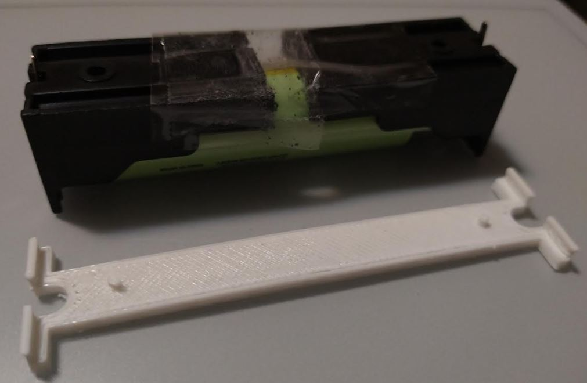

Yeah it's too thin, also design is wrong, nothing to prevent bending, just wanted to see how big stuff is again. It needs to be about twice as thick at least and then I'll do 40% infill.

Clearance was more than enough/too loose actually.

0.005" should be good for tolerance.

Lol probably part of the reason the print looks so bad, this weird shape I made is barely a solid.

Dang 53 minutes going to be long. Will work on designing the body based on stacking on top of MPU9250.

Oh yeah glue in the middle makes sense. This is funny the rotate just stopped working in SketchUp I quit lol.

It sucks how bulky this is but it is a major structural piece and I'm not really concerned of efficiency in this regard right now.

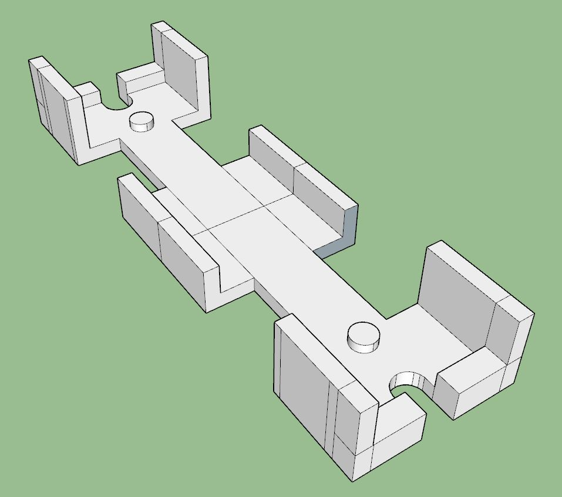

Oh... I guess the servos can attach to the corners of the battery.

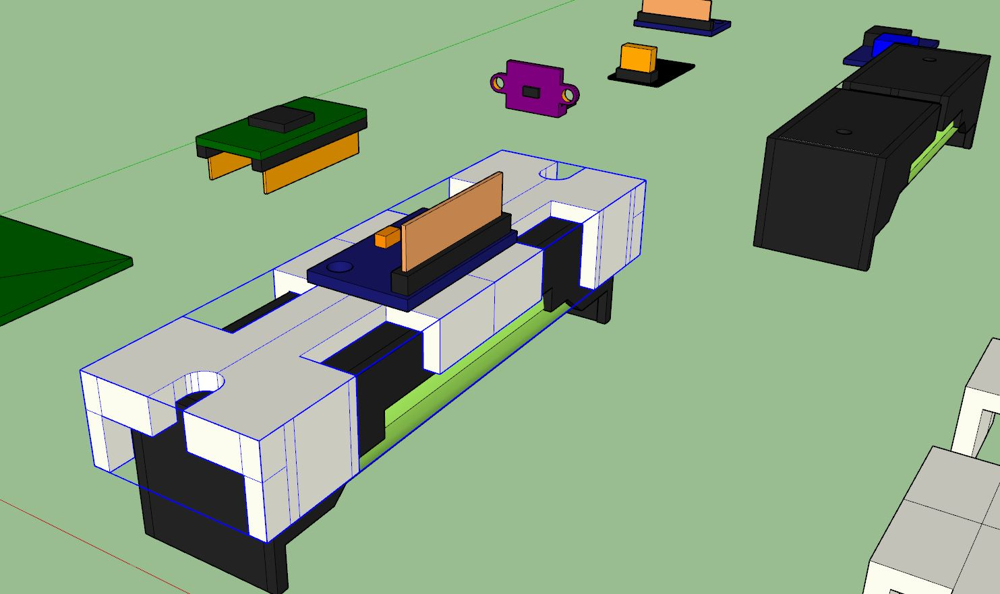