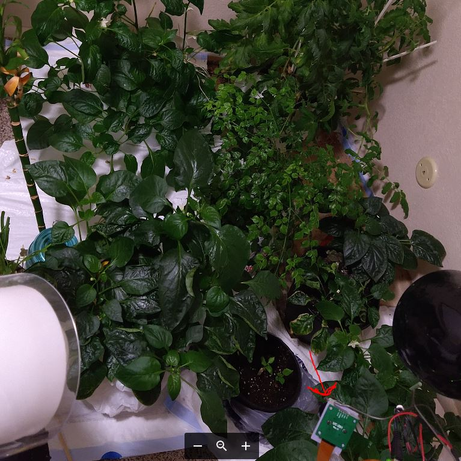
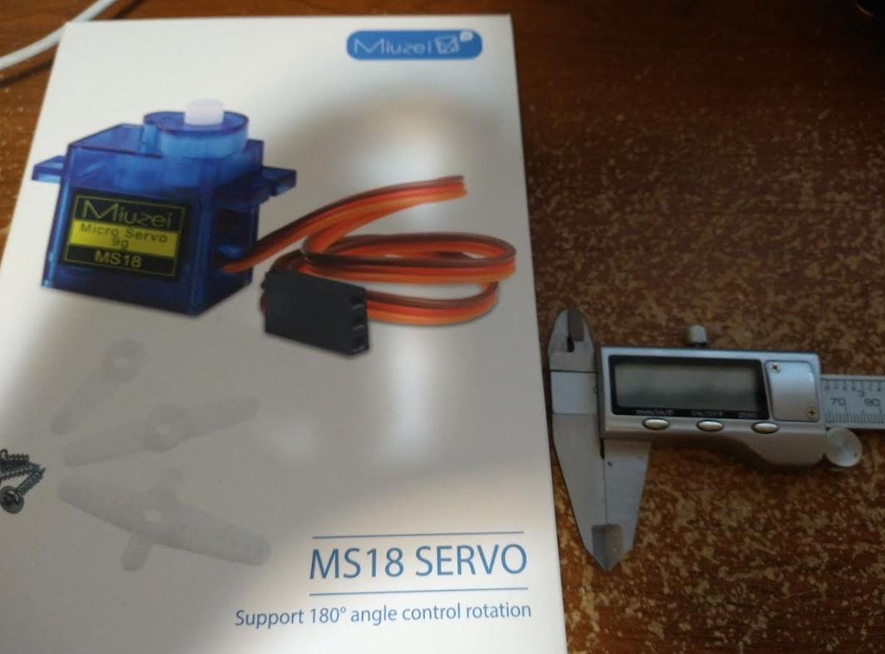
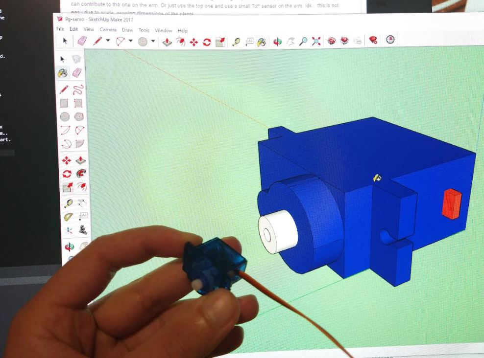

Well... I'll be leaving my day job in 2 days. I'm both scared and excited. Anyway I have another thing I'm working on but now means I only have one job instead of two. I really want to build this thing.

I'm going to model a servo real quick, I already have in the past but some feeling of accomplishment. I also bought a crap load of servos, another project I'm thinking about is a robotic arm with a water pump/hose snaking through it and onboard camera. It can then navigate a potted plant area and water it, where an opening is found (through leaves).

This is already partially an IoT with regard to an automated growth-light system and daily pictures. The top vision system can contribute to the one on the arm. Or just use the top one and use a small ToF sensor on the arm. Idk... this is not easy due to scale, growing dimensions of the plants.

Alright back to this servo. I'm excited, have not used a caliper in a while or opened up SketchUp (really need to learn Fusion).

Bad thing is these servos are usually greasy for some reason. Interesting their packaging changed.

That's a good move on them, these used to be individually wrapped now packaged in bulk.

OMG... I immediately remembered how the layout in SketchUp won't save for some reason, the tools layout.

I also remember all the sources of error eg. parallax measurement.

It's not hugely important how accurate this is I mean I'm measuring 0.0000 accuracy but parallax and what not. It's mostly a 3D placement thing so I can design the parts/print them, modify them... I'm more concerned with the software. So the robot can be made of cheap stuff but still be smart.

Yeah boiiiiii

This time I will use the spline/servo arms vs. directly screwing into my own home-made splines lol that was a failure/needed to use superglue.

And sorry I'm an inches scrub boi vs. metric.