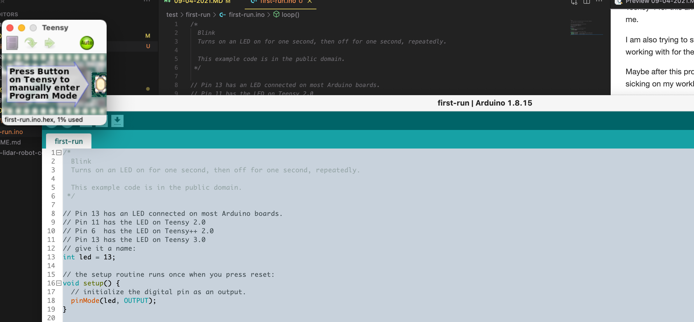
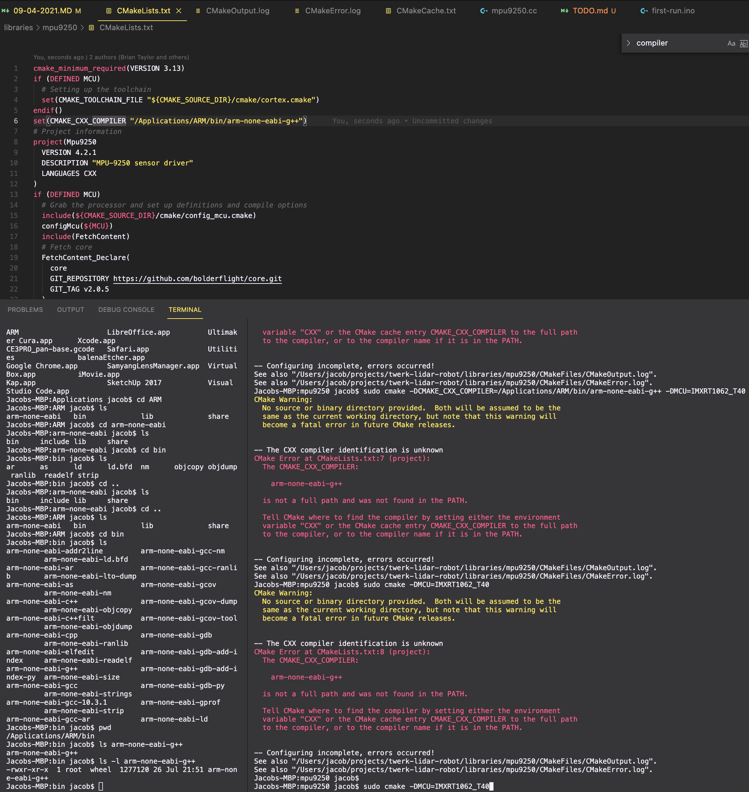

### First thoughts
So... I'm pretty beat. I haven't done much of my own stuff for a bit as I've been working two jobs. My own choice, more money but yeah.

This is a project I've had in mind for a while. After the first robot I made which sucked because it was mechanically weak and stupid (runs into obstacles); I wanted to make this one which will probably also suck... it's why you see Lidar systems that are spinning to cover more area. The gimmick of this thing is that it "twerks" to move the beam around. Really it would generate something like a conical/spiral pattern in front of it and using the onboard IMU for tracking, it should know where things are. An ideal thing is to use an onboard camera with basic image processing... I'm using a Teensy 4 for this and I don't know how strong it is but this thing is nuts. I've also never used one before so it's a first for me.

I am also trying to stick with a single language/stack eg. C++/Arduino only not Python (RPi) on top. That's what I was working with for the Slam Crappy project which I have not finished, the vision part was hard, who knew.

Maybe after this project I'll know what a quaternion is. I purchased all the parts for  this robot a long time ago... just been sicking on my workbench.

I am going to solder pins on this chip... probably poor idea but will do it anyway where I solder the sides downwards so they can stick into a breadboard and then the smaller one will be pointing upwards.

Damn it is insane how much stuff is on this board. Yeah I'll solder the side pins down and the top ones up.

I'll keep the top pins off actually see if I need them later.

Crap I thought it would fit on a breadboard but it seems to be a squeeze. We'll start with the cliche blink.

In the past I have just used digital pins for servos but I think this time I will go with PWM.

I think today a good goal would be to move a servo.

I have a 5V output from a 2S LiPo from a previous failed project lying around so I'll use that for temporary/testing power for the servo.

Teensyduino interesting.

So plugging it in it by micro usb it already has blink loaded on it.

WTF is this, interesting, push button to program... hmm.

Ugh... these servos have this slimy oily feeling to them. I will have to find some library to interface with the MPU-9250 with Arduino, when I worked on it before I used an RPi library.

Ehh... I'll just use the servo library, there are way more important things for me to figure out than that.

Pretty sure this is how you accidentally kill yourself, my dumbass lizard brain was on autopilot and plugged the step down voltage output to the 7.4V output of the LiPo, anyway nothing happened/still works but yeah. Probably just not all the way in thankfully or they have reverse input protection.

I'll use pin 2 for my first servo test since this will use an ESP-01 for telemetry/comms. Well it looks like I have options to use TX/RX elsewhere so fine I'll use start at 0.

Oh that's right you need a shared ground, okay cool.

Well it pretty much works like a standard Arduino so that's cool. Going to actually start planning on goals to achieve to build this thing.

I also bought these tiny BMS's even for a single cell, it's pretty cool, so I'll incorporate that as a good boy. I bought these really strong Li-Ion cells in the past 18650 types on Amazon when they were still selling them there. The problem is the battery design is a "flat top" and I'm pretty sure you're not supposed to use them in those plastic battery holders designed for a button-top type. Because one type I crimp an edge of the battery and it started smoking instantly I was like holy-f... but thankfully I was able to uncrimp it fast/stop it. I ended up discharging that battery and not using it again but yeah sucks.

Anyway at this time we're far from that point, but when it all comes together it is going to be a nice little single cell battery.

Damn... I have no idea how to make this work this Bolder Flight MPU9250 library lol... I'll figure it out but yeah I just feel stupid as hell lmao.

I'm like that monkey at the zoo watching a magic trick with a cup.

You telling me I just match SDA with SDA? That easy? Huh... looking at a random Arduino to MPU-9250 image it's just being read in by analog pins... hmm.

It is pretty cool when you plan out a system and then it works/see it running.

Okay I think I got it, you make it, then import it to use it.

Ahh naruhodo naruhodo gotta `$brew install cmake deeznuts`

Idk how to tell if what I have is T40 or T41 regarding the chip on the Teensy. hmm... guess I'll go with T40 for 4.0? Ha...

Ahh I see the two dots are like `..` naruhodo

had to export gcc and g++

Oh I guess that doesn't matter need to download this `arm-none-eabi-g++` thing

Big download, possibly owned by China (this is kind of a joke), nice.

Damnnn 800MB to install hmm... hope this actually fixes it lmao

Hmm still broken, trying something else

Lol I downloaded that arm-developer thing said installed but I have no idea what it did/where it went

greppin' to find where the f' this stuff was installed, think I need to export it or something

OMG reeeeeeeeeeeeeeeeee dang it... stuck on trying to find where the f' this went.

Oh... okay so it is an application but it's like a folder, in `/Applications/ARM/bin/arm-none-eabi-g++` let's see if this works.

OMGGGGGGG, need a break of Jahy samma

