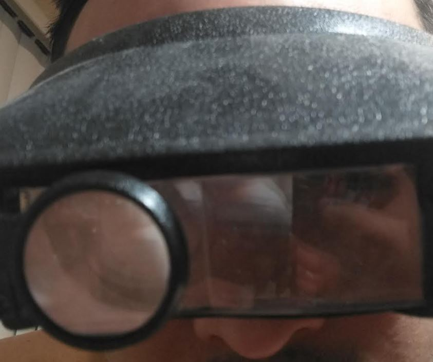
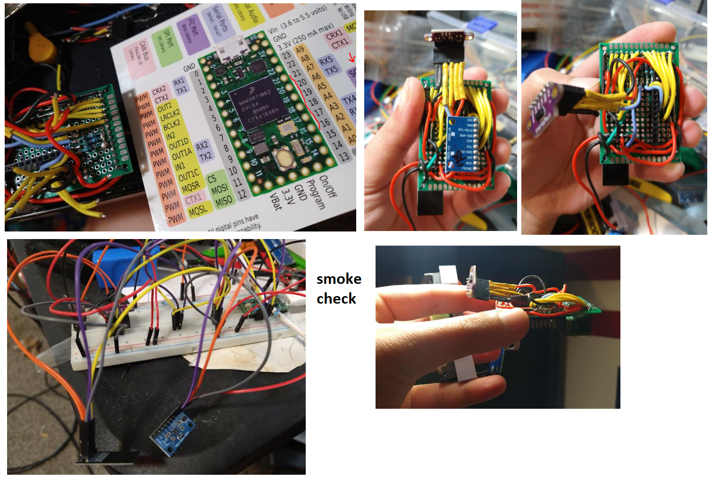
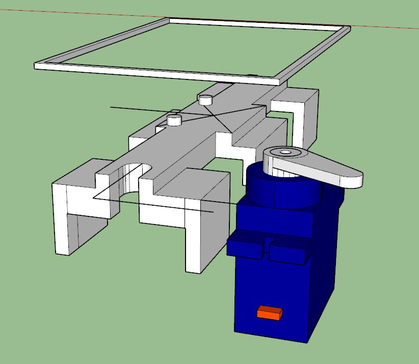
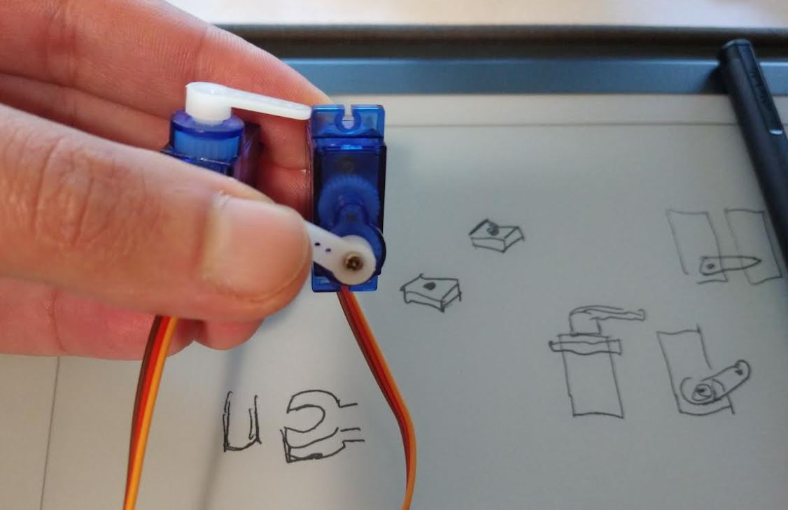
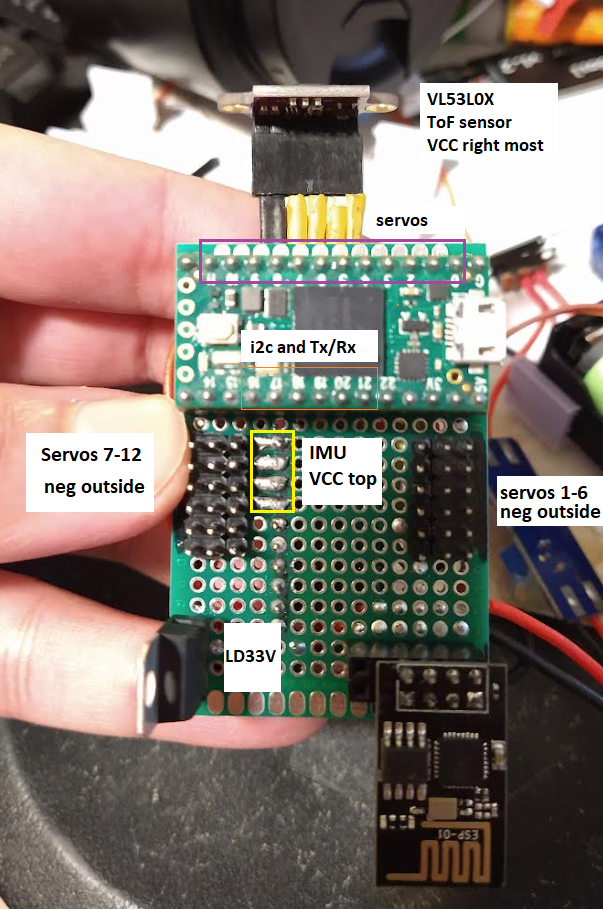
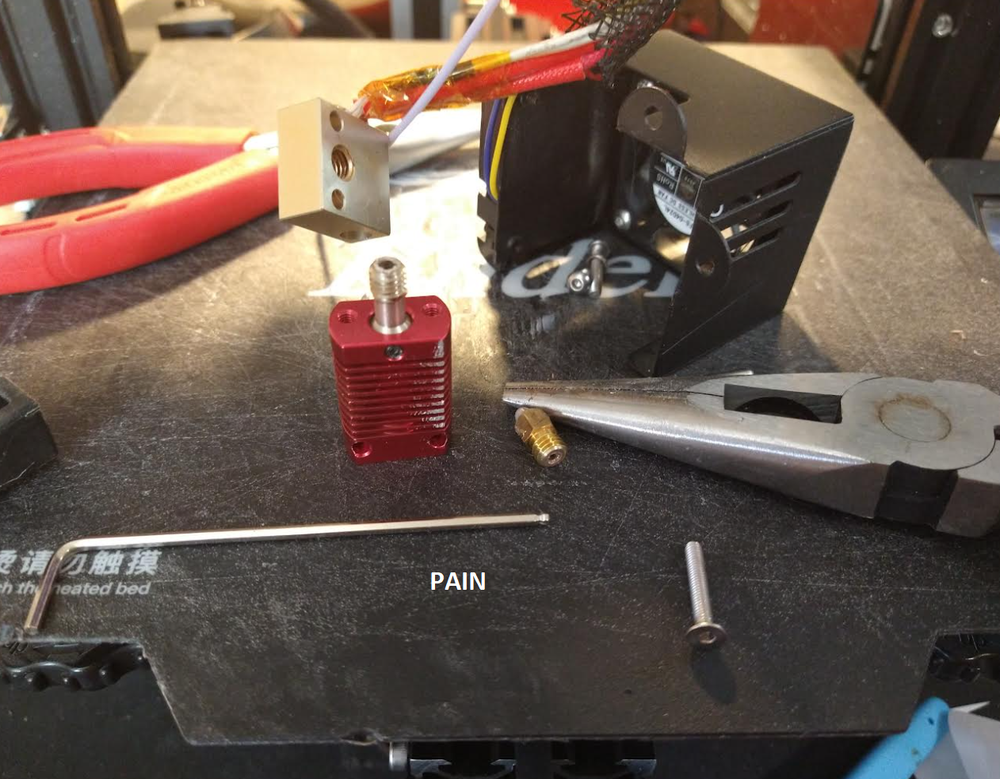
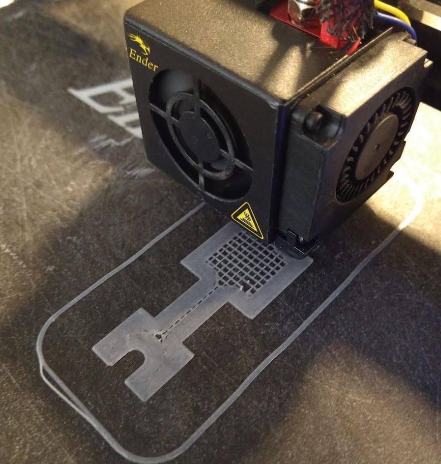
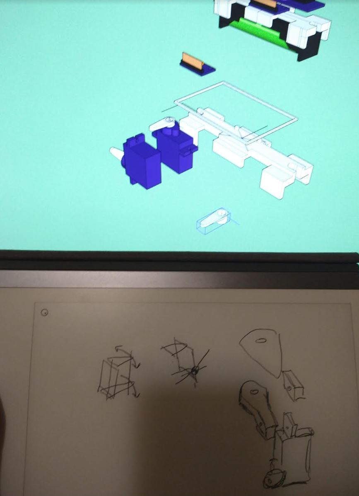
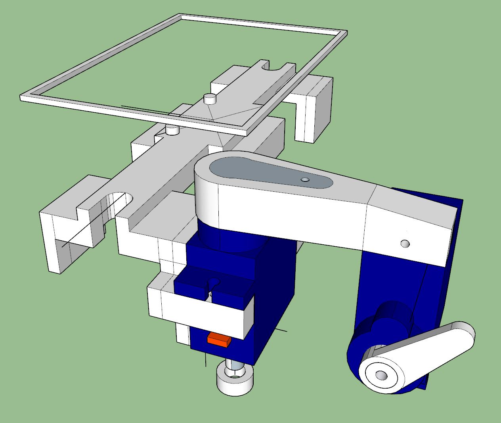
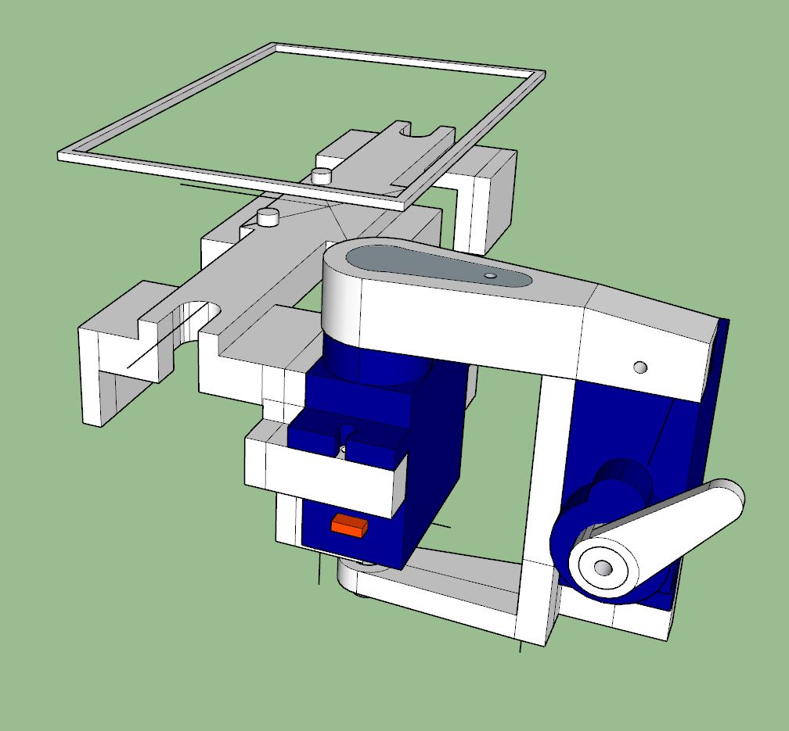

Back at it again 8 hrs later or so.

Previously on Twerk Lidar Blues... our host Jacob Cunningham has discovered he messed up the wiring and offset the pins by one... how the Teensy survived, we're unsure. Tune in to find out what happens next...

Oh man... it's so deep too like under layer of wires.

Somehow I lost my solder sucker.

My cat wrote this:

\\\\\\\\\\\\\\\\\\\\\\\\\\\\\\\\\\\\\\\\\\\\\\\\\\\\\\\\\\\\\\\\\\\\\\\\\\\\\\\\\\\\\\\\\\\\\\\\\\\\\\\\\\\\\\\\\\\\\\\\\\\\\\\\\\\\\\\\\\\\\\\\\\\\\\\\\\\\\\\\\\\\\\\\\\\\\\\\\\\\\\\\\\\\\\\\\\\\\\\\\\\\\\\\\\\\\\\\\\\\\\\\\\\\\\\\\\\\\\\\\\\\\\\\\\\\\\\\\\\\\\\\\\\\\\\\\\\\\\\\\\\\\\\\\\\\\\\\\\\\\\\\\\\\\\\\\\\\\\\\\\\\\\\\\\\\\\\\\\\\\\\\\\\\\\\\\\\\\\\\\\\\\\\\\\\\\\\\\\\\\\\\\\\\\\\\\\\\\\\\\\\\\\\\\\\\\\\\\\\\\\\\\\\\\\\\\\\\\\\\\\\\\\\\\\\\\\\\

Smoke test... yeap smoke on a servo bus line again. First boot it was good, ESP did it's thing, blue LED not stuck. Afterwards it was stuck, so I'm thinking it has a serial buffer building up (ha).

If I plug the ESP into the programmer it works as normal.

Briefly worked but bad again, after replugged in. I'm hoping it's not a current problem.

It sees the ToF not the IMU. I'll try and power it externally briefly I guess this step up converter has low amperage dang.

A little different behavior but still bad.

Oh no I'm stupid I forgot the bus scanner checks Wire not Wire1 my bad.

Still have the problem of the ESP getting stuck.

I desoldered half the servos too :(

Rx pin goes hot on boot on Teensy

Desoldered rx and tx pins from Teensy, still stuck in red/blue.

Desolder TX pin from ESP01 works...

I think I have it... I'm not entirely sure what I fixed, maybe the TX pin on the ESP was touching ground a little.

Restarted the rig a few times ESP is doing the right thing (blue led blinks a couple times then goes out -- means connected to wifi)

Yes... both sensors outputting and ESP up.

I have to wash off my nasty fingers from soldering

What have we here...

I don't actually use this thing it's not that good and you need good light on what you're looking at.

Some progress pics:

I actually did have a thought, I should check the servos all work before I get too far.

I thought there would be a clash between the 5V in and the USB power during programming but I guess they're like in parallel or something/don't matter which one is on with regard to powering the stuff down stream.

First sign not good, servo's twitching. This is without being programmed.

Now that it's set, it's working, servo 1 sweeping.

Actually I could do a current test power them all lol. I won't though, want to make sure I don't strip them though at this point I have like 50-60 of these servos.

0-5 is good (right side of board)

Feeling good feeling great, Dulce Vida by Saint Duck on Soundcloud

I do dislike (hate) how servos flip out/strip themselves if not connected/programmed right. This is why I was hesitant in the past to use them with Raspberry Pi/opted to have an Arduino bridge in between.

Looks like servo #11 is problematic hmm.

Oh no ESP having problems again hmm. Powered off for a bit, gone. I wonder if it's the Teensy socket?

Yeah #11 isn't moving interesting.

The problem with my socket for the Teensy is it's made of two parts, vs. a continuous piece. So there's an extra width in there where they join.

I would not advise to do that, I should have realized but it's a PITA to desolder 40 pins and I don't know if I have that part anyway. It's only problematic during programming since the USB can shift the pins. We're good now though, ESP works right, servo 11 is working. Its signal wire was funky.
### Back to design

For the battery chasis connection, I'm going to shrink the pegs. The current inner length is okay. I will reduce it a little more so the battery fits more snugly.

Also the top/base width is too thin/needs vertical parts to avoid bending with regard to however the MPU is mounted. Then servo attachments need to be added to the corners.

Would be cool to get the first steps in today but probably not with regard to how many parts I need to print.

Going to drop the temp down to 205C.

Ahh this is a good song too Tree Palm Next To You

Ahh SketchUp man... it's like something looks solid but it's not.

Oof 2hr print, I'm still sizing.

I still have not figured out how the lidar thing will mount on, using those pegs but needs to be aligned with IMU on x and z axes.

I have a laser pointer in my hand for my cat, I can use that to conceptualize heh.

I can see maybe corner clips, with ball tips to snap the pcb onto the body with a top-down force. Keeps the IMU hugging the frame.

I'll just attach the servos to the corners of what I have now after getting some point dimensions.

I'll have to see how this goes, I printed the part upside down with supports.

To save time the top guide and possibly other parts can be printed separately/glued on.

Although I might have already goofed without having the servo attachments yet.

This is where I am:

Trying to figure out how everything attaches. I'm thinking about those wish-bone designs but also thinking it was fine as single bars (the arms between servos).

Lol I'm doing this trying to figure out how the parts go together.

Also this is a top view of the board with some annotations.

Damn the print failed, stopped coming out at some point.

I'll try 210C.

Oh man... some time later nothing coming out of the nozzle, great!

Thankfully the hot end is fine.

This song how many times I've replayed it Baby Please, I have to Know by J. Wilson '90

Lol me trying some kind of ML "trust me you're not that guy pal"

Man I don't know if this is a bad design. The problem with my first mock up is the movement is restricted (horizontal swing).

I'm not sure what's wrong the print keeps failing.

I will go back to 215

I'm so concerned it will fail again I watched it for like 5mins straight hard to tell if something's coming out or not.

Looks like 215 is not hot enough, I'll try 220.

That did not work, going to 210. With regard to the servo arm design, I'll just go with the ugly one that I know will work.

There's way more work to be done on the software side, I can rework the arms later after I get a better understanding of the math/coordination.

Assuming I can get anything printed ha... not sure why I'm having problems, in the past I could print very reliably with this/gray filament.

There is this plastic tube that goes into the hot end (Ender 3 Pro) that guides the filament, for my case, the actual hole the filament goes into for the hot end

it's not exactly in the middle, possible this tube was guiding it away from there.

Going to try 225C the extruder gear is skipping.

I have to buy a new magnetic mat thing at some point. It's stuck on so well I can't scrape it off. Also it's sagging in the middle.

I can't tell how hot this end is. I'll put a laser thermometer on my list. I'll go back to the lower temp filament.

It's interesting changing configs it's half as long now hmm...

Oh... it's not printing the supports ha... that's why.

12:15 PM still failing to print ha, a little better but now messing with base distance... I used to just ram the nozzle into the mat to make sure it sticks.

I'm losing momentum this constant problem with prints is slowing me down with getting physical stuff to work with.

Alright... this time after giving a small gap between the nozzle and the bed, the filament balled up... so...

Alright... back to original PLA config from Cura, what I was using all this time. Guess I'm glad I still have a good amount of the filament I used to use.

Was a little better but some places not sticking, just made the nozzle make contact with the mat again sucks but that's how I can guarantee will stick for now.

Nope back to the card trick under the nozzle.

1:51 PM

I think I have it finally. It was the filament guide tube. I cut it at a diagonal and faced the open part towards the hole that was not centered. It's running better now, I hear the back feed less (clicking sound from feed gear slip).

You're back on the water boys (Life Aquatic)

Ha... failed again at 13% fails... stops coming out, little dots.

Ha... so that piece I was describing at an angle is actually a broken piece of that plastic filament...

[cries] I don't want to do this but will, have to take apart this hot element

Actually it might be left over plastic... idk.

Well... I do see the potential problem now... it's possible I burned out the white plastic thing not PLA...

So I have to completely take this thing apart and clean that tube out.

4:02 PM

Well I probably contracted some kind of carcinogen at this point. There was some kind of material inside this tube that I burned out to clean it... lol it's like that's a structural guiding piece with a higher melting point.

Anyway... tried it, ehh still scuffed, doing the nozzle rubbing against mat trick and seeing how that goes.

If you're forcing something you gotta stop and ask yourself, why.

I'm just thankful the little heating element's wires did not break.

This is looking really good so far though.

It's not 100% but those are just supports.

Side note I experienced that back EMF thing with steppers. I moved one axis fast and while it was unplugged the LCD came on briefly.

The main reason for the wishbone design is to reduce torque on the gears other than their intended directions. The gears shouldn't be load bearing other than torque.

I think I've got a design, just going for dumb simple, I'm pretty sure it exists already, cliche with triangles. I'm trying to do this blind (ego) and then figure out what I could have done better.

It's so hot in this room but outside it's 18F.

My plan is to hold the load on round pegs and then screw the horn into the arm.

Lol it's like "what is that". I'll be sure to do some basic FBD's too.

I'm trying to keep the servo moment arm at or under 2.5" I can get near 150grams or 5.3oz in torque which is half the weight of the robot idealy.

I don't know I could have this wrong too until I build it, see what it looks like.

0.025" servo mount screw hole radius

Clearance is 0.01 to avoid being too snug.

Actually going to try and keep it closer 2".

You might be asking yourself wth is that, you're right... I think this will work though.

LMAO look at these chonk arms damn

Side note this design is complete bs btw I'm just joining things, making sure the plastic is thick enough.

8:00 PM

Well I'm spent for now just got off the phone with people.

Unfortunately today was not super productive, mostly unbreaking things.

Will slow down in progress over the weekday. I'll chip away at the physical design. Would be nice to print it during the day.