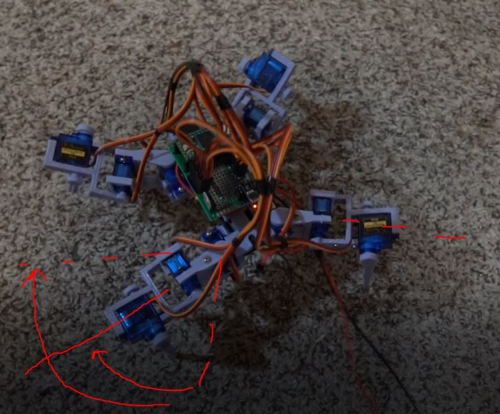
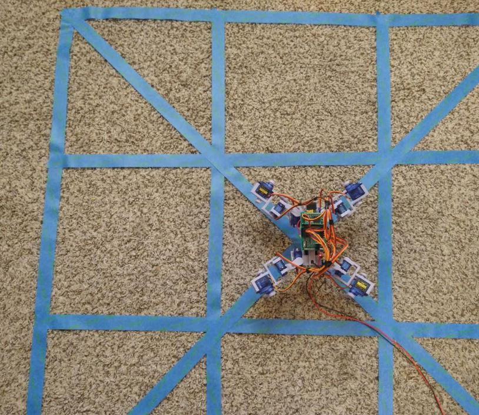

I'm going to study the current walking gait briefly.

It was set to slow in the previous videos, it is a little better when set to be faster eg. it's at 4 ms now vs. 6.
Fastest would be 1 ms.

I'm fine with it being slow while I first work on it.

It seems wrong that it does this "pull all legs forward" as the last step.

I do notice, it barely moves the legs forward... I'll see the stability of the balance but I think it can go further.

Here specifically:

Ehh.. nvm it's not much of an improvement... I think the gait is just wrong.

I'm going to enact these motions myself lol.

front left goes up, left back pushes to counteract falling

once placed, front right arm can move forward, back two follow

I do want to improve the gait for walking but I also want to try something new, like the whole point of this project a conical sample with distance data points.

I put this grid together, it made me realize the legs need to do a better job of moving up/higher clearance. Otherwise gets stuck on the tape.

Anyway the plan is I should be able to say "rotate in place, 45 degrees" and then do a scan... see the object I have placed.

I have not programmed a turning gait yet. I know if I was OP I could make it figure out how to walk on its own using machine learning or something.

I do feel like crap today. Did some work earlier but still... it's middle of the day should still have some poompa left.

Hmm... will return to this.