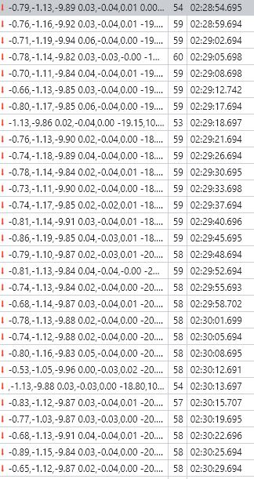
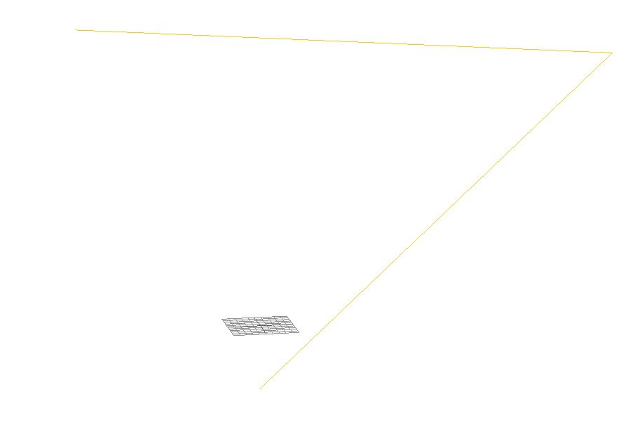
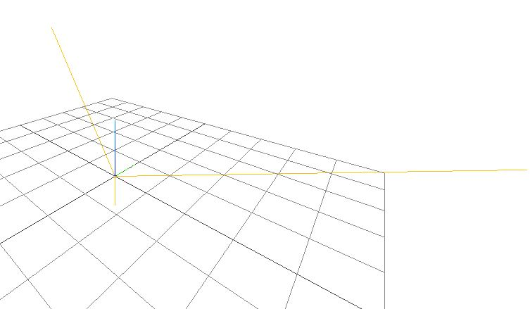

Today I'm going to start visualizing/working with real numbers with the IMU.

I have been reading/watching various content about IMUs and how to use them.

I'm not 100% there yet, I've gotten some idea of how it's going to work.

Right now I'm going to just get the ThreeJS visualizer to plot the 3-axes vectors (is that right to say)?

So that I can visualize the real time absolute position of the IMU.

Then I will work on adding the calibration aspects to improve the IMU.

Hopefully the IMU I have on the robot isn't too bad as it's already glued in place ha.

Lmao

[Pizza's twerling through my miiiiinndddd](https://www.youtube.com/watch?v=A3M-XFxF1UQ)

I'm feeling the pump... lesssss go.

On mac

I keep the robot in a drawer while it's not in use, always nice to pull it out.

Like I made that. Ha the Mac's USB is like "whoa whoa whoa, you're pulling too much current man"

What I need to do is sample the IMU and send the value to be processed in the web. It will be done on the robot once I understand what needs to happen.

Interesting ESP is crashing.

This live sensor read is rough, think it's my crappy websocket polling overlap but I am getting it at least every second which is fine for this smooth brain boi at the moment.

This is enough for me to work with for now.

Can see the example live feed below, just dumping the 9 data points

I don't know why but it seems like right now in order to get data from the ESP I have to keep pinging it from the web.

I'm trying to figure out why I'm missing a third vector in my ThreeJS plot.

Oh these are just 3D points and they're being joined damn it...

Yeah I'm doing this wrong.

Eventually I will need ChartJS on here for the visual calibration stuff.

Okay I need to back to the math part and remember how this works, what do I do with these points?

Seems like if the robot is unplugged from the serial monitor it will not send the data to the web app... which is odd...

The 5 second loop in the ESP-01 is what determines how fast the web app can be reconnected.

Yeah for some reason it won't send while the USB wire is not plugged in.

It's odd, once it has started it can keep sending even when I unplug the USB cable.

I'm stuck on this comm issue. It makes my whole thing fail if they can't talk back and forward freely.

I posted at the PJRC site to get some help. Will continue with the matrix stuff briefly. I have to do other things soon.

Going to try this again. Don't want to lose what I "learned".

I still have to finish the gaits, it can't turn right now... quads are hard to turn it turns out.

Following this [video](https://www.youtube.com/watch?v=0rlvvYgmTvI) again... I have short term memory it seems.

need mag and accel for absolute orientation

Orientation of the body is the rotation between the body frame and NED frame

Down = Z gravity
East = Down x Measured mag
North = East x Down

X is cross product

Gets DCM from NED

Oh these gravity values aren't too bad eg. -9.92

lol it's like wtf is this:

Lol... I don't understand what this means... ahh.

My robot when it sits on my desk is facing the north (to my right)

The resulting matrix which I think is 3 vectors (?) when plotted, the largest one (magnitude) is the north axes... with regard to NED... idk if that makes any sense.

East is at least to the right as you expect and it's the second largest thing and Z is very small...

Am I missing this "direction cosine matrix" thing?

I've got the NED I'm supposed have this DCM to quaternion but how...

matlab just has a built in function for it... I looked up some equations.

I know you want to use quaternions to avoid gimbal lock.

Wait a minute, wait a minute... (Independence Day chess scene)

I think I see it... these are like the edges of a box... I looked at the angles and they are 90 deg to each other.

I think if I have it connected to the robot/outputing values it'll work...

So I need to get the socket client bridged to this visualizer.

Then I should be able to see it react by me rotating the robot around.

Oh man... this code is soooo bad. Forgive me.

Crap forgot I have to copy the C++ code to JS so I can consume the IMU data for the real time plot.

What is interesting is if the sampling on the Teensy/imu part is too fast it fails to send data.
If it's too fast it'll even fail completely, I wonder if that is part of the USB problem.

Man... it is nice using something like JS, I can make things fast unlike C++ gotta think about what I'm writing.

Let's see it, moment of truth does it do something.

So... this is not correct at all and super slow but it's cool to see something.

Yeah the video's cube freely rotates, mine is pinned down in one direction.

I don't get it, the north is using green axis but it's pointing downwards at Z/into the Earth.

The IMU string length on avg is 50 to 51, need to keep that in mind regarding speed to transmit

So far down is the only thing that makes sense and it's green.

I can visibly see it, I can make green go vertically upwards or down, or left/right... the other axes don't seem to match what I think is the front of the robot. Also sometimes the axes flip randomly...

I have not factored in calibration but it's something.

Also this data transfer I think is the culprit with the ESP like it keeps crashing due to running out of serial buffer or something...

It's hard working with it because the ESP will fail and I'll stop getting data updates.

Also it's very slow... I need to see about making it faster somehow.

So at best I could get pitch right now, but I definitely can't accurately determine pan with this.

Need to do the rest eg. include gyro and do calibration.

It could be that Y is the Z axes like the video for NED... idk.

Yeah in the video his down direction is X weird... then towards viewer is Z and left/right is y

My preferred axes has z as my height

