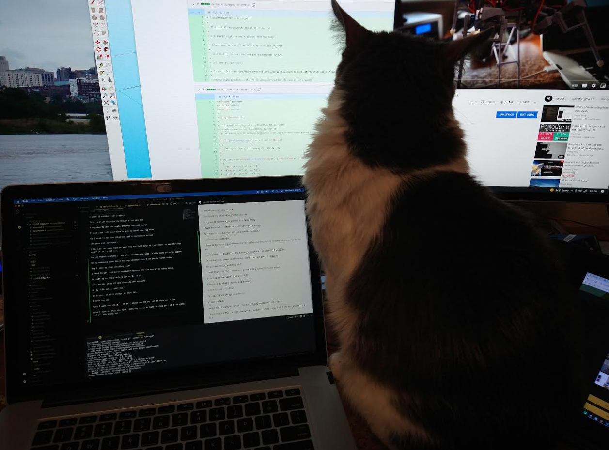

I started another side project

This is still my priority though after day job

I'm going to get the angle pitched from NED today

I have some left over time before my usual day job ends

So I need to run the robot and get a coordinate output

Lol jump and `getDown()`

I have to put some tape between the two left legs as they start to oscillate/go crazy while in mid air.

Having weird problems... stuff's missing/undefined in this code all of a sudden

Oh no watching some Scott Manley, distraction, I am pretty tired today

Omg I have to stop watching stuff

I need to get this pitch measured against NED and see if it makes sense.

So sitting on the platform got 0, 0, -9.70

I'll rotate it by 45 deg visually and measure

0, 0, 7.16 ooh... positive?

Oh crap... it will always be down lol.

I need the NED

Yeah I want the angle... oh shit these are 90 degrees to each other hmm

Damn I suck at this the math, like why is it so hard to chop part of a 3D thing and get one plane out

How do I get any work done like this, freakin house rodent comes up to your desk

BLOOD IS POURING SLIPPING BORING... lol Korn

I think I just do NED down against horizon

Man I'm so tired... failing

This is not happening, I'm just spent, I didn't get much sleep last night

This [site](https://www.omnicalculator.com/math/angle-between-two-vectors) has the info though, how to find it

Last values, I think this was "flat" ish position though

3.66 (voltage)

NED
-1427.84
1425.12
-151.79
144.05
140.74
-33.62
0.00
0.00
-9.74
