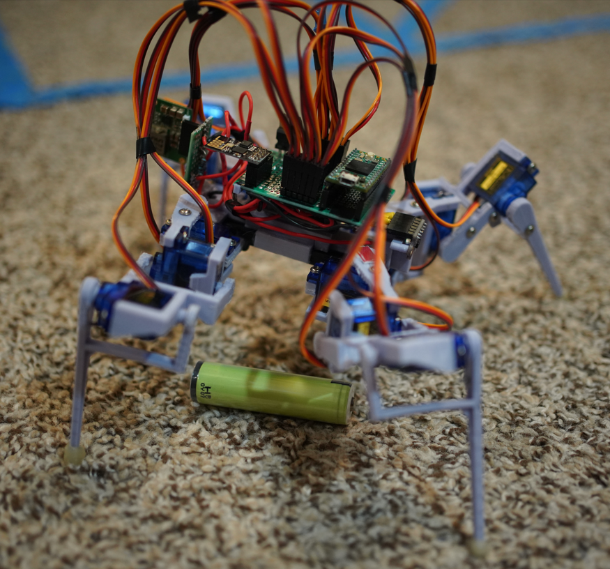

We interrupt this scheduled program...

# REEEEEEEEEEEEEEEEEEEEEEEEEEEEEEEEEEEEEEEEEEEEEEEEEEEEEEEEEEE

(dies)

(wakes up)

Today we're doing linear acceleration to estimate distance travelled.

You'll see in glorious HD how much of a piece of crap this robot is as it can't walk straight.

My cat's been wanting to chew things lately, now I have to hide the programming stand too.

I'm switching camera lenses I'm using a prime but it's in theory faster than the F4.

It is closer though... anyway let's go.

Man I feel beat/tired. I did just eat a lot.

I think I'm reaching my point where I need to f' off and do nothing for a bit, game or something.

Man... the walking is so bad. I thought I had it, but the balance is not good. It keeps dipping and it also does not walk straight.

I can't really do good estimations of motion if it can't walk straight.

Also the legs get caught easily, it is tape/not usual but still.

Lol this is not good, the battery popped out/just died

The walking is [so bad](https://www.youtube.com/watch?v=A8cfVhoEnxc) too ugh... I need to rework it.

I was watching another quad robot and noticed how they shift the weight around by combination sliding (inner joints for sweep).

They shift towards the triangle point away from the two.

Yeah I"m just not feeling it right now... need to go do nothing for a bit. It's friday anyway.

Maybe I'll come back to this later today.

Idk I might just rework it again... it's just not great

I freaking hate the sound of these gears too ugh... one day will get metal gear servos... I wonder if there are some with the same form factor.

Anyway the point "coolness" of this project is it would be exploring "far away" from me is in another room and I don't have to supervise it