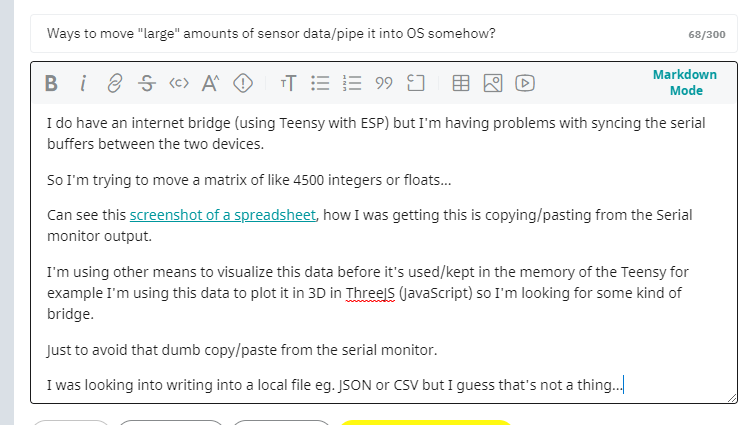

Sorry to live a normal life while Ukraine/Russia is happening.

Well today was a waste of a day for me. I've not been making good enough progress at work.

Yesterday was a rarity as I put in more than 12 hours in the day of work.

I binge ate today so I feel like crap and can't really do anything major.

I want to finish this project because the Pinephone Pro is coming next week.

I don't think I'll actually be able to finish this project though by then. There is still too much work to do.

I started watching this [video on 3D collision](https://www.youtube.com/watch?v=wVhSQHKvBW4).

Getting some ideas there.

I'm watching my robot's walking video, why does it suck?

Here's a clip out of a video, right away you see this is bad. It should not be rolling like this during a walking gait.

This thing has dumb programming it's not dynamically reacting to its orientation.

The thing is whether the IMU I have sucks or it's just me/my lack of understanding (both or latter more) I couldn't reliably implement a dynamic stance/gaits reacting to the real world right now.

I have to dial in the sub components more.

Another bad thing is it does not walk straight. Eventually it goes to the right.

Diagonally see here.

So with regard to tracking its position/where it's been... that's not great.

If I'm "going forward" I will only check the Y axis acceleration over time because I expect to perfectly go straight. I know I should factor in reality/drift too but this whole thing sucks.

I also am not able to dump weeks/months of time into this thing continuously as I would like.

So these are the goals right now:

- [ ] update sampling offets with measurements
  - means since the ToF sensor does not rotate about the same axis the measurements are off
- [ ] fix gaits
  - [ ] forward
  - [ ] backward
  - [ ] left
  - [ ] right
- [ ] track the distance traveled using acceleration summing as it walks/moves
- [ ] plot the world using simple 3D boxes when an obstacle is found
- [x] look into writing data to JSON file from Arduino runtime to make it easier to parse
  - looks like this is not [a thing](https://arduino.stackexchange.com/questions/79177/reading-and-writing-to-a-json-file-on-the-desktop-from-arduino)
- [ ] transmit data from robot to web interface by ESP for ThreeJS plotting
- [ ] actually do navigation and mapping
  - means I have a known physical world layout
  - I get something similar
9:15 PM
Trying to get motivation, I recently woke up at 7PM so yeah I'll be up a while

I passed out from binge eating... prior to this I was up 32+ hrs and slept 8-9 hrs but then I worked 12hrs+ until 5 AM or so and then I slept till 1:30 PM or so... binge ate and passed out till 7 PM... yeah not great. I did the 32 hrs thing to reset my sleep pattern but it went to waste.

Almost posted this but looked around looks like with Putty you could do it.

Yeah looks straightforward from [here](https://forum.arduino.cc/t/how-to-export-data-from-arduino-serial-monitor-to-a-csv-or-txt-file/354651/4)

Ugh... man my fingers are so gross right now, won't stop sweating.

Still not doing anything... I've cleaned this keyboard so many times now hands keep making sweat yuck.

