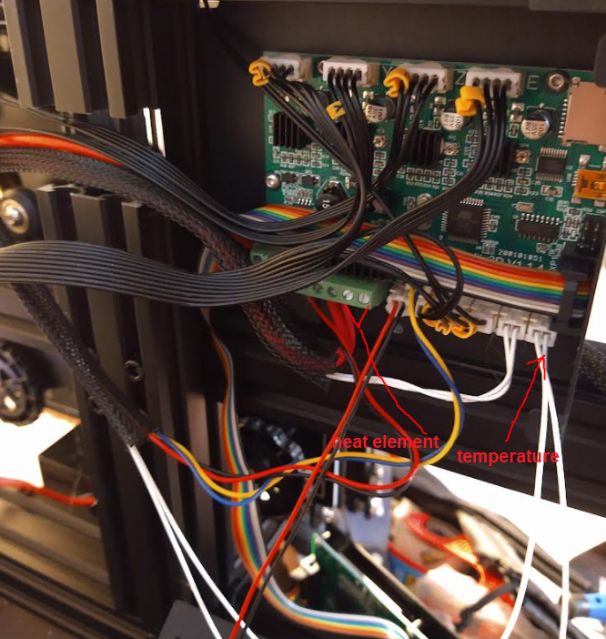
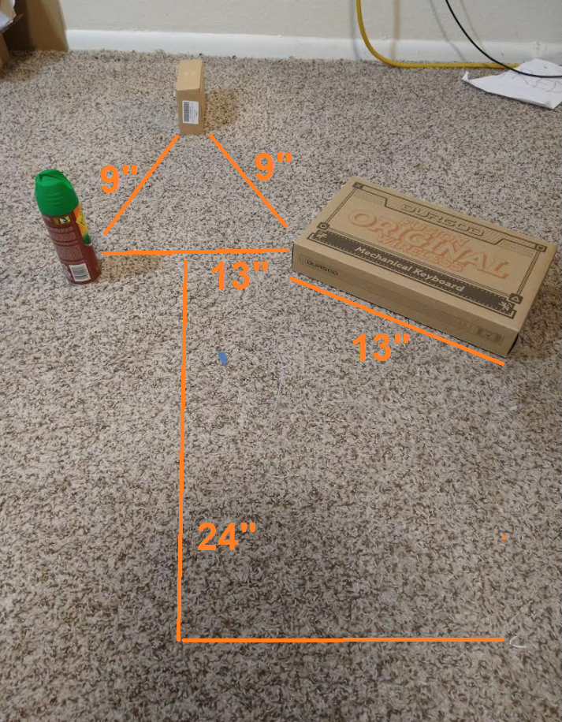
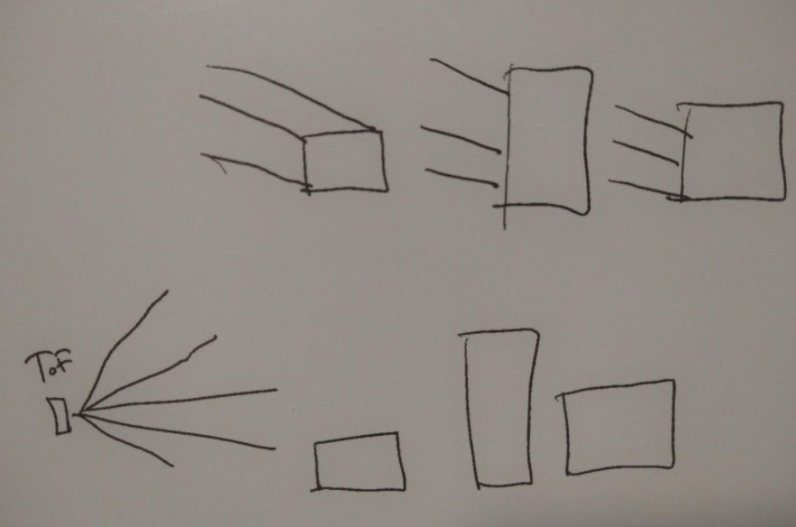

I finally got the Pinephone Pro in, messed around with it already.

I'm printing the webcam stand for it, that's a 5hr jobby.

I need to make a post on this project/good progress.

So yesterday I have gotten the forward motion and turning... they're not 100% but that's this project as a whole.

Now I need to setup the "system" that drives the robot.

Which eventually will get plotted in realtime to ThreeJS the telemetry.

I need to be able to show an external environment and then get the robot to detect it, it has to be more complex than a perfect wall for example a plastic bag on the ground.

I have a tripod leg that would be interesting, might miss it with the samples, ooh, inter-degree measuring that could be something.

Where the sampling layers are offset

Anyway starting to formulate this:

- initial on that's 0, 0, 3.5
- do a front scan, at least 2x away for it to be worth going that way
- keep going forward until obstacle found
- turn left (only direction can turn lol)
- map

"Done" is have at least cubes displayed in ThreeJS including battery voltage would be nice.

During this process the travelled distances are logged and sent to ThreeJS via ESP-01.

I have not checked the foot print of turning if it fits within the 10" bounds need to get that piece of cardboard out again.

Distracted by trying to flash img to PPP eMMC

Well I have over 2 more hours of 3D printing time so I'll work on this.

Oh man... 3hrs in print failed... I did make a mistake with my model (part of the body was underground). The failure was the head was plugged, bubble of plastic at the end of the tip.

I think my hot end actually died, it's not reaching temp

The hot part is hot, it's the nozzle that's not interesting

Man... the alignment was messed up, took a few tries to get the Z normal again, now it's printing nicely.

Well finally done with that printing job. It fit nicely did have to add some minor tweaks but as is it's usable thankfully with a small piece glued on from scrap plastic.

I'm kind of burnt already but this will take priority before I dive into that other project (writing a Linux app).

I'm feeling a slump... I have not been productive today, I did get a goal done but it was largely just working.

I forgot I should do an open space sample just to visually have a reference of that.

I still have to simplify it (average?) and do the ray collision stuff

Alright I think it's coming to me... let's go

Gotta process some data now

I need to see how high it lifts the legs

I'm just going to doodle/sketch now. I'll finish doing the spreadsheet stuff to plot the open space.

This is a pretty crude sensing platform and it sucks like this robot will trip over like a tiny stick or something.

So the robot is a 10" cube. it has 5 slices, the bottom most one is almost useless, it's a nearest range detection kind of thing.

7.5", 4", 2.5" those are the heights of the objects above left to right

This is what I'm concerned about, I don't have a lot of beams.

It's possible to completely miss something, so I have to plan the scanning based on minimum coverage/clearance/etc...

The image above you can see the triangle area, the robot can't fit through there but the it can through the entrance.

It would be trapped in there... depending on how far down it gets (middle line) that farthest box might indicate open space beyond this 13" gate.
