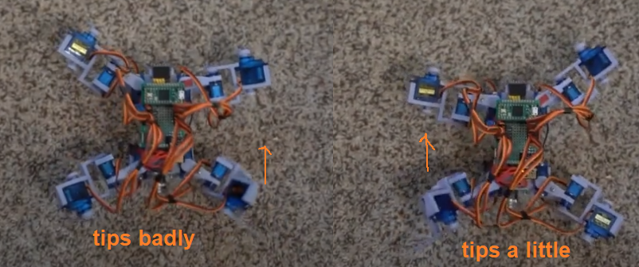
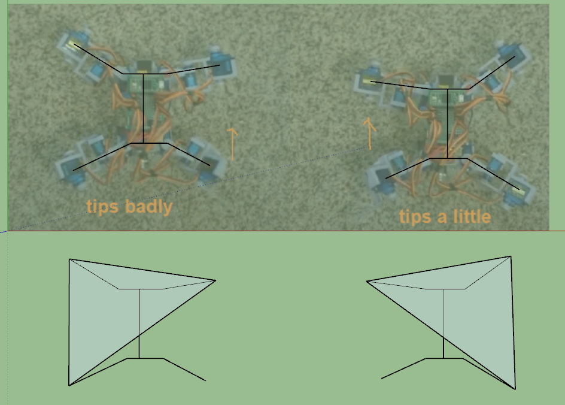

Well... I can't really think right now/seem to do anything.

I will take today/next day off (to reset sleep pattern).

The sweet smell of water/possibly mold from my leaking roof that makes my ceiling look disgusting nice.

Anyway today I will work on the actual navigation of this robot.

I'm going to see if I can transmit a full scan as it would be nice to include that in the ThreeJS map.

It would also be nice to have a prettier web interface.

I have to work out the scanning intervals based on the angles... I have to rework the gaits again at some point but it's just a waste of time right now.

Time consuming

First up I will do a scan and try to transmit it to the web interface

I feel lost right now, like what else do I need to do to consider this complete. I have lost a lot of drive on this project/have other stuff I'm working on/looking into now.

The goal was this robot could roam around on its own in a cluttered apartment complex setup where there are things strewn around on the floor, boxes, plastic bags, clothes, etc...

This robot would be better than your typical ultrasonic sensor which usually require an almost "perfect" reflection surface to work well eg. walls of a building.

Damn cat's in the window, power of the sun shooting directly into my eyes

- [ ] scan command
- [ ] send data by ESP see if it makes it to web

I don't know how well this will work, it's so much data to send.

Something like 150 x 4 x 5 = 3000 values, each value can be several digits long, signed, float... yeah...

This is why I don't think I can send it, my communication is janky.

Best I can do is compuete on the robot what it saw, if it ran into anything and then send the coordinates/box info to plot in ThreeJS.

Yeah I need to do another blank scan unfortunately, process it and then do the math in C++ on the Teensy

Math being collision checking

Well... much as I don't really want to I'm going to rework the gaits again for walking because I don't want that weight in the way.

The tipping is so annoying, I'm thinking I need to reduce the travel. Gotta watch some slow-motion footage.

The above is the last part of the gait where it swings the back-right leg forward and this is where it tips backwards towards that corner.

I wonder if the front-right leg was further backwards would that help?

The mirror tips a lot less if not at all so I'm not sure what the difference is.

They seem to be the same...

I'm going to try it, move the front-right leg back some and check it's balance

