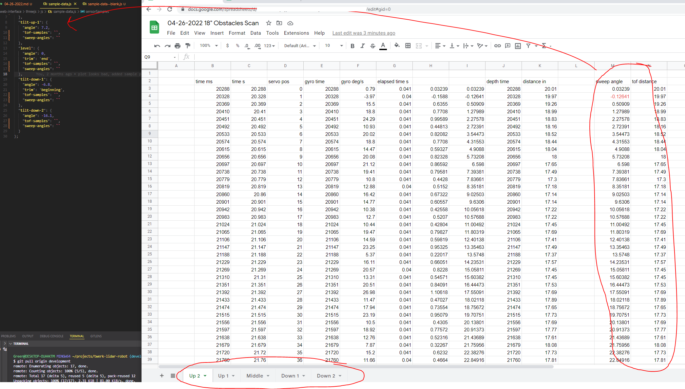
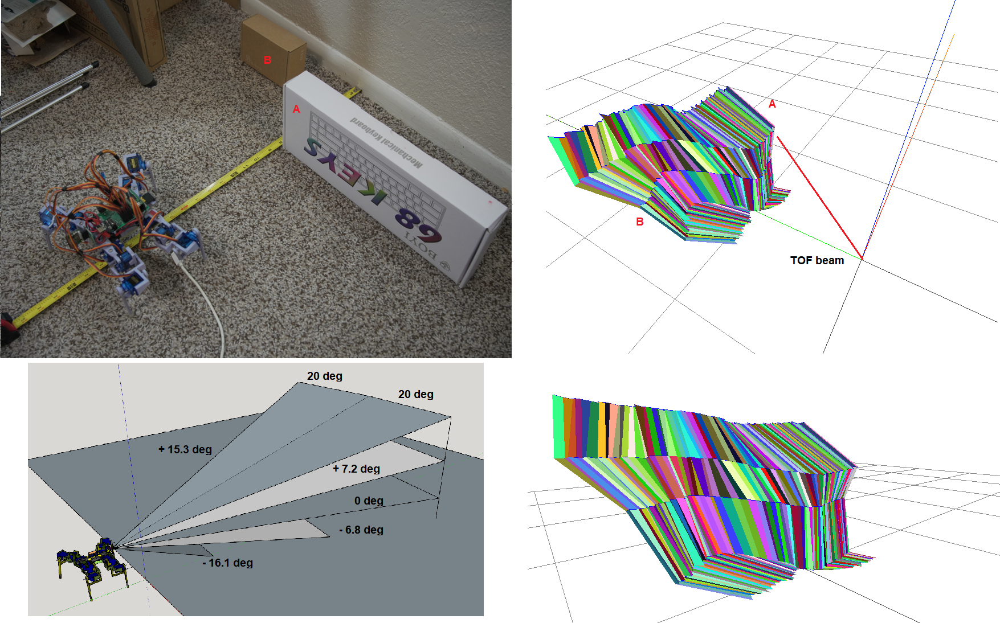

Okay so I'm going to put some time into this again today.

I'm pretty fresh... been up a couple hours now, not great sleep but I can write some code.

I'm going to do 3 fresh depth samples:

* free space
* 14" away from a wall
* known obstacle

That'll take time but what I'm going to do is write the depth/mesh collision check "algorithm" separately.

Then I'll put these samples into some kind of variable/file structure to use.

1:06 PM
Okay I've got the samples down. I did notice the outer two sets of servos (middle, outer) are warm to the touch

I don't know if it's because of the vibration where the servos over correct themselves... anyway it's a good lesson don't buy cheap stuff for a project like this.

I put over two weeks into the physical body alone and it's almost crap just because of the servos... I would have to find equivalent sizes in metal gear/more torque to keep using this frame.

1:16 PM
I put in an order for some metal gear 9G servos from DFRobot we'll see how they do, they look to be the same dimensions so that's good, I should be able to just drop them in.

I guess in retrospect if the physical components are the same, does having metal gears help?

1:37 PM
I've lost steam... I didn't buy the servos above I didn't realize they're based in China and DHL is a pain in the ass to deal with where I live.

Anyway I think metal gear isn't going to help me and also the future robot needs to be better period, not using servos but some kind of actuator and it has to have feedback.

I'm not looking to dive into another robot project in a while though, want to wrap this one up. I have other related projects like a vision system with the Pi Zero 2 that I have and another pan/tilt sensor attempt (this time a ...)

I keep forgetting what these things are called, slip ring that's it.

Yeah so you'd have this pan/tilt assembly using slip ring as bearings and you would have the Lidar sensor on that.

I'm sifting through the obstacle data to use that one seems more interesting

I keep listening to [this guy](https://www.youtube.com/watch?v=s4fStVqz7TU) lol

*wuhhhrrrrrnnnnnnnnnnnnnnnnn deep in my heart...*

Ahh man I'm already floundering not sure if I will get anything meaningfull done, I'm still waiting for a print. I've got more than 2 hours to go.

It takes time to sift through the data entered into the spreadsheet which is why it will be nice to do this processing on the Teensy and then send any info to the web, much smaller than the raw data.

2:12 PM
Jeez... just got done parsing through one spreadsheet of data

I will only do this one, and it's the most interesting, known obstacle dimensions/distances

See what I have to do.

I start out with the 6 columns of data (time, servo pos, time, gyro data, time, distance)

And sump up the values to get the full sweep angles per sample

What I have not done yet is work out the minimum sampling frequency to not run into things based on those 5 triangular plane samples and the robot's dimensions, max foot height clearance.

2:36 PM
Damn I made this graphic before which is a side view of the robot and the sensor angles... can't find it will have to remake it.

3:10 PM
I'm looking at the angle averages

24.42
-23.55
26.77
28.75
-20
-24.68
26.05
25.13
-20.74
-24.65
23.47
27.00

Roughly 25 deg on average

The servos move 40 degress, and it's half that so it should be 20 degrees sweep with that much error

3:20 PM rough model, these angles are kind of random

Just what I got after all the random gaits I tried

I still have not factored out the "ToF sensor on orb" so you can see the non-flat surfaces that should be flat

Anyway these constraints will tell me how often it should scan, operating "box", etc...

The max height (servo wires) of the robot is 8" but I think for simplicity I'll just treat is a 10" cube.

I'll see if I can get something worked out/a basic obstacle detection program running today.

The print will be done soon/will go to the park to try it out I'm excited for that, the trees don't all have leaves yet but it's a nice sunny blue sky day.

I have to get walking dimensions again regarding time and speed, I think I changed the max rate of the gates

Moves about 2" per forward walk gait, dang sucks about the backwards tipping

It moves relatively straight at least

7:31 PM
Back from the fields (kiyaaaaaaaaa) was great

Going to see how I did real quick.

Ugh boring shots, everything's still dead.

The sun is so energizing I felt at peace at that moment just being out there.

8:29 PM
Break, back, feeling spent and my skin is tingly from the sun

I'm going to come up with a quick and crappy navigation algorithm

My fingers are curling up on their own ha, too much typing/using camera

Since I'm running out of time I will work in silence too no music

The thing is I don't want it to scan every 2 inches.

It looks like the minimum distance away from it based on down 2 is just under 12" away.

So if you measure something under 12" you would try to turn.

Will try 5" is the closest before it has to turn.

That's 5" from the sensor plate, gives room for the outward sweeping legs.

I'm losing hope.

Ahh... not sure if I can do it, feeling spent.

