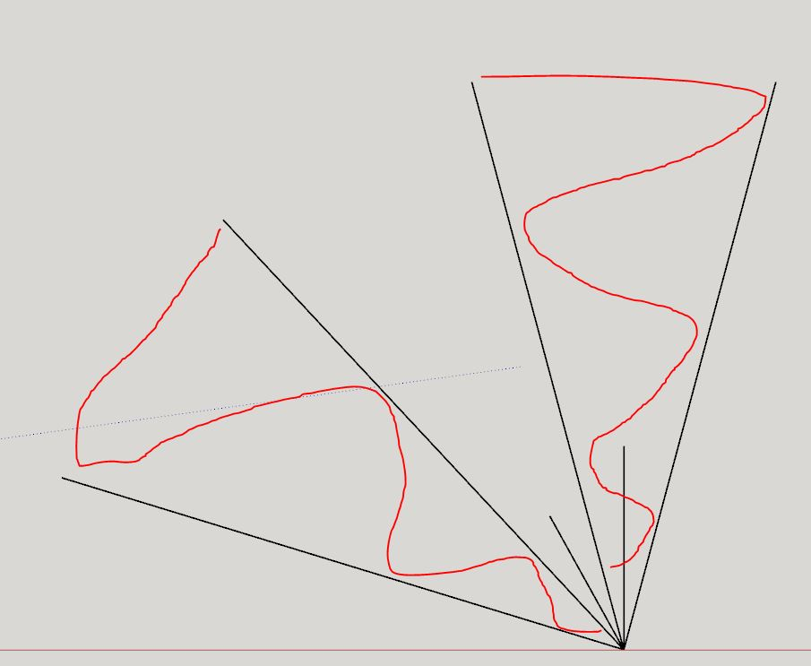

3:55 PM
Much as I hate to say it, I think I have to rework the sweep/increase it. Because 15 deg per side is too narrow it should be at least/more than 20.

The main thing is needing to scan wide enough/close enough for the body to clear.

The turning is 58 deg so if I can get say... ehh I don't know everytime I rework gaits it sets me back so much.

At 16" away you can get the 6" left/right clearance at 20deg sweep.

15" it has to be at least 20" away.

The red squiggles are the sample area about 30 degrees.

The middle gap the farthest clearance at 20" is just under 10", you could theoretically go through that but the robot turning radius is capped at 6"/12" box.

This is representing one turnLeft gait (58 degrees to the left)

Interesting it almost makes a hexagon shape if it just turns in one way at a fixed 58 degrees.

Sucks there's no "small turn" future feature.

Goal today aside from my CE prototype is drawing the basic cubes/improving the crappy obstacle detection logic I made earlier.

Actually my clearance might be larger, I need to put it on the ground/extend the lines outwards.

Keep forgetting the sensor plate is not at a rotation point, it's in front.

See here it's bound by 11.5" sheets of paper and the legs still touch them

The yellow dot is roughly the center of the turning area.

Anyway even with the 2.25" sensor offset from the rotation sensor in mind it still needs about 20" ahead to be sure to clear the 12" body.

I'm looking at some top sweep video stills

with regard to the width of the body itself (9") the left sweep matches it's left-outer-most leg in 12"

Extending that to 6" left clearance, it takes 17" ToF of distance to clear.

it takes about 17" as well on the right side, a little more.

So I can set a min cap of 17" and then factor the rotation in.

Then it can move forward 5 gaits, since there's an 11" clearance with regard to the 12" circle that represents the robot's turning radius.

