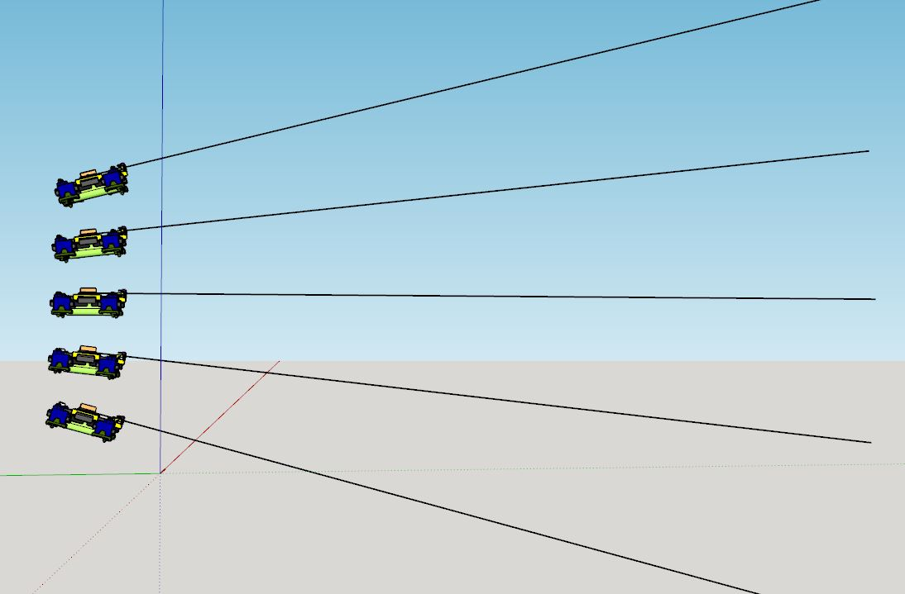
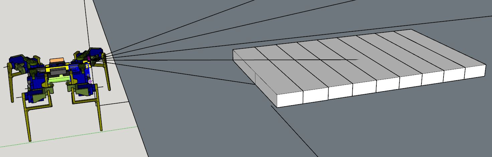

I'm going to spend some time on this today, yesterday's progress was kind of weak.

I want to actually make an algo that processes the scans and does basic obstacle detection.

I did realize this sideways slice is not an accurate representation, the body should tilt.

Not sure why I made this but just visualizing how it works

Not sure what exactly I'm doing right now

These are 2" wide, 1" tall blocks, the legs have a minimum clearance of 0.78" so anything above that the robot can't really traverse. It could if it had planned gaits/stronger servos but it's a dumb, "everything is flat" kind of robot.

Yeah I think the course-ness of the scans vertically is the problem.

It seems like you really would have to scan every time it moves forward which sucks.

I guess what could happen is if the acceleremoter values are not positive enough, means you're stuck.

I think I tried working on this before and it was bad due to the rocking nature of the robot and the quality/calibration of the sensor.

"All clear" means

- u2 - 12" clearance
- u1 - 12" clearance
- m1 - 12" clearance
- d1 - 12" clearance
- d2 - 12" clearance

if d1 is at 20" means nothing in front theoretically

same for m1 being at/close to 47" which is the max capped distance

Going to format the data back into what it's stored as by the Teensy.

I think a scan every 4 forward gaits (8") would make sense. This number comes from the distance between d1 and d2 beam intersection against the ground/a 2" block.

You could put this robot on a ledge and it would walk to its death ha, because in front of it is clear.

I'll put a basic "error correction" in where you need at least 3 grouped points to confirm something isn't a fluke in case of a weird ToF measurement.

You really can't beat a vision system, specifically an inertial odometry type where you map pixels to motion. Because a metal rod could be completely missed by this scan and the robot would just run right into it.

Vision has flaws too like a body of water might look solid but it's not able to support weight (context/fusion of other sensors)

I think that will be a main goal of mine is making that modular vision/navigation unit which bundles the camera/vision processing and a depth probe on a pan/tilt system.

I'm not feeling this, today's a bad day for me, personal problems, low sleep

7:19 PM
I'm going to throw something togetehr real quick. Napped

I have to set this aside a bit again.

The end goal anyway is complex/needs work, I'd like to achieve that/have something polished to show.

