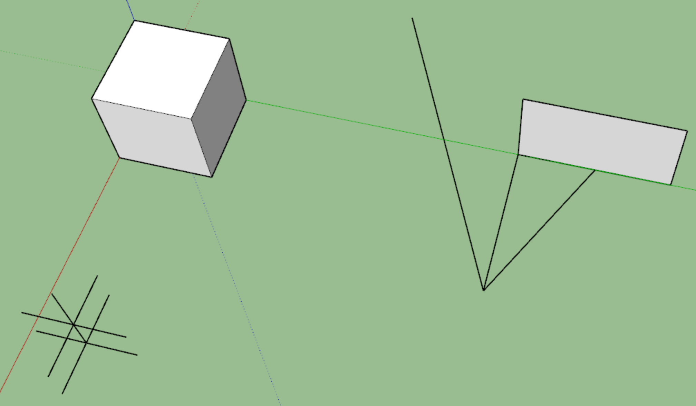

So... I pre-ordered a Pinephone Pro, I'm not sure when that'll come but I need to be done with this project and move onto that.

I have wanted to write and release a Pinephone Pro app although in this case it will probably be a KDE/Kirigami related app at first.

I want that future though, to go against the duopoly of Apple/Android and I like the idea of a desktop based on your phone. I know it's not equivalent to my gaming PC but still.

Also this is one of those fetishes/fantasy that isn't really based on reality eg. I am always at my nice desk with ideal setup where this mobile-based development could be a cool thing though it's crippling yourself. Like those tiny computers with their tiny keyboards... like why. I like using a full-sized mechanical keyboard (65% preferred).

Anyway I have lost steam with this project, I'm also distracted but semi-burnt. I worked some over the weekend after a full week of work so I need like a "break break".

I created the `development-2` branch with the intent of reworking how the servos move but honestly I'm just going to proceed with the rest of the mapping/math.

What's also not considered is the realtime data transmission stream. That will come later on after the robot can actually maintain state and navigate.

What am I missing right now?

There is no world state... I need that 0, 0, 0... which actually is based in inches and it would have a height, I have to measure it real quick.

It's been a bit sine I worked on this robot so I'm a little excited. Mostly I want an ego bump from posting an update somewhere.

3" and 5/16" is where the side center of the IMU chip is roughly.

3.31"

I'll just do two decimal place precision

Doing some real world sampling/estimation

My test is the keyboard box which is roughly a 13.25" by 8" box, long wise

It is 13.5" away measured, now will do a robot sweep sample, just zero pitch angle

Can see my test setup here

The robot was aligned initially this is after the sweep sampling where it went halfway right then all the way left.

It is interesting like right away right here, it should know it's going to hit that if it keeps going forward.

But it is beyond the body threshold which is 4.25" ahead (measured from ToF sensor)

This dimension primarily is concerned about the legs having room to swinging forward.

Checking the data if I can reproduce the above image

I'm just going to round the numbers to 2 decimal places or truncate, I remember there was some rounding issue of floats in C++ FLOATS DO NOT WORK THAT WAY ha Morbo but no there is a `std::round` function can use.

Anyway bottom line is this thing has so much error and misunderstanding on my part it's not really accurate/just a toy.

6.75" is the horizontal distance of the farthest sweep it should be 15.09" away according to a SketchUp mockup of the setup above.

Oh... there is a problem where the ToF sensor is farther forward than the center point. It is 2.25" forward of the IMU center.

It is 2.16" in SketchUp but that's to the peg. The sensor extends a little more than that, 2.25" is my eyeball parallax measurement with a tape measure.

Anyway... means I have to add this extra bit to any ToF measurements.

It's pretty good, the sensor got 15.2" and the modeled is 15.09"

What has to happen is you scan beyond the min range, then determine if there is anything in front. Then you move a set amount like a whole body length, then you stop and measure again.

Which I have to see how long it takes to cover that distance moving forward. Right now it does not move forward in a perfectly straight line.

4.25" min ahead of ToF + let's say two body lengths since it's pretty accurate.

4.25" + 17"

21.25" is the threshold of "something is in the way".

Ehh actually I'll just keep it one body length, because then you know it can advance forward a full walk cycle or not.

So now the obstacle detected threshold is 8.75"

Yeah this sensor is pretty damn accurate, I measured from the cardboard origin to the wall which is the farthest distance it measured and yeah it is pretty spot on regarding 39-40" away.

So this navigation process will work... it's all just matter of arranging it to work well (lol really? no... you don't say)

Can see below how I'm visualizing stuff.

I'm just stepping through what I gathered and this is just one plane too.

Oh yeah the down angle is important that also coincides with "is there something near me on the ground".

Oh yeah let me get a sample of that real quick to compare.

The pitch angle check is not good. I think it's because it abruptly jumps.

It's hard to make it smooth manually eg. combine the servos, make a change, look at result, continue...

The pitch down gyro measurement peaked at -35 which quick check is a negative rotation (clockwise).

Counter-clockwise is positive for some reason.

So this means I'll have to put some time into the pitch up/down so it is more smooth.

