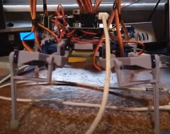
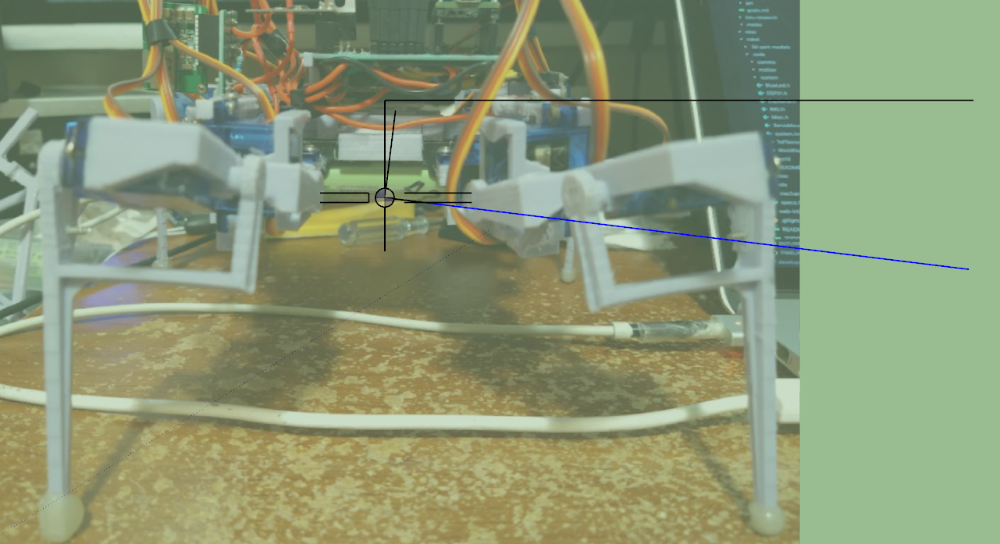

Alright... goals

I will fix the pitch up/down today. I'm already pretty spent but I think I can handle this.

I will also increase the slicing on the sampling I mentioned up to 5 horizontal rows.

I think I'll do that after I write the code to go through it/without me copy-pasting into a spreadsheet.

Ahh man I'm not feeling it, need to do it though, make progress.

I put a loop to tilt down, then up, ...

Yeah it's bad when it tilts down

It looks "straight forward" to fix, for the back legs when they're going townwards to lift the back up, the outer legs need to go outwards to make up for the lost height when they slide inwards.

For the front legs they are going up and the legs are again losing height by going outwards.

How much do they move not sure, I'll try half.

So I'm just gonna try and pair what's moving up/down. Will try 10 degrees at first to check direction is right and if that's enough, not using trig here.

"inverse kinematics" I know that term but don't know it yet/to use it.

Oh damn they're mirrored/have to spin in opposite directions

Lol the back-right servo doesn't move at all, middle just realized odd

Ugh... it's the manual set lengths forgot about that, I have a fix for it but it's not applied everywhere since there are so many calls

It's better but it keeps shifting forward some like a quarter inch every time and to the right

I'll try increasing the outer servo throw by half

It's better, it shifts some but it returns pretty close

The leg tips almost don't move which is what I want

And a quick screen measurement angle is... 7.6 deg and does that make sense?...

idk... I moved the inner legs 20 degrees and the outer legs 15... would have to do some math regarding mid point, changed height... kind of deal.

But I can external expect how much it should move/what the angular velocity sum out to be.

I'm good with that, let me get a sample

Ooh... what's interesting is it's possible an angled surface will deflect the beam/it won't come back that's not good.

It's very small/precise unlike an ultrasonic sensor and it has a small dimension between the emitter/receiver but I pointed it at an angled drawing tablet and it said it was beyond infinity/far away...

Haha 1 degree... that's not good.

Yeah... not sure why this is like this, 1 degree motion?

Yeah... measured it again it should get a 7 degree rotation... damn

But... that's a parallel surface... maybe it's exagerrated? I feel like I'm fitting to the wrong curve/conclusion here.

I might have to use the NED value... hmm that sucks because each step will have to crunch those numbers the 3 operations.

Granted... this is a 600MHz processor like it shouldn't be a problem but I have no figures on the math.

I don't understand, torque is torque right... even if the rotating thing is far from the center it will still rotate...

Or maybe less because of the arc, I have to imagine where the rotation is

This is where the IMU is in relation to where it's rotating about due to physical geometry.

I think this makes sense/is right.

The two (middle) servo rotation points have to be linked together because it physically cannot change... so if it tilts in anyway those two rotation points are aligned.

So yeah... I'll have to pull the NED and see if I can get pretty good angle from it.

