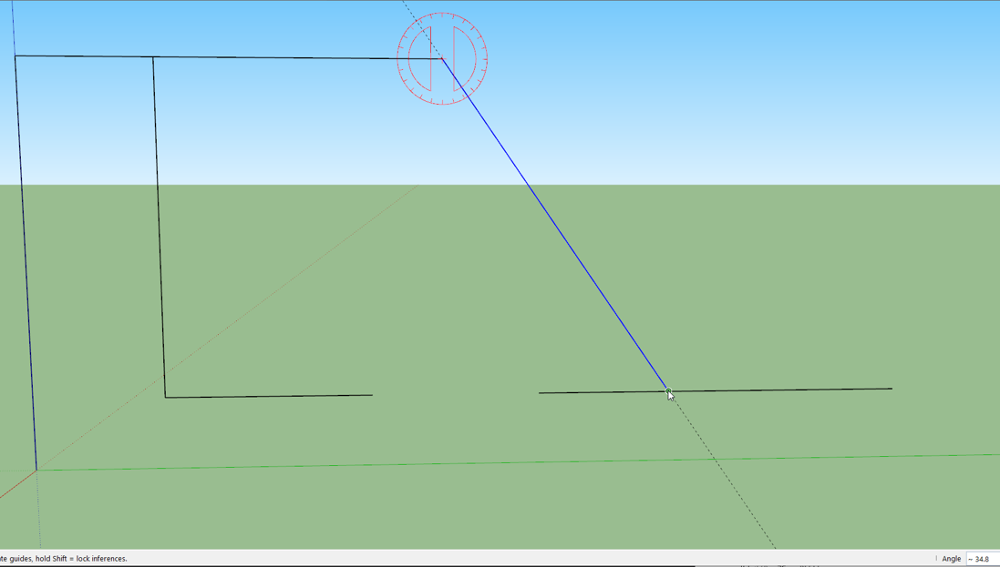

Back on this again, got sidetrack with another stupid crypto trading project

I'll post that later after I let it run for at least a week untouched

So far I've been having to change it it's been slow because I did not mock things/just used it against the endpoints.

So the 5 min looper it takes that long for me to see some failure and fix it, and then it's still broken, so yeah...

So far I'm down 2% lol, it's definitely not a brains thing just because I can do it/try it sort of thing

Last time I was trying to figure out the pitch angle using NED, since the pitch gyro values were not good

This is hard for me since I'm not a math guy/have barely worked with vectors and thinking in 3D space

oh man my hands are sweatin... second energy drink

I'm already feeling spent but I'll push through

I really want to make progress on this project

Got the focus headset on let's go

Values for 45 degrees up approx

-3235.56
-331.37
-3108.15
-53.31
445.24
8.03
0.00
0.00
-7.25

Oh yeah... I could just do a comparison, this is level then measure at an agle and use trig

Not using NED at all

So -35.10 in f/s^2

The problem is I don't have a specific dimension to use like a hypotenuse

The hypotenuse is gravity but I don't have an agent height... maybe I can use the IMU height from the ground, not sure if that makes sense

Going to cheat with SketchUp since my dumb brain is having a hard time visualizing this

See by knowing how much the value shortened and rotating it I can figure out the angle but what is that in a function it's CAH in SOH-CAH-TOA right (lmao)

Should be 34.8 angle

Oh damn I got it, using wolfram alpha

So I have two known lengths, the original "intensity" of graivty when it's flat on the groun and the measured value while at an angle... these two lengths are used with inverse cosine to get the degrees

Might be in radians, convert to degrees

Ehh the values are not accurate

This is not good, it will only read "extreme" angles as in beyond 20 degrees in pitch due to the 1/-1 acos limit

I'm going to review NED again

I am curious though what is the minimum angle to scan the floor to give a body length of space

21.7 deg down

Shallower angle means farther away

This is assumming the ToF sensor doesn't dip down as it rotates which it will

It definitely does it dips 0.32"

Power of the blyat compells me (Gopnik)

So I did a tilt down and got an NED sample

