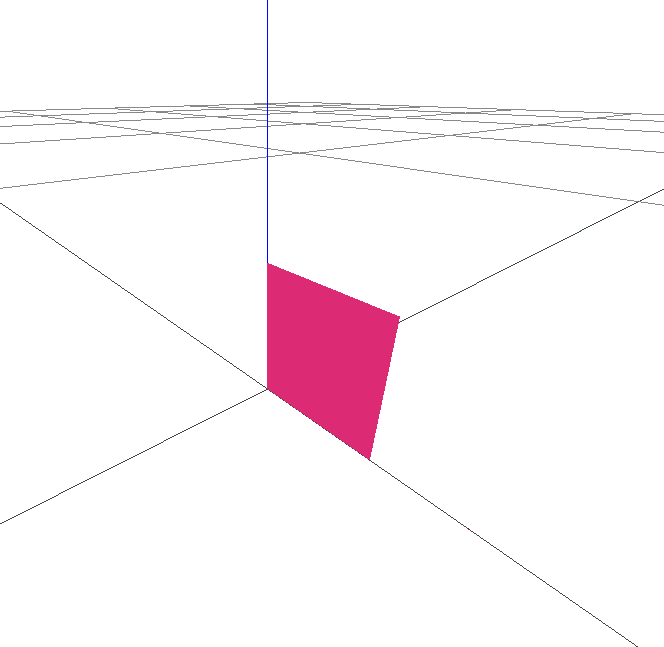
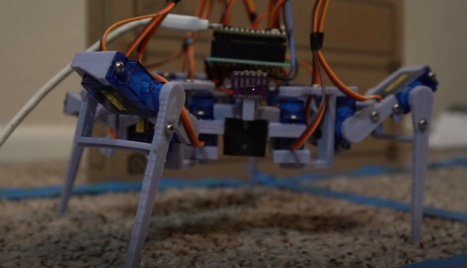
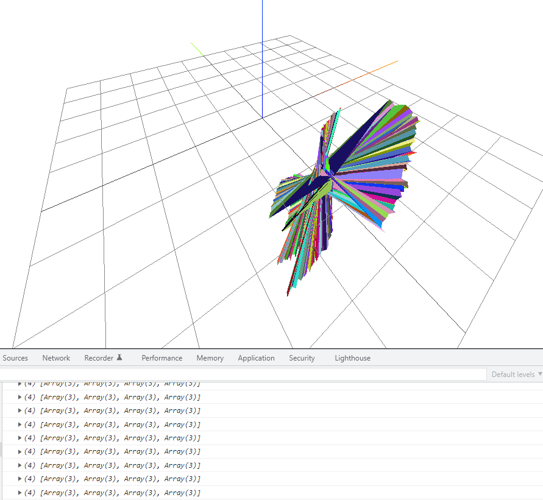
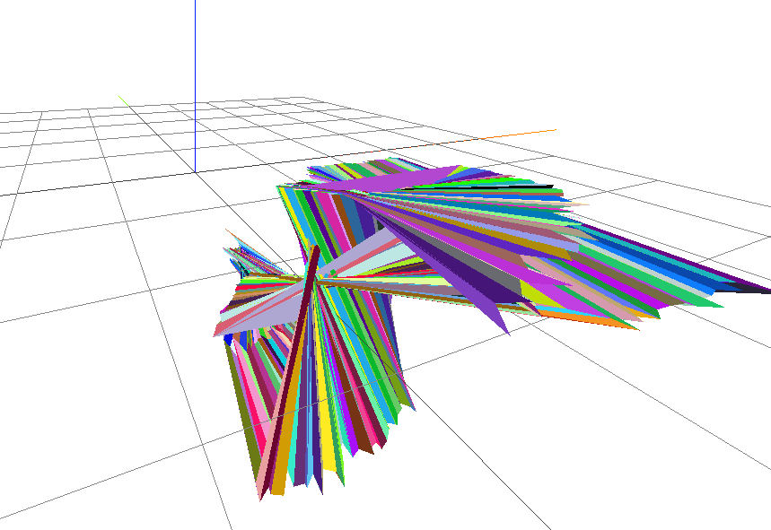
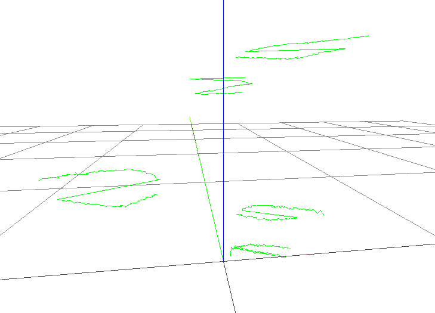

Back at it again want to get that angle and move forward

So the tilt seems to be 6.4 degrees (camera SketchUp external measure)

The servos moved... 20 degrees, and the outer ones moved as well

I just had a thought (ooh) I can skip all the math crap for now and focus on that later (a project specifically on a better IMU) and since the tilts are known I know what they should be.

So... yeah I'm down for that... because I could learn how to use the angle between two 3D vector formula and extract the part specifically for pitch... but I'm not sure if my IMU is even working right.

It's like NED/I'm looking at a map/I know which way is North, of course... the direction of North can change (into the ground) even so... the axes on the IMU do not behave the way I expect them to, I keep fitting the output to what I expect should happen.

So yeah... I will manually get 5 tilt samples, verify them by video stills and then use that to work out calculations.

Unfortunately I need two more pitches which means I gotta program two more tilt up/down commands

But I'm down... at least I'm not stuck

Oh yeah I do need to get the geometery min/max distances based on tilt but that's easy in SketchUp

Tasks:

- in SketchUp do the base dimensions/arcing to see where the beam will be
  - gives min distance away
- add two more tilt up/down... probably just 10 degrees vs. 20 degrees
  - check these angles in Sketchup/what sampling they add
- start developing the mapping stuff based on ToF responses
- (probably too far)
  - transmit these dimensions as cubes and plot in ThreeJS world

at 6.4" down (current tilt) it measures very far away eg. 32.63" away

The other two tilt samples will need to be even further, a simple one is to do twice what is there now

Here it's lookin as close as 17.38"

The upper scan is far though for height clearance it's 48.7" away but the lower scans should catch anything in front

Also this distance is within the 6' suggested operating range

Wow this angle is actually insane damn, it's very steep, this `tiltDownFurther()` function

13.1 is the second angle

Ehh... I just feel weak need to get the pump, get this done, the micro crypto trader project has distracted me due to my own crappy state management, it keeps breaking but I think I have it nailed down now, it's up at least not in loss but I think generally crypto is on the upswing so it was bound to happen (why don't you buy more) well I've been rekt already at least $1.6K down at this point in recent time.

So I'll get the new tilt up/down things in placea and then record it doing it to confirm the angles

Let's go I summon thee power of Death Grips

So now I have those tilts and their angles which unfortunately is not mirrored but I'm past the point of caring now I need to make bigger strides.

So it's going to tilt all the way up, then go the right, then follow an S pattern like this:

```
---------- (12.3)
|
---------- (6)
         |
---------- (level)
|
---------- (-7.4)
         |
---------- (-13.9)
```

Of course I still have to track linear acceleration to track it moving and the rotations

Crap sweep is sliding around, also the servos seem clsoe to running into max endpoints/stripping, these things suck, I have already started looking for other servos specifically with metal gears.

Ultimately won't use servos but some kind of BLDC actuator or whatever

Sweep looks like I will need to do some adjustments there as well

Ahh man... if I adjust the outer servos on the sweep then the pitch outer positions will be affected as well/have to sync them

So the lowest down angle has a clearance check of 13.66" away

Ha... I just remembered I don't think this thing can turn yet... I have to go back to a mirrored x-shape from the standing/walking pose and then turn.

An immediate goal is to dump data from the full scan process

Log it then plot it in ThreeJS manually

I made a plane mapper ("mesh"?) from points from my "Sensor Fusion CLU" project that went nowhere

I can see the shifting around issue due to the sweep... a possibility is tracking the outer leg positions in an external variable and using those/pulling them in per motion so they line up

But there's still so much to this project to do and I'm trying to finish it in this month.

Next month I should have th Pinephone Pro and will work on an app for that.

I don't have a lot of money at the moment so that's why I can't like buy a bunch of parts for the future robot, I can work on parts of it. The future robot is going to be bigger/stronger/better (we can build him...)

It's inspired by this Star Wars laser spider droid thing with regard to very long/tall legs but it's still a quad design

It's the big one without eyes, the rods lift up/down via a pinion rack gear, that'll be cool to design/print

This is going to be a lot of data to copy/paste

It's actually concerning when the robot is in the farthest downward tilt and it is looking left, the beam is running into the closest leg... so I'll have to limit certain distances as in bad measurements.

This project needs so much time but I don't have it, so I'm doing large sweeps where it accomplishes most target goals even if poorly.

I mean at the bare minimum if it can navigate better than an ultrasonic sensor/perfect reflective walls then great... but it would be nice to also do internal mapping/remembering where things are. As well as showing that graphically.

Oof... this is brutal there are around 150 samples per sweep and there are 5 of those so you'd have like 750 points to plot... that's a pretty data-rich mesh I suppose but probably means can reduce it by taking less measurements

Hmm there are cases where I'm missing data points odd

I wonder if it's from the reverse... idk didn't have this issue before

It's odd it has less steps after the first one, wondering if I missed a deg somewhere or something

I'm already starting to scope out future parts, better IMU's I am still lacking in IMU knowledge/trust in telemetry

Distracted back on

Need to get this mesh plotted, sucks about the missing data

but they're aligned by the millis time

I'm trying to find the mesh plotting code I put together a while back it only did 9 points, it now has to do 750 or so lol

There was some trig math involved

I need to sit down and do this, it should not be hard, simplify/chunk it down then grow it

Oh... I think I'm starting to remmeber what all the math was for, you have a depth measurement from the ToF sensor, this has to be projected somewhere in 3D space based on the sweep and tilt angle.

The plotting is for my own visual sake, the actual robot will internalize this data as either free space or blocks if it hits it in the threshold

Oooh.... no I have to do it again the copy/paste of the 750 samples... one of them is missing a chunk

It's tedious because I have to move the data into the columns
I have to sum the rotated angles
Then put them into a JS object
Parse out the values, do trig to get the 3D points
Make the mesh grid

Be like "cool it looks like reality" wow

There is some overlap in data due with how it back sweeps, that would be duplicate data/shoudl be removed

Yeah so a couple of the motions have three steps, and the others have two

The one that back tracks has the three steps

Oh I rember now, because the sweep is tracked by the "fluid motion" except for the backtracking ha

Ugh right off the bat it's missing two data points wtf

Might be if the imu didn't read

Maybe I have to put a minor delay between each step to get the imu to catch up idk

It is just a huge PITA to manually process this data through a spreadsheet but I need to plot that mesh today, tonight, now

Yeah the last one has full data so I think it's just a missed timing when imu is available

I will put in other sample data to fill it in

What's bad is this full sample took more than a minute to run

As cool as it is to have a single point lidar and the entire body moves, "makes it simpler" mechanically, it would be much simpler to have a dedicated pan tilt system on a robot than vice versa.

Ahh man this old math turned degrees to radians and I do the opposite on the robot

I'm feeling spent need to get food cooking and then I'll come back, I will finish this need to post this video.

I have to remember how this works, how to plot a plane

Oh it's four points

Aye there it is



I need the functions to pull the x,y,z coordinates but yeah.

Then just go through it and plot it.

The interesting part is I have to join a mesh of varying lengths probably need to chop/align.

Oh snap I also have to add a z offset

Oh man the ToF sensor moves too... so it's not accurate damn

So a standard sweep has 100 points, 50 each way for the 50 code/25 actual degrees

The extra 50 is from backtracking which occurs in...



Ha that's neat you can see the beam on camera (RIP my camera sensor pixel jk)

I'm worried the shifting legs will be a problem, where the pan/tilt positions don't match

I have to chop off data points based on the direction

So it's like this:

tilt up 2: extra
tilt up 1: normal
level: extra
tilt down 1: normal
tilt down 2: extra

The trick is where to cut off/which ends to line up.

For the first one it's the first set of data, because it turns right, then back tracks/goes all the way left.

For the middle it's the last part, because there it's returning to the middle



Ahh yeah that looks right

I need to step through this

Ahh crap I just realized the angles are going from left all the way to right or vice versa

So the angle matters with regard to cos/sin

I'll have to just split the data in half and go off that

At the end of the day it is mirrored

Nice thing is it looks like the full sweep is in the same direction after cutting off the duplicate part

Write this down real quick

x = tof / cos sweep angle
y = tof * sig sweep angle

The issue is where do you measure the angle from

That's what the part that's cut off is for to establish "0"

Ahh man... I'm failing come on

Okay I'm working this out like a dunce boy, this is what the remarkable 2 is for

What you do is average the whole angle, it seems to be 25 deg or so. Then you rotate that against 90 degrees + half of that 25 angle to make it perpendicular/center...

The numbers get shifted so that the angle is no longer 0 degrees it's 12.5 say, and it reduces towards 0 (middle of mirror) and then starts increasing again towards 12.5 mirrored.

Then I have to flip the sin/cos depending on what side I'm on.

After this I should be able to plot something that looks like a surface/wall of some kind.


It's odd the axes seem flipped, counter clockwise is supposed to be positive rotation, it doesn't really matter but still

I don't think the rotation even matters just do half and then flip the numbers

I think I can just ignore sign until the end

This math doesn't make sense but I tested it and I get what I expect

Ugh... still a mess of stuff hmm, it's also underground which is odd


I'm going to do it by section to make sense of it before doing batch

Oh damn... the values are flipped i just realized that oops

It's zig-zagging back and forward

That's a both hands to head moment

Oof I also duplicated my keys for the tilts

OMG wtf is that



At least it's (partially) above the ground now

Ahh man... I think I have to resample but get less points

So I'll have to do mod servo pos

I could do every two degrees that would be half as much

Every even or something like that

Oh man... I'm so spent...

Less data means easier to prove

Well I thought mod 4 means half of mod 2...

Let's see I'm curious too if the arc intensity is higher with less samples

Oof... this s completely F'd

There's gaps in the sweep data

hmm...

There is a mistake in the adjusted angle math, I'm back to the original full data

Man I'm having a tough time graphically aligning the data, to make sure it's plotted right



This does explain why it's not plotting right, the data's all screwed up

I don't understand why some are underground, I put the offset in for the sensor being above the ground

The three sets of squiggles are below the grid plane

Well... this failed, I need to rework this.