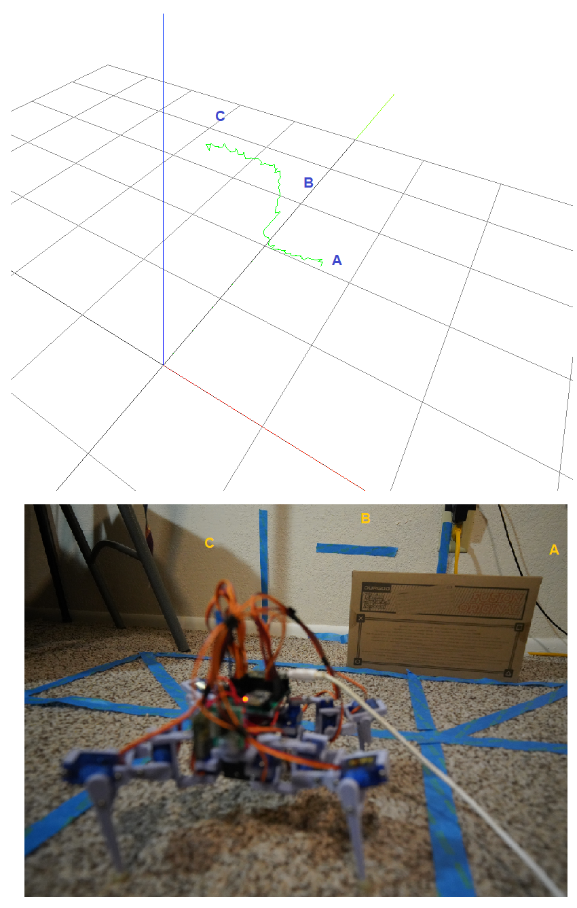
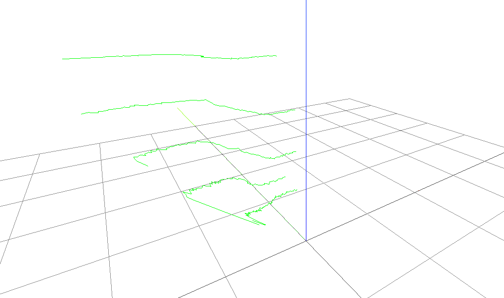
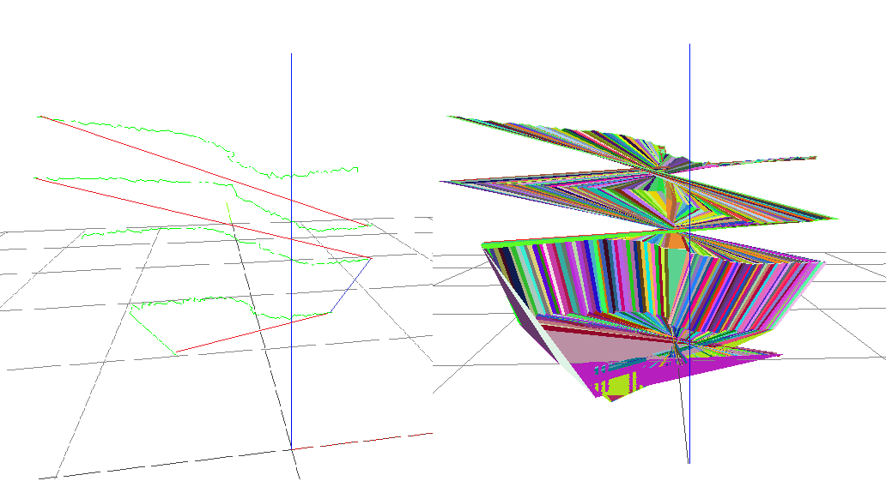
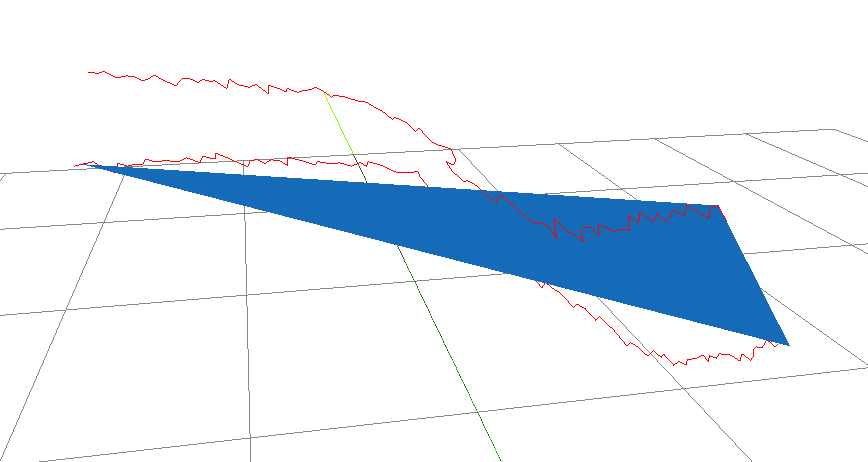
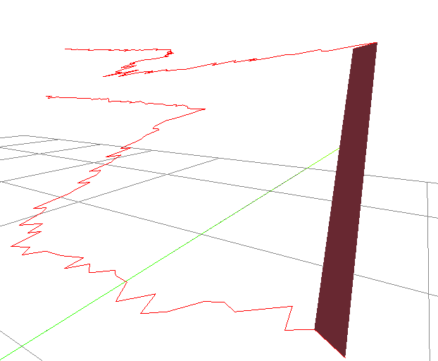
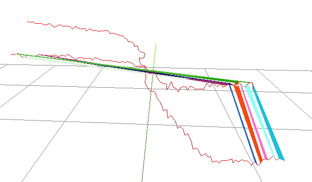
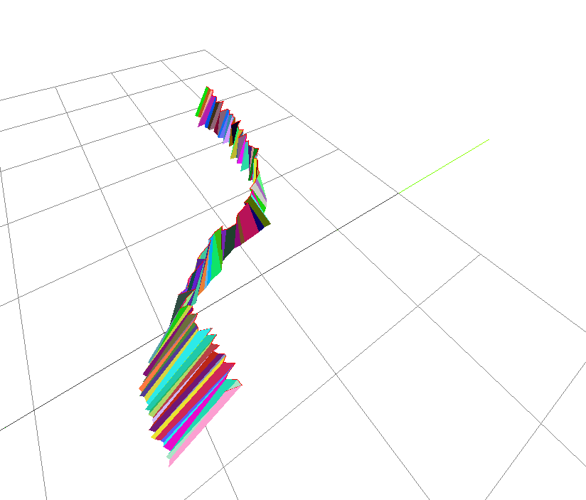
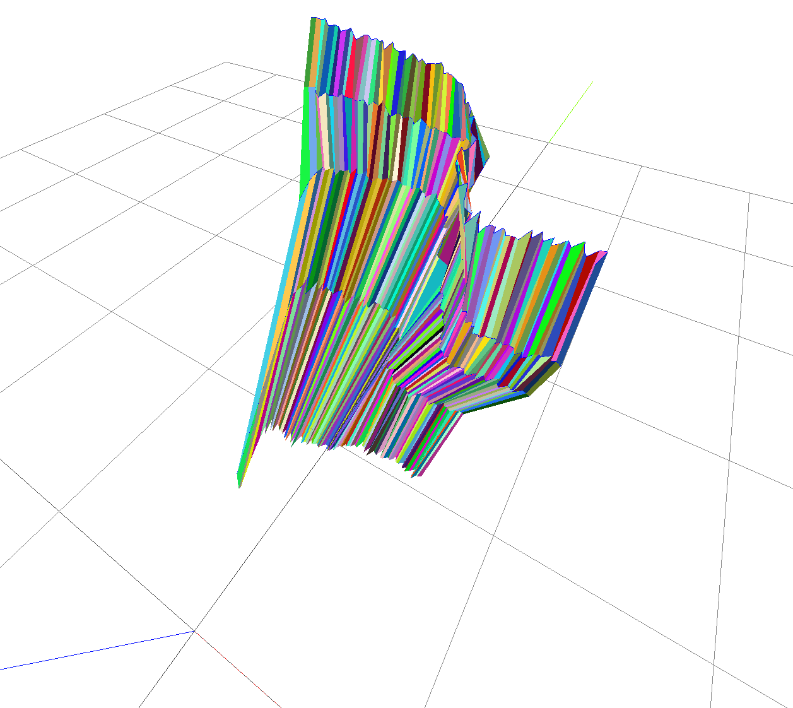

Alright back on this, will start from the basics.

Just a basic sweep plotted as a line

Damn it I forgot the mod I put in

I will have to fix the outer legs when it sweeps so it doesn't slide around, I'm hoping/thinkig it's like the pitch... I'm just concerned about them clashing... worst case I can do that global position update to share it between the different commands.

Ahh man I feel spent... I'm close just need to step through it in parts.

One problem is the angle offset/mirroring it's all bunched on one side

In the level example the rotations go in one direction so yeah think that's why

Few things wrong, truncation for example

angle not being inclusive for negative check Z axis

Now cutting it in half to see if that plots on the right side of Y/north axis

Finally something that makes sense

I did force this into some nasty code to get it to work.

The errors just compound like the shifting legs.

The ToF distances are good too.

Let me see if I can use the old data from yesterday and actually plot the mesh now.

This is looking good but I'm not sure if I'm forcing the data to fit realit... the negative angles were undeground but it can't be underground since it hits the floor.

So for now I'm forcing negative angles to truncate at the floor/0.

Now to try the mesh plot, they're all aligned right so it should work.

There is some issues on the bottom left where I think the beam is hitting its own leg.

Awe failed lol

Ahh another source of error is that the sensor point does not stay in place it moves forwards/backwards depending on arc and left/right

So a solid wall will not be solid it should be

Also the truncating to 0 plane is probably losing depth it should be "orthogonally projected" till intersection or whatever if I knew math

Well chop it off anyway where it crosses the 0 z axis

Ahh I'm starting to see it now what's going on.

Some points are joining across versus nearest neighbors

The blue line is showing what's the correct way to join the points into a mesh

That outlier on the bottom left might have to get cut

There should be a smooth contour plane thing like a lays wavy chip

Yeah really dumb it down that helps

I see what's happening now.

The microwave just reminded me of this song I used to listen to to "follow the delusion" lol future now eg. CTO of your own company.

Hedley I can do anything.

Nah the fantasy wasn't specificaly CTO or own company just financial freedom.

I was trying to manifest an escape at the time as I was failing out of school.

ha it looks like a protein fold if you look at the zig zags close enough

well not really but thought of it out of the blue

Let's see how it works for the rest, there is some mesh overlap though

WTF it'll just shoot off randomly hmm

I'll have to step through each one

OMG I got it yes... that looks much better

I was reversing the next row arrays in the sub loop, had to move it up so it wouldn't change.

I did try a solid color but it's hard to see depth without shading, the random colors make it more clear where the edges are.

Finally