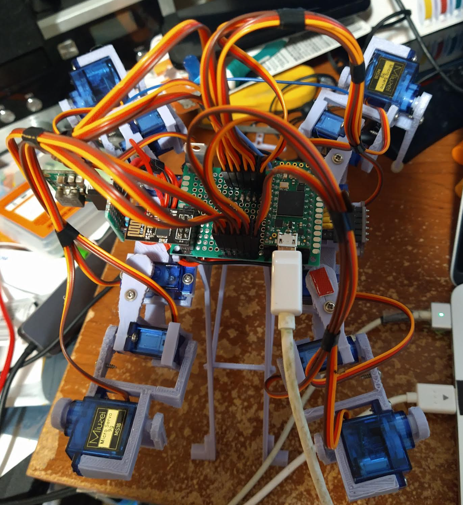

- [x] write data to CSV with Putty
  - gave up, waste of time
- [ ] fix gaits
  - [ ] forward
  - [ ] backward
  - [ ] left
  - [ ] right
- [ ] update sampling offets with measurements
  - means since the ToF sensor does not rotate about the same axis the measurements are off
- [ ] track the distance traveled using acceleration summing as it walks/moves
- [ ] plot the world using simple 3D boxes when an obstacle is found
- [ ] transmit data from robot to web interface by ESP for ThreeJS plotting
- [ ] actually do navigation and mapping
  - means I have a known physical world layout
  - I get something similar

I have to do another "stay up till the next night" day...

I got all my work done, finally unblocked BLOCKER! ah agile

I'm kinda spent already but I can do some work on here, I still have to stay up another 16 hrs so yeah...

I'm going to carry the above to do list around until it's done

There is one thing I want to do before doing the new gaits, I want to factor in the sweep/pan offset for the ToF sensor to plot more accurately.

I'll do the Putty stuff first though just to have that.

Actually I think I need to do the gaits first because they will change the sweep/scan and then the ToF offsets will be invalid

Unfortunately installing Putty on Mac is not a straight forward process it's supposed to be a one-liner with Homebrew but having problems.

I'm trying to do this Putty stuff first because it's an unknown to me and my brain is rapidly shitting the bed.

Been up 13 hrs already out of 16 in a day usable

My god this GTK3 install is taking forever

Ugh... I could use one of my windows laptops instead of this mac but whatever

https://forum.arduino.cc/t/demo-of-pc-arduino-comms-using-python/219184

This site has a cool program written by Robin2 to have Python receive the Serial data... I'll scan through the code and try it.

There is some neat ideas there... if the robot is tethered you could transmit this data in real time to the ThreeJS websocket from Python for testing.

In full raw data vs. the simplified cubes.

Ugh... forget it I don't care. Can't get the port to work.

The thing is even if I manually copy/paste each page, I have to split it up that sucks.
But the CSV has the same thing unless it is formatted to generate separate sections or multiple files... either way it sucks.

This is what it looks like from a top view right now.

I'm going to make the legs more flat so it's like a crab or sideways H shape

I need to make big progress, the Pinephone Pro is coming in and that will completely derail my mental process as in I have to learn C++ and GTK or something.

So I made it into that sideways H shape and it can't stand on 3 legs without tipping.

So I need to do a shift forward thing not sure if it will tip over or I need to coordinate the leg raise at the same time?

This forward sweep stance looks cool reminds me of that spider that burries itself in the sand.

Yeah this doesn't help it be stable on three legs ugh...

Man I am really bad at this imagining this thing moving/how it's dynamics work.

I'm back to the tipping gait method where it tips away from al eg that's lifting... maybe I can do it just once so it's asymmetrical

Yeah... this is brutal I have to manually program all the gaits because it's not using a genetic algorithm to walk on its own

Ahh man I'm having doubts/second thoughts like maybe I should just upgrade the old one

7:06 AM

Starting to get a headache from too much caffeine

I don't know why but it won't walk straight... I think it could be the legs don't lift enough/snag the carpet...

Damn cat stole my seat, I got him his own too

This gait sucks because it moves backwards to go forward

8:44 AM
Ugh... it's just so disappointing how this thing doesn't walk straight

