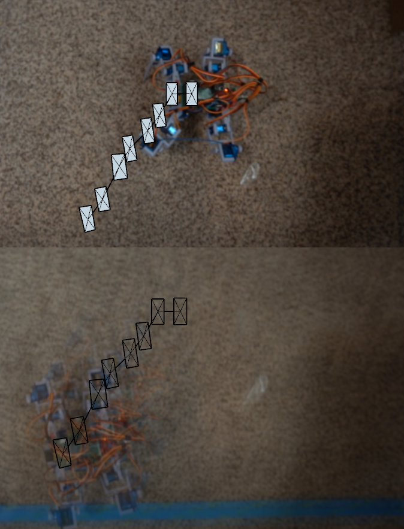

5:00 AM

- [ ] fix gaits
  - [ ] forward
  - [ ] backward
  - [ ] left
  - [ ] right
- [ ] update sampling offets with measurements
  - means since the ToF sensor does not rotate about the same axis the measurements are off
- [ ] track the distance traveled using acceleration summing as it walks/moves
- [ ] plot the world using simple 3D boxes when an obstacle is found
- [ ] transmit data from robot to web interface by ESP for ThreeJS plotting
- [ ] actually do navigation and mapping
  - means I have a known physical world layout
  - I get something similar

I woke up very early today so I'm committing some fresh brain to this project.

Yesterday I wrote a new walking gait but it needed more work on clearance. I'm working on including the outer legs means adding more things to move up/down.

Sucks these are all manually programmed vs. coordinated/abstracted together.

Really been digging Beach Bummer by No Vacation

Put that on, morning sip of coffee

Yeah this is hard/confusing like the original servo movement function addressed servos by integers as opposed to the names of the servos.

I will separate out each sub-command of a gait to keep track of them more easily.

The other thing I mentioned in the past is without tracking the servos current positions every command has to know where it is in order to avoid jumping/fast movement of gears eg. smooth 90-90-40 vs. 50-40 (gets current starting pos wrong)

I'm going to get the Pinephone Pro soon that will derail me in projects/what I'm working on. I want to dump some time into that. Gotta produce that content.

Oof... I moved a lot of stuff around, lots of broken things

I think today I will get the new forward gait and turning gait done as well as updating the ToF measurements.

Maybe I'll do the mirrored gaits as well.

I primarily just want to get to a point where I'm just working on software/data and less of mechanical stuff.

Let's just take a stroll through memory lane, I just had a random flashback

I was sitting on my bicycle at this bridge... that was a bad idea, derailed my thoughts, made me sad too thinking about the past.

See at this time I was working at Red Lobster washing plates, sometimes as a deep fry cook (frozen stuff), stocking, cleaning, etc... I was trying to break into the tech industry, I'd been freelancing/knew how to make websites for a long time. Less so as a PSD-to-HTML guy but more I knew most of the parts required to get a site up eg. generate a CSR for SSL, bind parameters to avoid sql injection, hashing passwords... stuff like that.

This was my first real job and at $20/hr it was a step up from my current $11/hr or so.

Anyway I just remembered biking this distance, early in the morning (had to be up by 5 AM to leave by like 5:30 bike the 1.5 hrs), can't remember start time but it was an 8-5 kind of job. Catered food that was nice.

I did feel sad leaving them but it was capped they only did WP type sites I couldn't learn more.

I miss the riding a bike through nature though, I had to ride 15 miles each way so that was burtal as a non-cyclist on my Walmart bike. But yeah I got to experience the trees around me, listen to podcasts/books, was nice. Would stop to look at the river under the bridge. Before this I used to ride through a field for this factory job I worked in Missouri, was nice looking at the fields of grass.

Anyway that's that... I'm doing better now financially but I'm still negative net worth/not free.

My world view has expanded though as in I expect to get paid above $50/hr nowadays.

Although at this time I'm a parter/co-owner of something (should be working now lol but I worked over the weekend).

Anyway must continue, especially with fresh brain

I still in the back of my mind have that fear like "how will I pay my bills" kind of thing but it's like, relax bro... you've mathematically proven to yourself via spreadsheet that you have more than a year and a half of burn rate even if at debt. Also you get pinged almost daily by recruiters... the other day an Amazon recruiter reached out to me about their drone program. Yeah whether or not I could actually get that job is something else, still I'm useful now/have years of professional experience even as a "Sr. SWE".

Oh man... I would jump at this job lol I'm just committed already as CTO of something else.

Realistically I probably could not get this job no degree and no specializations in robotics. The software part maybe I could do/be part of like other non-robotic software eg. websites/tools.

Oh yeah this is where you could do object-oriented programming... the legs are objects, they can inherit base "prototypes" like how to move a leg, but each leg can move its own servos.

I don't think object orientedly unless it's obvious/applies, most of my stuff is imperative scripting/cause-effect type code. There's no thing/inheritance it's just a script that runs start to finish. I'm starting to learn Haskell on the side though that's gonna be fun... at least I have a real world thing to learn it for (Simula).

Well that's not good, the outer leg updates make it unstable/want to tip over.

It's odd the other direction is fine

Oh yeah... odd... the other one the leg goes outwards... oh I think I got it, it's not moving down as far eg. 20/40

Ooh there we go working now nice, it looks hot I just wish it wasn't made out of shit parts

There's more software improvements that come to mind like flipping a command that would save lines of code. Like you raised the leg up, now lower it back down same distance.

Oh man thes stance is so hot.... it just looks like a crab or something.

Looks like it moves 1.25" per full forward gait, then will measure duration after I finish full gait update.

It has weird issues flipping backwards... hmm need to watch it in slow mo maybe

Yeah I'm half-assing the back legs they need to do the same thing of making sure they're clear/don't snag on the carpet

Oh man... sucks all of the sweep/tilt commands will have to get updated since the original stance positions changed [cries]

I'll try just lifting the legs up higher for the back legs. It's in a stable position so it doesn't have to tilt.

Looks like the back-left leg (last to move forward) is what has problems.

Yeah the front right leg dips in response, I think to support the weight

Ooh interesting that was a good catch, moving the wrong servo

Ahh yeah the back left leg can't go up on its own, has to tilt

Ooh that looks good, now let's see how it tracks

I watched it move for a while and it seems to be the back right leg losing grip as it pulls forward, so then it moves to the right

I wonder if I re-order the servos in the move forward if it matters.

Okay I think I saw it, the dipping makes it dip towards the right, need to angle the outer servos inwards to prevent dipping too much.

Yeah... I have to come up with another way to free up that back leg.

I think I can dip both right side legs and the front-left one goes downwards to roll the body and free the back left leg up... maybe

Yeah I think it's just going to be hard to guarantee moving in a straight line.

If I had an onboard camera/was using visual odometry I could know for sure which heading I was going.

The IMU is supposed to tell me but it is not very good and I don't know how to use it that well. The fact that it's a legged robot makes it harder to have smooth IMU samples.

Time to pump this up (mememe amv), I'll just do menial tasks today/"office work" and answer any calls or whatever, maintenance

Also ponpon shi ha from Cyberpunk 2077 I enjoyed that game when it came out.

Ehh this is not helping... hmm

Not sure what's wrong it has to dip to lift the leg, but how does it keep tracking straight...

Using the power of [YT](https://www.youtube.com/watch?v=vO8JRykMWBE) slow down playback speed ha

Also the process of pulling forward makes the feet slide around further adding to position tracking inaccuracy.

Oh... I think I got it, to lower the front-right quadrant instead of using the middle servo you can use the outer servo so the ball on the tip of the foot remains in contact with the ground/same place but allows teh back-left leg to be free to move forward.

Let's try it... (talks to himeself)

Oh actually I already was doing that, I have to combine it with the middle leg

I could roll the other legs to the left

Looks promising

Ehh it still eventually starts turning

I wonder how accurately I can get the orientation from the x/y linear acceleration axis plus the gyro data for turning

Mapping the world isn't going to work if you can't accurately track where you are in reference to the external objects over time.

The forward speed is 7 seconds to do a complete gait and at 1.25"... 0.5ft/min is the speed

2 mins per ft

Oh one thing I have not watched it move on a smooth surface... I wonder if it's the carpet

It will primarily operate on carpet though is the thing.

It's just sad that it gets stuck on tape and it's over... this is where adaptive programming comes in, notices it's not moving, rotates/tries to free itself.

Anyway I have to make progress... if I'm taking today off to work on this, need to get big things done. It's already been 3 hours

Anyway latest videos

top view
https://www.youtube.com/watch?v=mVvf7lJhbyw

front/side view to see legs running into tape
https://www.youtube.com/watch?v=wS5MLwiqwUU

I'll just have to check against reality as it drifts that it's catching that in mapping too

Yeah the carpet grips the leg tips and it puts them under tension/flings them out

I need to do a turning gait now, even if I just have forward/turning, if it can turn on a dime can work with just forward.

I'll keep hacking away at this project for a while.

I'm not that pleased with the platform itself and sensors... the sensing is too sparse/course where I can't accurately gauge where exactly I am visually specifically like "have I seen that before".

Oh yeah the breadboard wire on the left legs are for when it's on the programming stand it helps stop the legs from overcompensating/twitching like crazy trying to keep their position in midair.

Oh no... I just remembered I have to rework the pan/tilt stuff too... was it worth re-doing the walking gait? not sure... it stays straight longer.

Getting a snack, feeling tired damn

I did not sleep as long as I expected for being up a long time.

I'm going to do a top-view analyzis of the drift.

Oh there is something interesting to map, it's a corner of a wall. To see that in ThreeJS and the robot storing that as a wall corner.

I had a thought (ooh) the wall sample would actually be a great way to calibrate the ToF stuff... I could make sure that I get something that makes sense knowing the geometry of a wall and the robot.

Let's see if I can draw the pump out in me, listening to Ah! Leah! by Donnie Iris

Oh... actually I think this is from me (obviously) I mean it used to go to the right, now it goes to the left due to the shifting changes.

Ugh... I should have filmed this footage on a tripod I keep swaying around like I'm experiencing an earthquake.

When it pulls forward the front left leg shifts outwards (to the left)

Oh... I just noticed my motion gaits don't match for the front legs I think that's why it's swaying out... I'm watching the walking gait in slow motion 1/4 speed and seeing the front-right leg behaves well but not the front-left so it's shifting that front-leg outwards to the left and moving that way over time.

Man... one of the servos died.

I also finally realized this IMU setup was blocking the robot from running while unplugged due to waiting for serial connection.

At least I pre-printed servo boots in the past.

DOA servo how nice, doesn't even power on wow.

I shouldn't be mad these servos are $2 each as in a 5th of the cost of a decent "name brand" servo.

I wanted cheap so I got cheap. I won't glue this servo boot on I don't think I need to.

Ugh... something's still wrong with it, turning

I still haven't fixed it, and I'm stuck on this have not started on turning yet or updating the sampling code or actually doing the mapping/navigation aspect.

This robot is still dumb, it doesn't know where its legs are in real time or its own orientation.

It's pulling to the left because...

Oh damn the Pinephone's coming in today wow.

It was supposed to get here Wednesday oh well I'm down.

Idk... I think fundamentally (what) my gait is wrong because other robots I watch when they walk they don't lunge forward with all four legs. Somehow as each leg goes forward it moves forward doing that.

Yeah I'm watching one robot right now in slow motion, it's right-side legs are at say 45 angles but the left ones are at 90 degs... as a default standing stance

It moved a leg forward, then the other legs just pulled forward.

Now the legs are flipped, left side is in 45 degrees, right side 90 degrees hmm

It's not perfectly straight across but pretty close

Hmm... yeah I am not reprogramming a fifth forward gait

Oh... maybe when it pulls the front legs forward, it should arc the outer legs outwards

The back legs look okay they're not shifting

What if I keep the offset from the down position and then reset it to neutral as it pulls back...

10:38 AM
Not improving...

I'm going to slow it down, watch the gaits, I think I know what's happening... the angle of the legs can't stay fixed as it's doing the arc, it has to adjust

ugh... just dumping too much time into this

It has improved

REEEEEEEEEEEEEEEEEEEEEEEE

I'm just going to steal that gait

I'm looking here
https://www.instructables.com/DIY-Spider-RobotQuad-robot-Quadruped/

Damn this thing is amazing how snappy it is, probably because it uses 2 cells.

This thing is old too from 2015 crazy

Man I hate that when people steal other people's work, the other one I was looking at ripped/copied this one

I'm watching the gaits but I'm writing it myself/saying where I got it from

