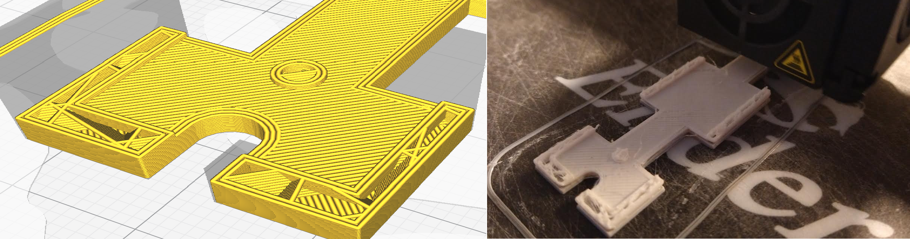
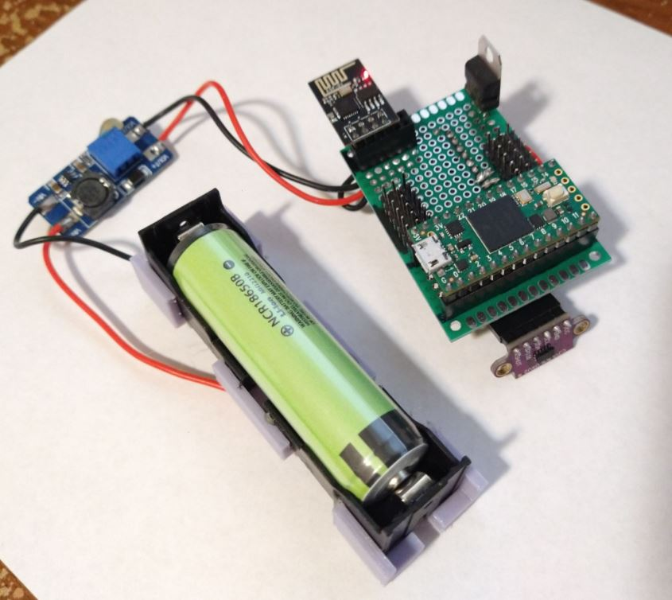

Back at it again. I'm going to commit to this these next two days. I want to get the physical thing built and then work on programming whatever over time.

I'm going to try this black filament I bought, the white filament seems too finicky to print right now, I may even go back to this ugly purple-grey I was using before.

Well... paid all my bills, even more broke, back to this.

There is one thing I have not done yet which is use an ESP-01 to talk with the Teensy.

Oh yeah it should [just work](https://www.instructables.com/I2C-With-the-ESP8266-01-Exploring-ESP8266Part-1/) as i2c as well.

I'll steal old code I worked on where the ESP-01 is used as a websocket server to connect to, the tablet controller will connect to it to get the telemetry.

Interesting how long it takes to write to the ESP-01.

Oh dang I have to find it now on the network.

I'll prove the communication works by blinking an LED on the Teensy from a web interface.

I'm hoping the ESP-01 can run off the Teensy's 3.3V pin says it has 250mA out which is a transmitting consumption of ESP-01 I believe.

Otherwise I would need a 3V down regulator and I'm trying to avoid that since I'm boosting up from 3.7V.

I think I found the ESP... need to get a basic websocket client going to test.

I'm stealing some old code again that I had from the [not-quite-an-ant-robot](https://github.com/jdc-cunningham/not-quite-an-ant-robot/blob/master/websocket-test/websocket-client.js) project which is what made me want to build a legit robot with 3D world awareness.

Oh yeah as I suspected this is not meant for web/straight html... will adapt one from MDN.

Hmm socket test not working not sure what's up.

This loop is not continuing oddly, yeap my code was breaking the poll hmm.

Not sure why I put this 1 minute poll in for. The old robot controller does work, so that's odd.

Idk why I made this piece of crap in the past, the readme example makes more sense.

I just had a funny video idea for this project when it's done, true to the name.

It's weird it gets stock in the loop, doesn't advance.

It can't connect from the web to the ESP either... hmm.

Oh there is one other basic thing I need to do, is to have more than one thing connected to the same i2c wires and check that I can distinguish/address each thing individually.

Oh... I wonder if it's like the app has to run from an IP not localhost/direct on a file.

No change hmm...

Tried it on my desktop, finally got an error, says connection closed hmm.

Oh damn... using wrong ip... misread the lines dumb ass.

Man I don't want to touch these electronic components they're covered in grease.

See the lines are consuming to my feable mind... assumed the 187 is a Pi not ESP.

The shenzhen one is a usb wifi adapter, pretty cool tech on my Pi Zero non-wireless.

Oof wasted an hour on that oh well.

Now I'm going to parallel wire an MPU9250 and ESP01 to make sure I can separate them. I'll later come up with a circuit to join all these, will have to solder it all together.

Finish the body and then start programming the gates and what not.

Build the "world system" that'll be pretty cool.

I have to think about this how the web will talk to ESP-01 to Teensy and sensor to get that data back out.

I think for the ESP01 I have to use the other set of i2c wires due to the 3.3V power constraint.

I'll need those 2K Ohm pull ups for this i2c line.

Alright I've got the IMU and ESP connected, now I need to apify-abstracitfy everything so it can just be used like a method.

It starts with... `VOID SETUP` I don't know why... ha sorry RIP

Crap looks like Teensy doesn't provide enough current for the ESP to run on.

I think I will design the board to have a voltage thing to measure battery's voltage. The battery is the protected type built in but still, that would be neat.

Plenty of analog lines. Can commit left side of the Teensy to controll all 12 servos.

Yeah... sucks but I'll connect the 18650 to a step up and a 3V linear down regulator for the ESP to use.

Shower break, nice hot water

I decided to just connect everything, I want to know I can use these things.

I do have to start printing stuff but I have not come up with a design yet. The main thing is the IMU is centered over the base of the chasis.
It is not intended to be load bearing though I have to remember that.

Was panicking couldn't find a 3.3V regulator have a lot of 5V though.

Not able to get ESP up on WiFi interesting.

Wonder if the 2.4GHz part of our wifi is down.

Guess that one ESP is a dud.

I think something's wrong too it's so hot the ESP when in the i2c mode.

The wiring I found is as an i2c master not sure if it matters.

Oh okay... looks like the Teensy has to be on as well (i2c bridge)

Everything is wired up now. No the ESP is still super hot.

With `CH_PD` disconnected it's not getting hot but... wifi not working either ha.

This is odd... I did notice on one of the buses (5V) one of the resistors was unplugged.

But the i2c that the ESP is using is on another set... not sure if I'm doing it in series vs. parallel, pretty sure it's parallel.

Anyway the ESP is not hot anymore, same wiring as before, been on for at least a minute... odd.

I need to make a mental model of this circuit, MS Paint here we go.

It's like "it's not hot anymore because it died"

Oh dang... I thought the Teensy 5V pin was an output hmm... no smoke so we're good. Whole time I had an external 5V supply but still.

Alright this is what I've got on a high level, didn't want to spend too much time drawing pretty lines. Just need to remember how it goes.

I can't tell if the ESP is periodically going down or what.

Yeah it's down now hmm.

Well programming time les go all the way Slyfox. Also started drinking. Don't worry this is like 2nd time in 6+ months.

What will this do... get data from each sensor and send it via websocket to web interface. This means have full access to data and can send it out.

Everything is communicating correctly.

I find it challenging too (easy) to think of a programming running in a constant loop.

It's like how do I pull these things in and only use them when I need to? How fast is my main loop.

Let's see if my naive code just works.

Can't communicate with IMU dang.

Oh right I have more than one wire now.

I saw this bus scan thing that would be good to have.

Found one at 0x29 hmm.

Looks like you can set bus on the ToF

Dang I don't know what this `TwoWire * Bus` thing is for `setBus()`

Dang I"m stuck... soy tonto. Trying to have two different devices on the same lines supposed to work but not sure what I'm missing.

I think I'll also need wire transmission by address too.

That's cool 0x29 is ToF hmm.

Crap... looks like I have to do this every time you turn it on/off, maybe do some scan/this shutoff thing hmm.

I think it's working, need 1 wire begin, I'll keep the 400000 clock for IMU that's fast mode.

Trying to find tape measure to verify ToF distance looks right.

Lol the value is not changing oh no.
I was using continuous sampling but I'll use single and see.

It's always outputting 322.48 Oh no looks like that number comes from 8190 like a max out.

Testing code on its own for ToF that was working before. I unplugged the MPU9250 and checking if it will work on its own.

Hmm can't get old ToF sketch to run, will unplug other stuff.

I unplugged ESP and both i2c devices found (ToF and IMU)

Yeah ToF is working and accurate hmm...

Broken again

When sadness smothers us, where do we find the will and the courage to continue... ha.

What do you mean I can't pull this out of my ass and expect it to work?

It's possible I'll use Rx/Tx lines for the ESP even if it's possible to use the other i2c bus.

A diagram I see shows 10K resistors on 5V line, will try it.

Hmm I might crap out and use each i2c bus for a sensor and then rx/tx for esp01

I can't tell what's up with this ToF sensor, did I kill it somehow?

Well I have two more... Ahh man I'm sad.

Well the new ToF sensor is working well... so... I'll assume that one is bad.  These things are expensive too lol $10 each.

Alright if you're dumb, pivot.

Oh damn I missed a pin lol... I can't get the IMU back up keeps saying error.

Oh I got it, had to switch Wire the variable itself too not just the binding.

Now I gotta switch my ESP approach for Rx/Tx connection.

I feel like such a scrub but I would have to dump some time into learning how to "hot swap" i2c buses. This xshut pin concerns me as you may have to use that.

I think I'm back on track though.

Ha it looks like I was using this 3V drop down thing in the past for Rx Tx between an Arduino and ESP01.

Looks like it'll be fine though says Teensy transmits 3.3V data.

Let's find out.

Okay I think I can test the rx/tx comms quality with Teensy using serial read (from ESP01). The Teensy will pull something from ESP.

I'm looking at this [old wiring](https://github.com/jdc-cunningham/not-quite-an-ant-robot/blob/master/robot/schematic.png) I used for rx/tx.

Beer 2

I see there's a resistor going to the EN pin.

Oh no this ToF sensor seems to be acting up now.

Maybe it's fine, I swapped and it's the distance of my ceiling from table 322in... which is not right lol. But like within a feet is fine it responds.

My setup code is what screws it up. ToF on its own after sensor restart works.

This timed sensor mode is interesting because you could tell what beam corresponds with what time...

Continuous seems bad like for power consumption but not sure.

IMU is just 0 for gravity hmm.

Oh... you have to call this `if (imu.Read())` bit

Okay looks good I need to see why ESP is not connecting to wifi though.

Ooh maybe my 10K resistor to EN pin was not in all the way.

When plugged into USB programmer it connects to wifi hmm.

Laughable thought, might be my power source... let me try this bench powersupply I have wow great idea.

I think that's it wow... using 87mA right now.

Alright I think we're good... damn.

I gotta do a new crayon circuit now, oh first need to verify rx tx works.

It's serial.write lol

I never know if this is right, serial.print on the ESP is read on the serial of Teensy... anyway I'll go with it.

Gotta start printing soon want to size things up.

I almost have a form of 2-way communication setup.

This is funny the serial keeps building up/chaining until I ping it with the client websocket to dump it.

I did realize the PLA boxes said 215+ for the new white/black colors I recently bought. The old gray one I had was 205+ C.

Anyway, the blended white/black color that briefly came out was kind of neat. I still have the same temp at 200C like a dunce.

Oh man... so I did figure out how to change the print temp, I'm going back to the white filament. It looks cool.

I don't know why I'm scared of this 215C lol. It's too hot!

Holy crap the print is so much better lmao.

Alright I gotta make another basic "circuit diagram" then I can proceed with more modeling and possibly soldering parts or at least the sockets onto the board.

Oneechan... this stupid song Groovin by Flamingsosis.

Yeah I'll definitely make a prettier version of this, I just don't want to forget how it works.

The print is not looking good. Dang.

I actually might go back to this crappy gray I have.

Maybe it's the model, let me check the slicer.

Ahh... this is tough... like I need this print but it's not ready... I think I will move forward with the soldering/sizing of the board and placement.

Yeah I think I'm just going to go for it, I have a model of the connections I need.

Oh man this is so much soldering...

This print is also bad... I switched the material profile back to 200C but it still kept the 215 idk... I also wonder is it because I designed the parts in inches but exported in mm.

I'll just say no sane person would want to do this, hand wire/map all these pins.

It looks better when it's done. This is acceptable actually. Pegs are too big.

Step up set to 5.04V

OMG this sucks sooo bad... 8:00 PM check oh god I don't know why I forgot/completely did not think about how much of a PITA this would be to solder by hand.

I also just went for it... like I'm going to plug everything in and turn it on... hope it doesn't smoke.

Also my eyes are quitting on me so blurry ha.

OMG it's not smoking hooweeee. 8:32 PM

But is it actually working? Need to test.

ESP is connected, that's easy... let's see if the sensors work.

Oh crap I forgot a power connection to the Teensy lol.

This step up has a coil whine, makes me worried.

Nope says error connecting to IMU nooooo.

I also need to add a switch to turn it on/off.

9:06 PM trying it again

What's concerning is when I turn it on there's a sound like soldering iron hitting flux on a board lol.

I saw smoke oh boy... Was a minor short between servo power bus lines.

This is what I ended up with.

I keep typing 2021... I have more pictures just tired, going to try something with the code, I think the RX pin is high so the ESP can't boot.

The other problem is the sensors are not found... they don't even show up not sure I probed around they have voltage/pull ups.

Oh no I think I'm one pin off on the I2C... hard when it's upside down.

I will have to verify this tomorrow. It would make sense with regard to i2c not detected, also the tx 5 pin should be low even when the Teensy is on, so I think that is also one off not sure...