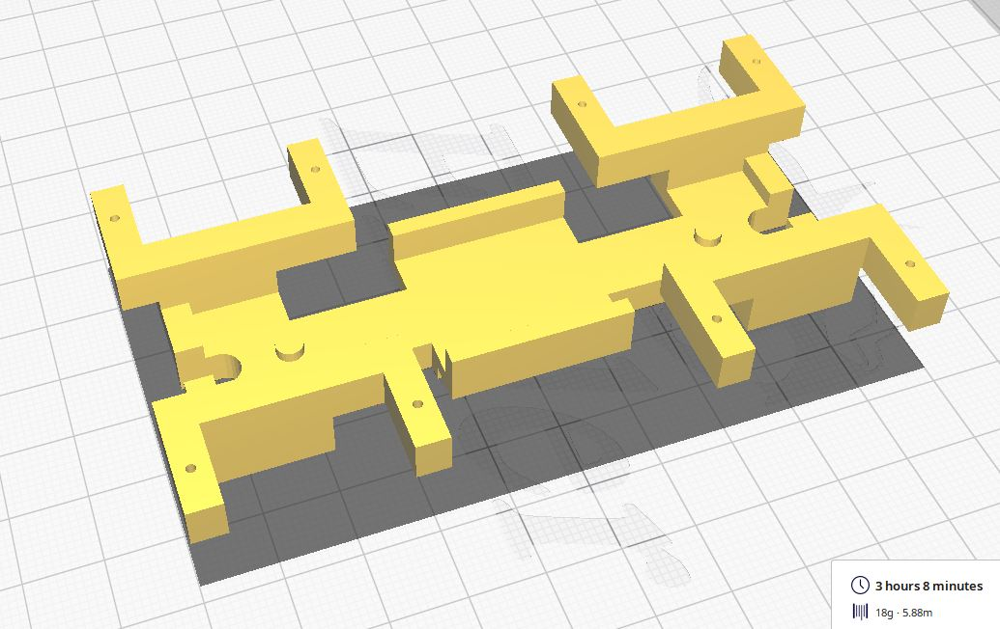
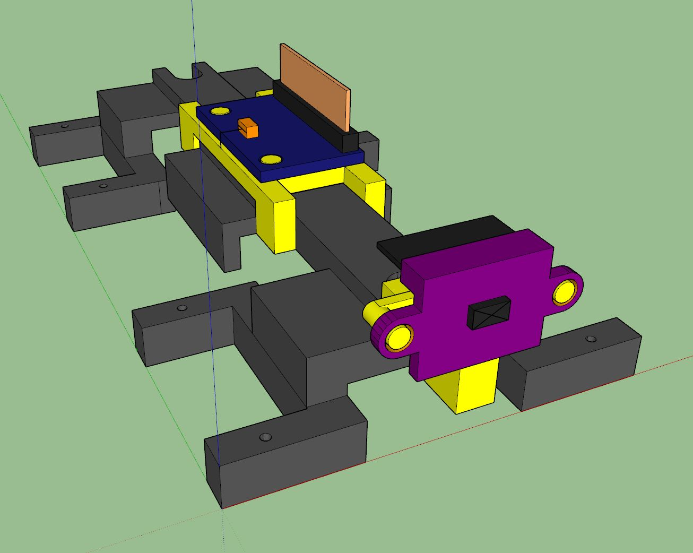
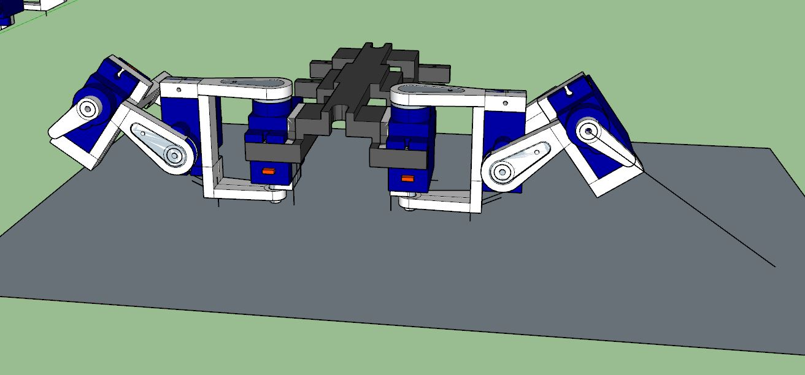
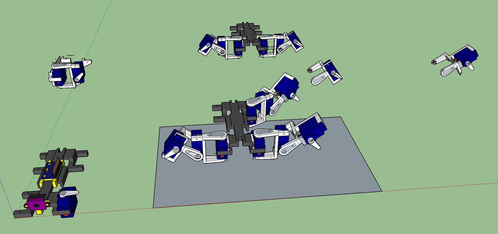
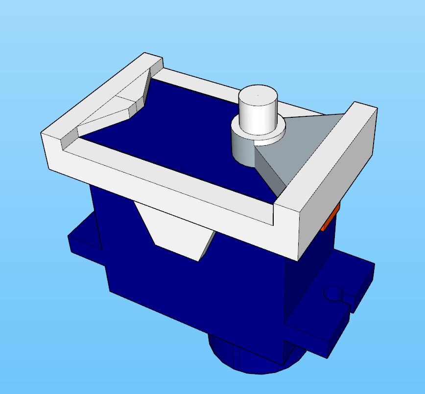
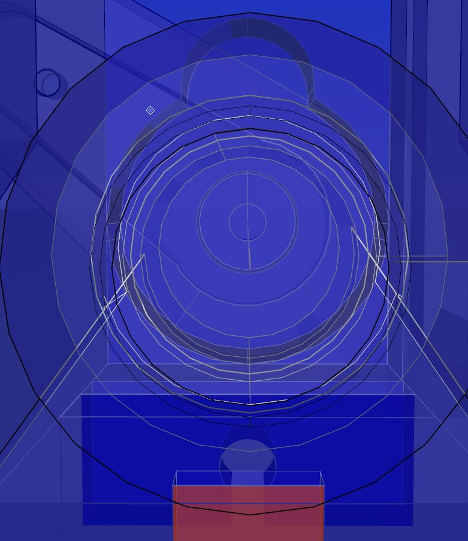
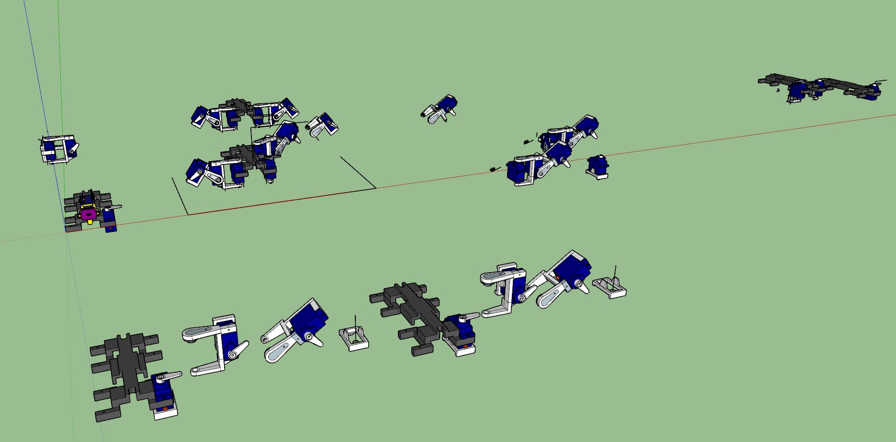
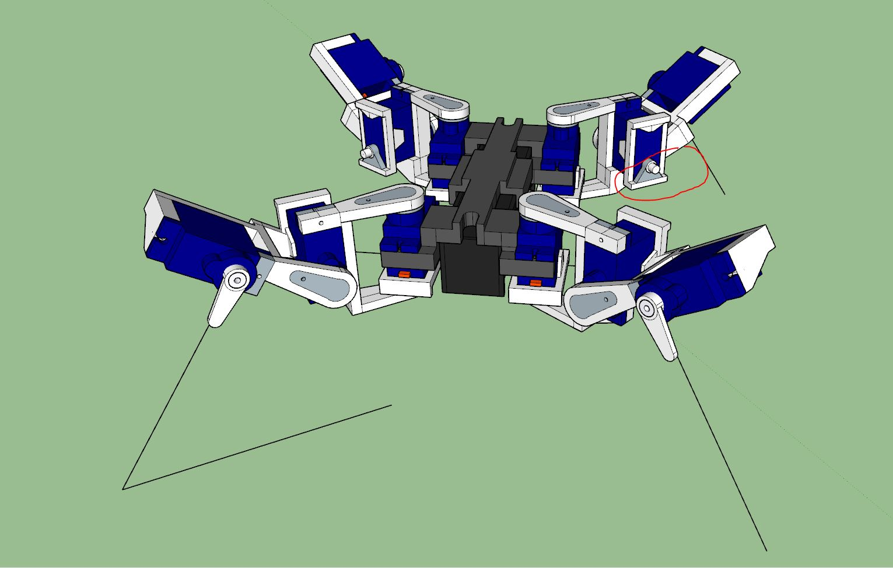

Back In Black starts playing by ACDC

Oh man... got through something hard... now going to do some work on this. Trying to keep the fire alive, this project is my reward.

I'm getting excited for the math aspect of this, applying physics to a 3D coordinate system that'll be neat.

I think I mentioned I want to split the printing up into smaller parts.

Might be stupid to print it this way but I wanted to keep the center part as solid as possible (regarding supports).

There will be a top layer that "snaps" onto the frame with some glue and that will hold up the IMU/top board.

I am still trying to figure out how to align the ToF sensor with the IMU.

I decided to print these "servo booties" if you will that connect to the base of the servo with these pegs so that it makes the wish-bone design.

This is printing so well now... I might not even bother taking the printer apart ha despite having ordered parts.

The mat is deifnitely good though.

Ahh man... the feed gear was slipping. I heard it make a weird noise, dang.

I might have spoken too soon about the print head stuff, it failed at the heating element so yeah...

Ehh it's not great but will work/something to start with.

Hmm this doesn't seem right.

I'm getting there. I've got the base layout in my mind at least. Have to pretty up these parts, do some test printing/fitting and then finalize.

I'm curious how badly these plastic joints will wear out over time. They probably should use bearings.

It doesn't look right, initially I was going to flip the outer servo but that means the moment arm is farther from the center of the bot which means more weight to rotate. That design is already at 3" away form the weight which means 3.5oz/in torque.

This is what I'm calling a "servo boot" you put it at the bottom of a servo and then a clevis/wish-bone type thing connects to it.

I'm primarily just going with what I have to get the physical aspect of this robot done.

I'm worried about the performance, the first robot I made it had a weight just under 11oz and it was very under powered.

Whoa trippy, I have stared into the eye of the goatse

Servo screw diameter, 0.07"

Almost have it

Ooh moment of truth, 3 hrs later. Man it's so fragile, definitely have to up the infill on these parts.

Battery pegs are too big... might have used old one.
Battery when inserted makes the body flex, not good. I'd rather have to tape the battery than deal with flexing.

Side servo fit is nice.

This thing is so cool, like it's crappy but it's also advanced. It will have a sense of the world around it and its own state.

Tomorrow I'll print the other stuff before re-printing this at a higher infill.

This clearance is low 1.1" hmm...

Well it's looking more like a robot. I messed up the boot alignment though.

