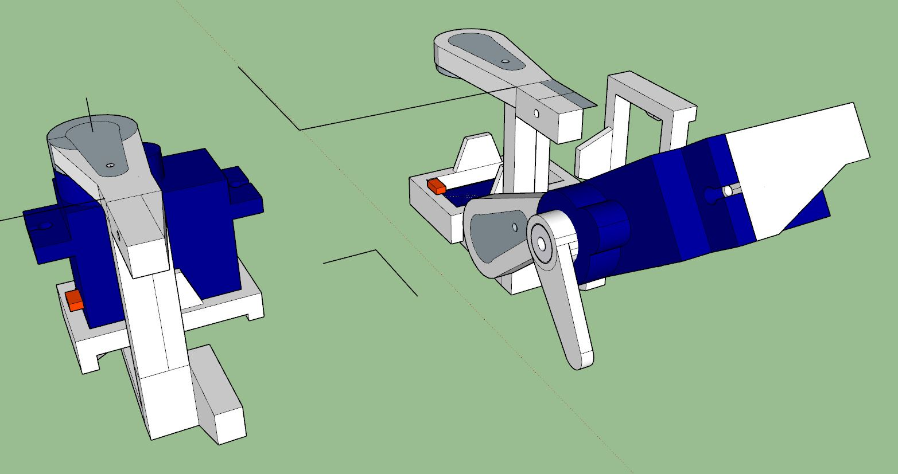
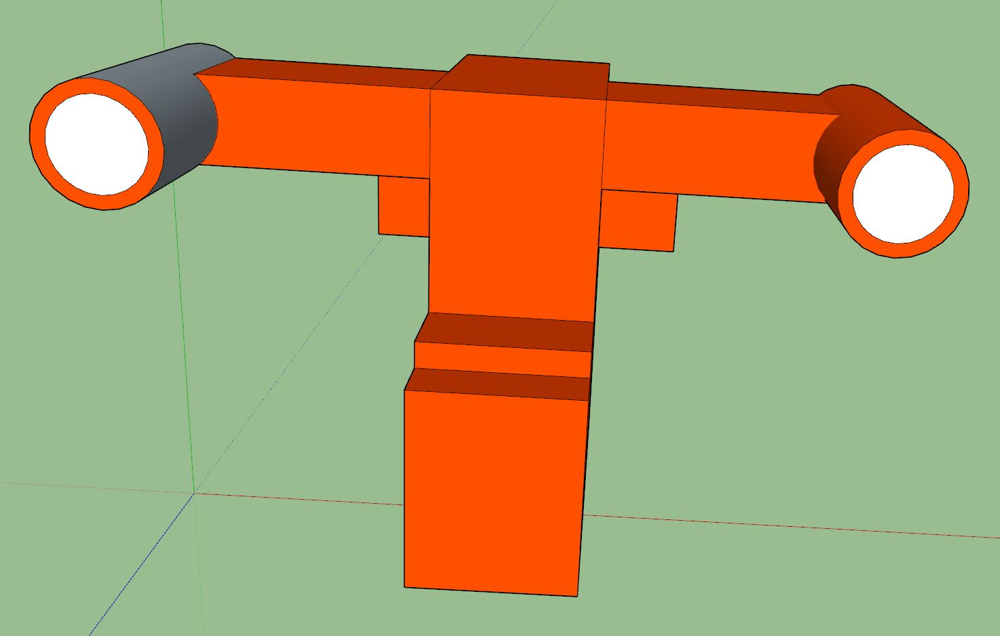
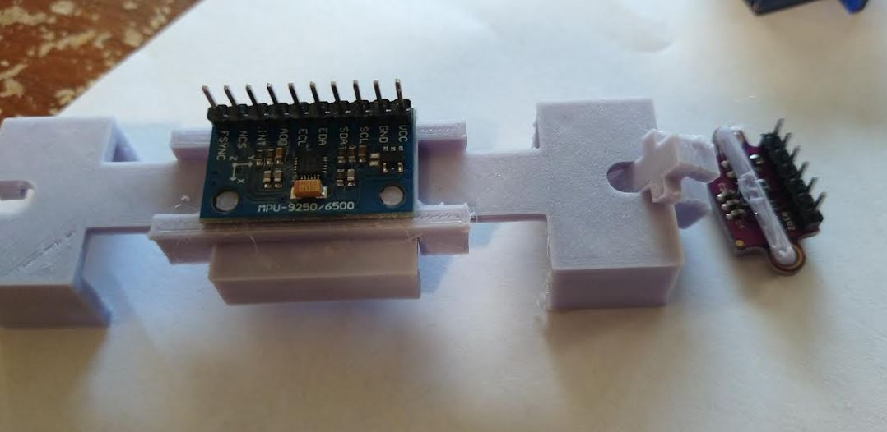
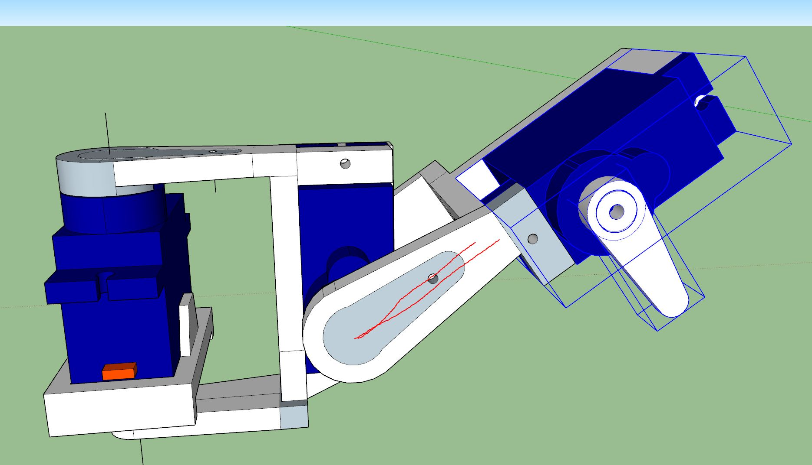
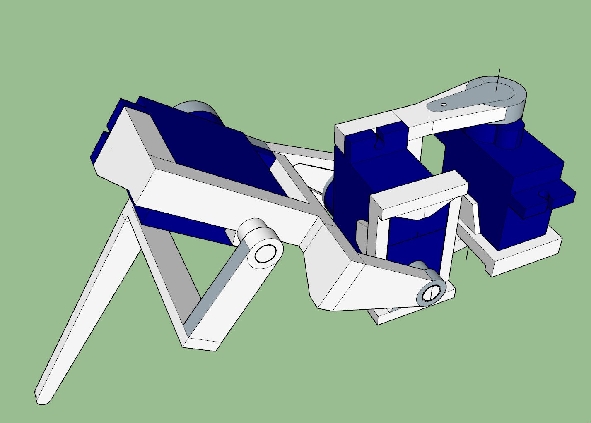
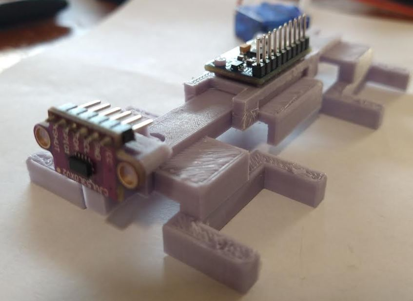
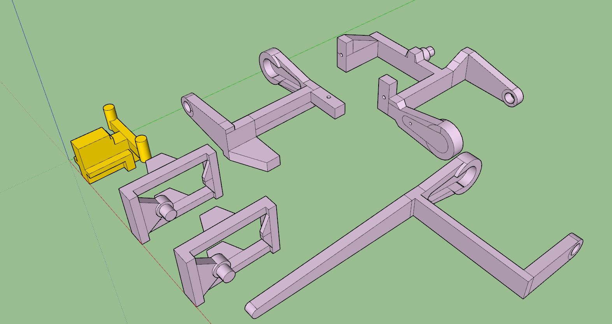
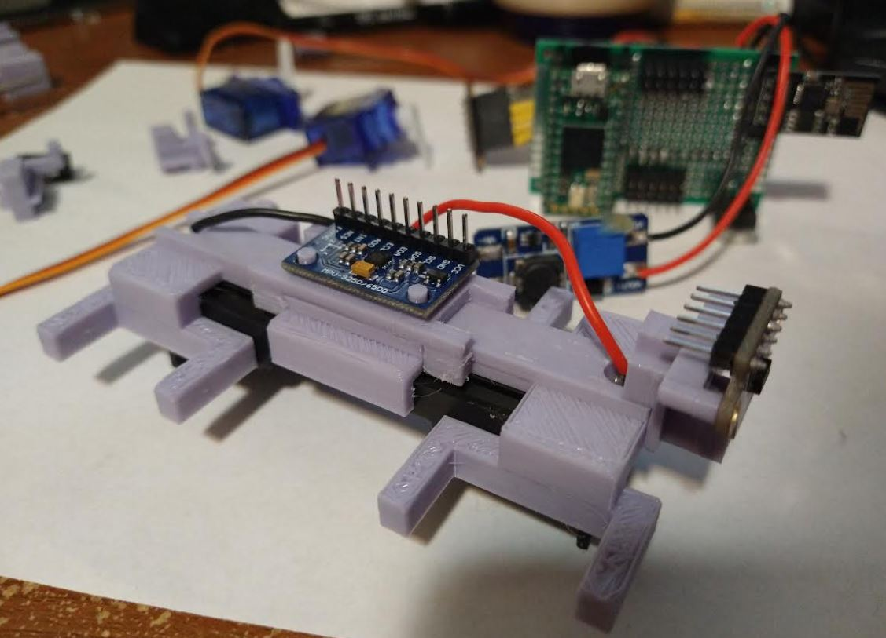
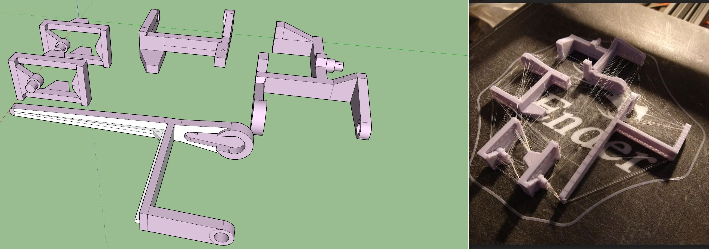

Continuing on, still need to pick up those parts.

Will continue printing stuff and checking fit.

I'm really trying to wrap up/get the physical thing built as I have a lot of programming to do still.

I'm looking forward to the "world coordinate system" or whatever the official non-hype term for that is.

Ahh man... everytime I line things up, something's off.

Damn I immediately broke the ToF sensor mount while removing supports.

Since the parts are generally small I'm going to bump the infill to 30%.

Ehh... can't even use the ToF piece it's broken/too small.

I was designed to be an insane robot...

IMU sensor mount is pretty good as is but needs to extend the rods for the IMU breakout board holes and add a support so it sits flat. Tolerance fit onto battery chasis is pretty good as is.

I know based on the material's strength, you would have a minimum "safety factor" in terms of thickness so you know it won't be weak/fail like this ToF sensor mount. I think that's 4mm but in inches don't know offhand. This is a "definitely good enough" over estimate type.

Next thing I have to finish sizing are the servo arms.

There is some weirdness to the parts... not sure why the lines aren't straight... hopefully I can fix it in software.

That idea of like if it broke physically it could adapt and move still/get to a direction like return to home.

Finally one comlete leg assembly, still have to print it out and check dimensions. The spacing is massive... probably too much material used.

Latest print is fibery requiring some minor sanding.

ToF mount pegs are a little short but fit well, I can work with it.

Ooh this fit is good... I will just add dabs of super glue. I'm not at a phase yet where my designs use screws using those inserts.

I tried to align the sensors horizontally but it's not aligned, it's off by a little bit like a 1/16th of an inch.

Yeah it's 0.15" off... I could reprint the ToF sensor.... AHHHHHH I will.

Ooh... I wonder how well this will work.

One thing I have not designed yet is the step-up converter mount, that's kinda just flappin in the breeze at the moment.

Oh I have an idea, I could use some servo screws to mount a washer that keeps the wish-bone mounts from popping out. If that is a problem. Actually I could just 3D print the end caps.

I'll use vaseline to lube the joints up (heh). I had this genius idea to use a razor blade on a monitor to clean off a stuck thing and it gouged out some material/made it not transparent anymore, I read people suggest try vaseline but yeah... it was bad... moral of the story don't do that (the razor).

Wow my printer seems to be on point now, the supports weren't on there and it still made it mostly right like 95%.

There is a mistake though in the design, the amount I raised it up, didn't put it on the lip.

It's getting there

Now just gotta get the parts finalized and wait to print, each servo arm (x4) set is like 3hrs+ oof.

3hrs later... fit check...

Broke one already oof... the circle joints need more thickness. The Suports are hard to remove without breaking the parts.

If you print sideways the holes will shrink. Also the swivel holes are too  small. One of the servo mounts failed.

Might not have been a solid.

Forgot:

Generally just need to make the parts thicker and will try to orient them vertically. Then higher infill.

Actually I think it's fine as is, but I have to work on each part individually before batch printing again.