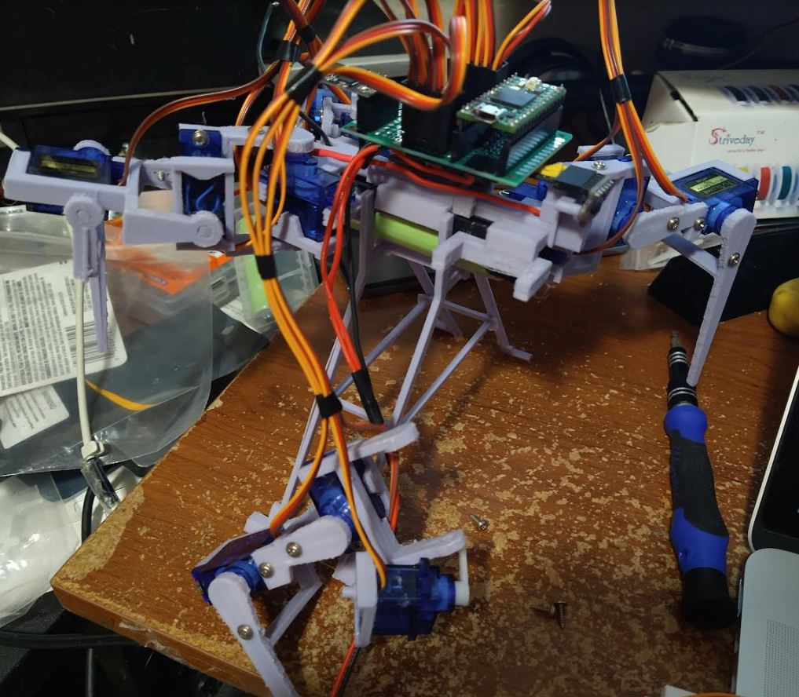
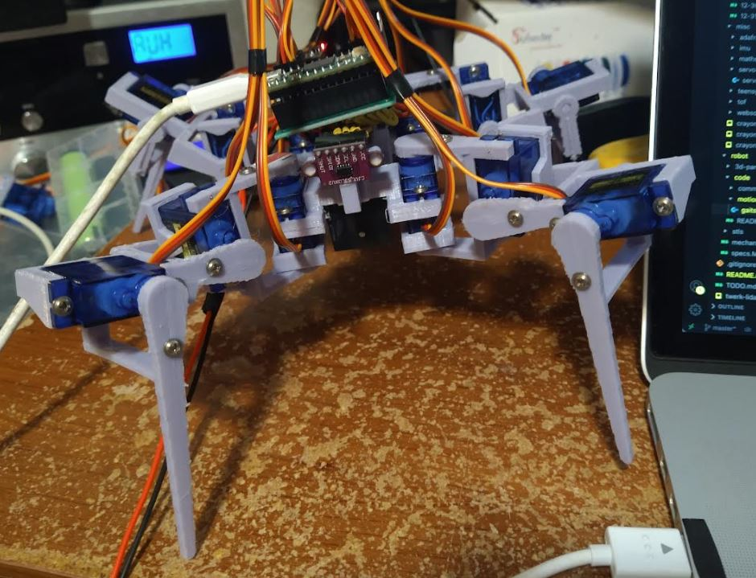

Alright, let's get this thing moving.

Looks like I was using an enum to get a servo by shorthand. Then using a "global looper" to coordinate the servos together.

Man I can't think, I just want to get this thing moving so I will steal the code I wrote before.

This is pretty cool:

Lol it won't stop shaking... the front-right-inner servo.

This is actually hard, I can't get it to stand up on three legs if one just goes up.

I think the same side leg that's not moving has to increase it's pitch to tilt the robot towards the side it's rising on. At the same time the moving servo is moving.

It's drawing around 450 mA in the standing position, wider base.

Current draw is climbing... it's at 0.7 A now, servos getting louder. Lift it up back down to 200mA range.

Ugh... I will replace this servo, it keeps twitching/annoying me. It's the front-right-inner unfortunately. Not as bad as a middle one I guess.

I have to print a new boot because it's glued on. So far programming is not going well haha... I have to use the dynamic balancing for the gait... it should expect to fall into the step I think.

Alright servo boot printed, I reassembled it.

The top part of the servo arm assembly where you put a screw down is weak, it split on the front right arm.

Should increase the thickness of that, since the screw has plenty of room to go into the actual servo arm.

I'm using glue and a random piece of plastic to add strength to where it snapped.

Yeah... this is not working.

This is not working well... crazy too when it drags the legs against the carpet, the current draw spiked to 1.5A.

I want to get somewhere as the power supply will come in tomorrow. Then I can run commands wirelessly by a websocket client.

Using the power of "slow down video playback" I will analyze what I did wrong.

Front-right leg lifts up, body tilts in that direction, freeing up back-left leg.

Back-left leg swings forward no resistance. Looks like other servos try to move but they have not been freed themselves.

Morpheus "free your mind". I can't... I'm a servo.

Looks like I just targetted the wrong servo for a motion, the planned gait seems sound.

This could work... let's see. It's slowly inching towards me "killll meeeee".

Neat on 3 legs it pulls just under 500mA

Ooh got a hot stance.

Ahh man this gait is so bad, it's pulling itself forward. It's like if you're tired and you drag your body with your hands like a horizontal pull up.

Wow I've seen the current draw spike to 2.6A

It's slipping on the carpet, unbelievable.

I will need that tape after all, the battery just fell out ha.

Front right servo needs to be mechanically adjusted unfortunately as it is too far forward, needs to move back.

Lmao I moved it the wrong way ahhh... the fear is I shear off the servo boot peg and then I have to reprint it again...

First kind of walking:

It's funny like I'm not even sure if it's moving forward it's so bad.

I will see if putting hot glue balls on the bottom of the feet help with grip.

It doesn't walk straight, it slowly drifts to the left diagonally.

I think I see one problem with the back legs, they are arched too far out.

Going to try it out on a flat surface/not carpet. Oh wait I can't it's tethered ha.

Eehh... I gotta think about this gait, it's good enough to work with.

I'm looking forward to the power supply I will probably have to print something to hold it since it's bigger but it will be nice to make the proto board not flapping in the breeze.

