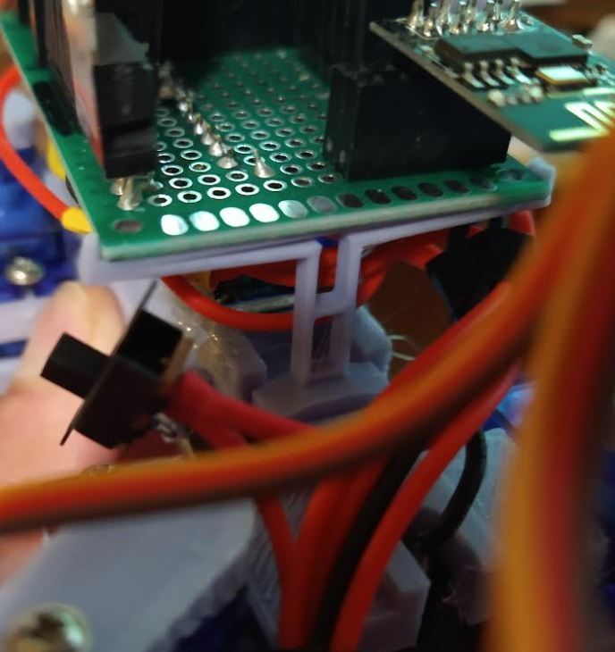
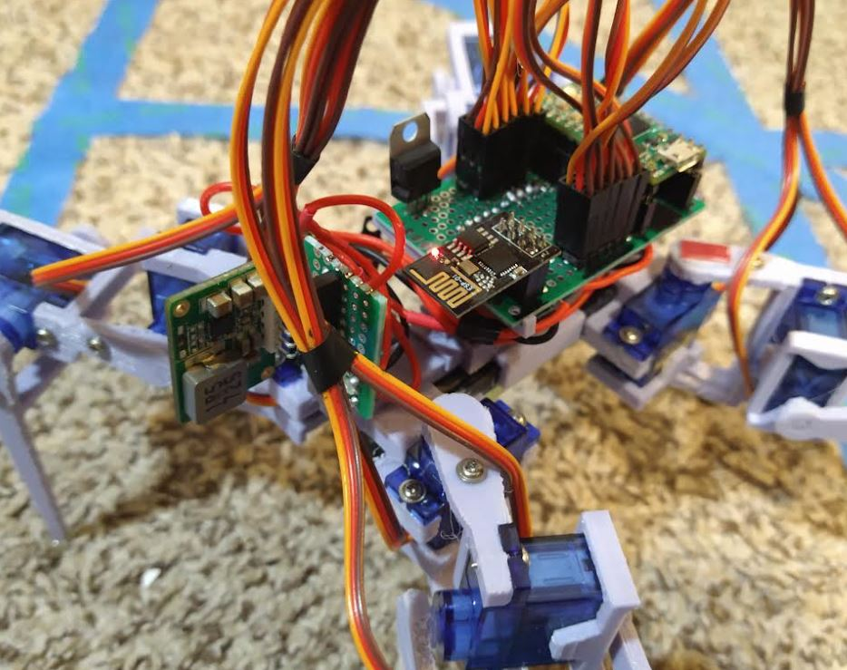
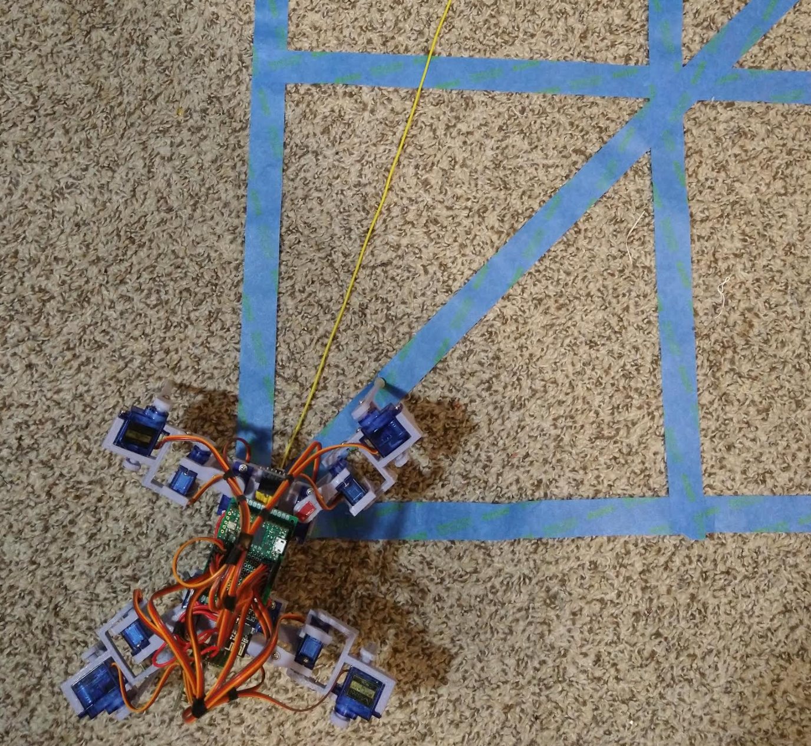
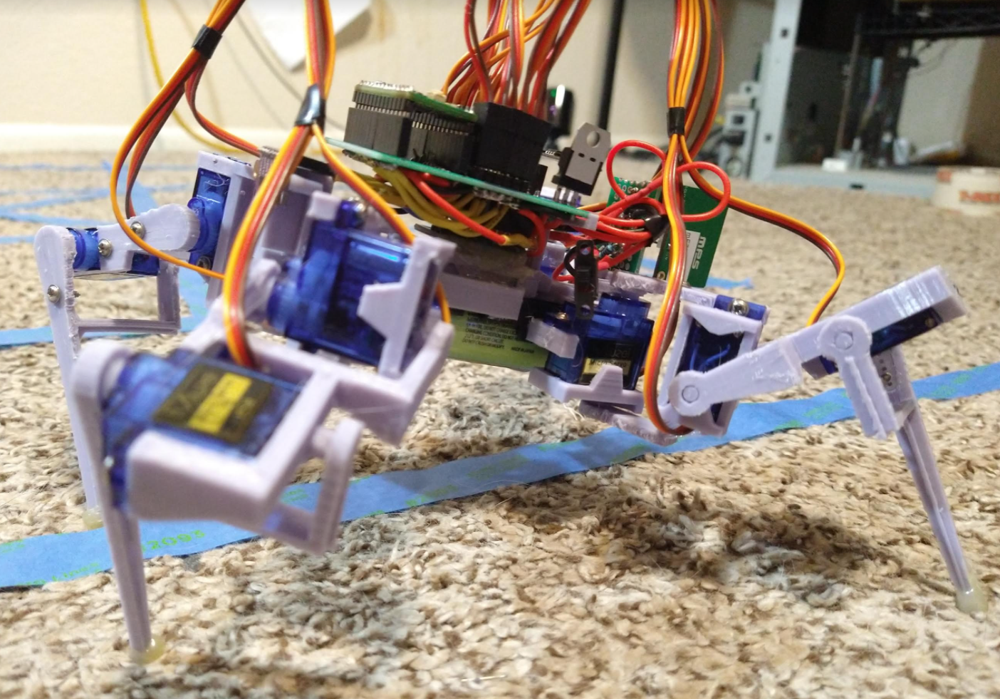
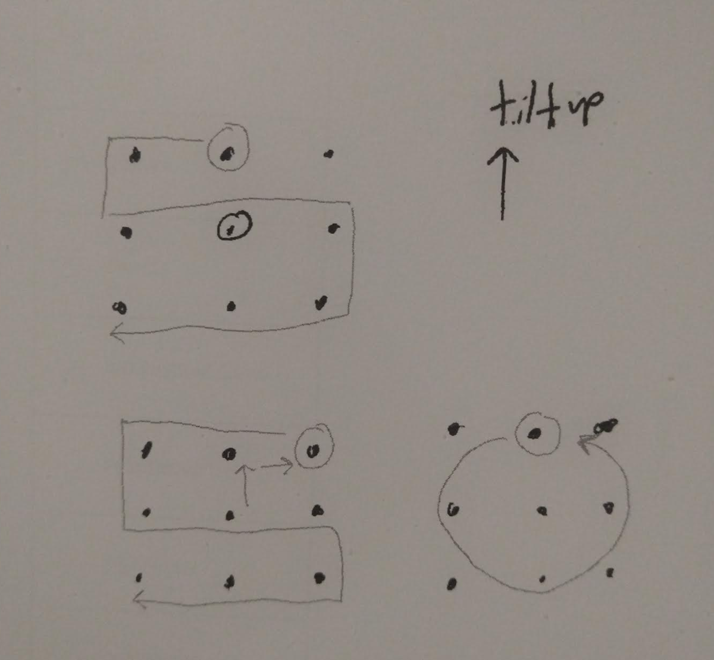

Night before/morning thinking

I have literally not worked on anything for 5+ days. I am feeling antsy, I want to get this thing working.

I'm also excited about the 3D version of it, that has to happen/within reach. I'm using tech I'm familiar with eg. JS kid on the block.

- solder new power supply, verify it works (I damn well hope it does)
  - attach to piece of proto board and then design/3D print support that also holds up the main proto board
  - tap battery with diode divider for real time voltage, max should be 3.3V for 4.2V, maybe a little lower to be safe
- finish remaining gaits for basic 2D control (f, b, l, r)
- develop the sampling cone gait
- use data from above to create first obstacle detection

Those are the primary goals to have a thing that does what at the base this is supposed to do.

The rest will be programming time regarding doing the 3D mapping and real time telemetry in the web.

I'm concerned with how much data can be stored and how much can be transmitted real time via the web socket

There is noticeable delay while transmitting data

I will also later on evaluate better gaits.

2:46 PM

Ahh... taste of NOS. Been too long.

Got the parts in from Mouser yeah boiiii.

OMG how do you open this, this packaging is great.

Wow this is top notch, need to look at these pin outs.

I'm not entirely sure, the pin out from this [datasheet](https://xonstorage.blob.core.windows.net/pdf/3260640link.pdf) is 1,2 VIN, 3,4 GND, 5,6 VOUT but how do you pair it... is it like odds vs. evens sort of deal... I have four tries lol JK these things are $14 each.

Anyway I'm going to use a socket for this one too, why not... the robot's just getting heavier but it's cool.

I used most of my skinny proto boards for this failed water moisture sensor project I obsessed over.

This thing is a bit bigger than I imagined (lol) but not a bad thing. I do like it's form factor.

Gotta find a resistor voltage divider pair to use for the analog tap. Think I got lucky with the servos that the analog pin set is on the opposite side. So I have plenty of options to tap just wish I thought about this in advance so I could have soldered a lead.

I will tap A8 it's closest.

Lol... after I have most of it soldered, I'm trying to see if I should switch to k ohms so my current draw for the voltage tap drops from mili to micro amps.

This is not an energy efficient thing. The main issue is I dont' really have nice 1/3 resistance pairs for the higher K.

Lucky I checked battery voltage it was 2.94 which I don't know why it was still outputting if it was that low.

Oof... I had the wrong pin for ground... no smoke... but let's see if this step up still works.

OMG it's working, I think I got lucky because the ground wasn't actually joined, proto boards.

Anyway the output is 5.05 nice.

Yeah this is a time where I could drop a say 9mA draw to 9micro amps but the thing operates between 0.25 and 3A so that's not really that significant and most of the time it's moving eg. in the whole amp range.

Wiring up everything now with heat shrink (professional).

Damn B.B.K. by Korn is so good.

Ahh... I am sad. After all this time, it doesn't work... I don't understand. I bought the 3A current one.

The battery says it can do 4.9A though capacity is 3.4Ah

I guess the startup current draw is too much.

Unfortunately I already soldered everything to do a bench power supply current draw test.

This also is a bit too big... too many wires. Quick weight check: 9.8oz so it's still within target weight.

Ahh man... I will briefly see about a one-leg at-a-time rising to normal pose.

It's not a complete loss, previously it couldn't boot at all... like where it would operate normally even suspended. So this power supply does its job but trying to support its own weight (with all servos on) from power off is too much.

So... there's way too many wires to fit this external power supply module with the main CG of the body... I will print the proto board support, it'll just be a V thing and then I will think about an overhang support for the power supply.

See the set of XL6009 I was trying, they are for higher voltage application not a small jump from 3.7 to 5.

Anyway this is what I've got... I've learned a bit... the voltage divider stuff I learned about from the [home security Pi Cam project](https://github.com/jdc-cunningham/raspi-home-security-cam/tree/master/ver_1) I did.

See below I used most of the long narrow proto boards for the moisture sensor project which "failed" specifically the ultimate plan where a deep sleep ESP-01 triggers a bigger Seeeduino to run many of these moisture sensors... I learned about mosfets on that project. The problem was the tx/rx lines were steeling power/messing up the boot between the two devices. Eventually it would get out of sync and the Seeeduino would kind of brown out from being kind of on.

The hardware itself worked, the one above is a single-cell lipo type where the ESP-01 is modded to free up an analog pin (this was hard to do/solder not worth it imo). But it had a constant power loss with the step down. The electronic switch (mosfet) was supposed to deal with that. The ESP-01 with a coin cell and deep sleep mode could make it work... anyway yeah. Might look into it again in the future as part of the IoT garden project.

Anyway... the main goal today is to do the actual twerk lidar object detection sampling stuff so... need to get going.

I'm finally able to be me again/work not get wrecked by whatever sickness hit me hard on Friday (5 days ago).

Is interesting why a voltage divider isn't a short circuit, had to look that up. That's where I got the 9mA figure from eg. 430 ohms is the series resistance on this divider.

Alright I'm designing the parts now so I can print them and then do some more programming on the gaits and then onto sampling.

Once I get a full time job or salary from the thing I'm working on now I will get a Fusion license and learn it, SketchUp just annoys me more than how it is convenient.

Ehh this is not that fancy but I'll just have a "shim" support thing for the external power supply.

First test fit, 20% printed in 9 mins, I still have a hard time conceptualizing the size. The removed material is not that important/made it weak.

Ahhhhh I gotta go, need to do some programming. I do want to see it walk untethered real quick. Will do that after the parts print/get that setup.

This power supply is beast though, it can do two channels. What would be interesting... what if you connected both inputs to the same battery and then outputted half power to each side of the robot... so you could have like 6A available... idk.

Will point out this is not how I envisioned this thing looking. The way the power supply is just a thing that dangles out. But it's good enough.

I did use hot snot for the power supply proto board holder, as it was not that tight of a fit and the back-right servo wires will rub against it.

The legs aren't sitting all square I just realized, need to adjust that.

Oh yeah my sleep pattern is reversed right now so I will over extend into tomorrow and then reset it. As in at this time I get sleepy at 8 AM, so I need to push/stay up into like 5 PM and then will be back to normal sleep pattern/wake up by 9 AM or so.

Ha... it's like the thing has a rudder it's funny just looking at it on my desk, alright, I want to watch it walk real quick untethered.

Oh cool since the ESP is powered separately/in parallel to the servos, the servos can be programmed off USB power but it's not ideal but have room at 500mA.

Although with motion I will just have the onboard battery system on to be safe.

OMG... it can't do it... wth. Soon as it starts to move it stops... is it the battery?

I think it was just low on power phew... I would have cried man lol not really but forced it to work.

OMG this gait for walking is not good lol... I definitely have to fix this, I think the CG is definitely noticeable too, it behaves differently after these mods.

[Some current untethered walking video](https://www.youtube.com/watch?v=1-sL4RkLaGE)

Well... need to move on for now with the conical sampling.

Going to focus after this song. I want to get that voltage readout too.

Tangeriiiiineeeeeee

Ooh 950... let me see if it checks out. So far it's not right.

3.94 actual vs. 3.85 which DMM's have that load thing 10 ohms or something idk.

Measured is 938/1024 so... well that is right for math. 92% of 4.2V is 3.86

I did use the ratio of 4.2/3.223 based on the resistors.

The analog value itself is off?

Huh now the values are just 0s hmm.

I'll just assume the error is 0.09V or 0.1V and try to be above 3.2V

Alright let's do this sampling now. Immediate goal is to make the profiling thing to see something and then do basic demonstration of it. This is for initial publishing goal.

Trying to work out the pivot right now. Tilt is easier. Could try seeing what happens if the horizontal things just move left/right.

Oh yeah these commands have to be done together.

Ha it actually went the other way

There is mathematics to this, not just an approximation.

Ooh this sucks, the "undo" of the motions is not simple, it should be just flip the last two numbers but I don't know how to do that in C++ right now.

Ooh that's hot, so fluid seeing the full sweep left/center/right/center.

Oh yeah I need to do some quick measurements to see the coverage with current motions.

Hmm... the servos move 30 degrees... so the robot should have rotated 30 degrees right...

But this doesn't look like 30 degrees... anyway...

I'll do a quick trace in sketchup and check.

Yeah sketchup says it's 20 deg (traced proto board, rotated to be parallel to horizon)

I forgot I didn't get that much sleep today well like 4-5 hrs... so I could potentially sleep at a normal time... it's 10 PM I'm feeling something like losing drive.

I will get this done/published as I have to focus on other things for a few days anyway.

I need to add a tilt up/down and then make the "6 point scan".

This is cool though, programming a robot with a laptop.

I do see a problem with some old motions, the numbers are sometimes not from the center point, they're from the previous point... so I'll have to go through that. This may contribute to my gait performance.

Yeah those positions are affecting the scan pattern hmm...

When it does the tilt up, it skips steps so that's not aligned with the center/starting positions...

Let's see this boy scan.

I will have to pitch the forward legs as well. It works well tilting up but not down.

OMG this pose lmao it's like a mighty silverback

I could name him after the fallen but that would be in poor taste.

This is a bit excessive, so I'll probably cut it down in half.

Then again idk... let me see how it looks downwards.

Wow that's too far, that's the Jacko pose ha.

This looks good but it wastes effort by backtracking (centering) it should just do an S pattern.

I also realize I'm ignoring the outer legs, I've pretty much ignored them completely. so you can see the legs actually hop/jump to slide outwards, that could be prevented if the outer legs swung in/out as needed.

I actually have to think about this, I want to avoid repanning over the same place.

Ehh a more advanced pattern is to use the conical/rhombus shape vs. an S like I'm doing now.

The other thing I'm thinking about is where to start/end the ToF samples with these commands.

The ideal S scan (bottom left) would start the sample once you were in the top-right position and end at the bottom left. Of course... with no feedback and servo accuracy/slack/all that... probably better to do a three-level average approach instead (per sweep).

Yeah the top-left is going to have overlap where it passes over itself again.

I guess the sweep command could return the samples... but that's mixing intent.

Trying it again, looks pretty good.

Now for the money shot.

Yeap... this is one of those "why did I do this" moments. This could be a turning point in your life... ha.

That's cool my desktop just froze hmm... not sure what it is. The keyboard is going bad that's why I bought another one... I'm not 100% on the design it's the Durgod Fusion but I am trying new switches, been using reds this time, now using browns.

Let me be clear, this is a gimmick but I respect science, THE PROCESS. A lot of things to be engaging are usually click-baity, flashy, hand wavy... this will ultimately address hard science even if it's a toy.

I as others have thought, what is the point of life? If a bus hit me out of nowhere and I died right now... would my life have been worth it? And what do I strive for... one of them is learning. A friend said that too. But yeah the pleasure of building/figuring things out. Even if you can't take it with you.

Anyway back to this. I have a laser pointer for my cat. I was trying to think of a way to attach it to this robot, might have to print a case thing.... then you could see where the beam is pointing/confirm/gauge things.

I gotta be careful with this laser, my cat is in attack mode when he sees it. Yeah I will definitely do that, design/print a holder for the laser pointer to use to calibrate with.

But for now I can use SketchUp/draw lines and see where they converge/get measurements. I know I can use trig but faster.

Oh god this is the dumbest thing I've made this video.

Well I'm not a musician and I just used the second "free" song I found on YT.

Father forgive me! Lol for bringing this to this cursed land.

Well there [it is](https://www.youtube.com/watch?v=iTRvZlqN2gc), I made it, it exists. It is real now.

Anyway I will definitely need that scene for context where it's pointing the laser pointer around against a wall, probably with drawn tick marks for reference like a grid.

Well... time for some math. I wish I could print right now but I can't... actually I should design that piece so I can print it right away/not do too much thinking when the sun returns in 8 hours. Ehh... I'll do it later, it's not too hard to design. Just a cantilevered rest for the cylindrical laser pointer.

Ehh let me design it, I need to use SketchUp there (desktop) anyway.