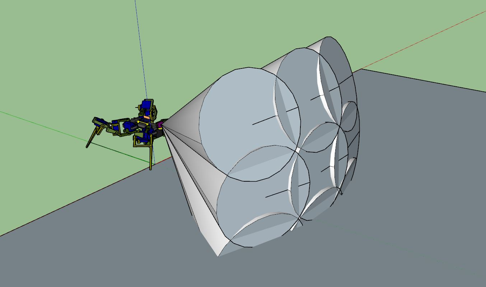

9:47 AM
So it turns out this "lidar" sensor does not shoot out a beam (guess it makes sense, where is the lense(s))

It shoots a cone, a big one too, 25 deg FOV

So I had to rework that, see below:

This means the pan-tilt sampling doesn't have to sample every degree, pretty much just the outer/middle points.

What's interesting is if the above is true then the closest measurement detected is 6.5" (down angle measurements)

I probably did a check for the 18" away using only the middle/up scans.

There are a few things I wanted to address today/this weekend.

The communications is one of them, since the Arduino/Teensy is not multi-threaded.

I have to come up with an async messaging system.

I'm trying to come up with a plan, my mind is kind of all over the place, need to aim for something to achieve

I still don't really have an exact design for the UI, I have some thoughts/features I'd like to have like an async/promise deal.

I am going to look at the ESP01's code again, to see how it deals with serial buffer buildup (from the websocket poll)

I'm also thinking about an acknowledge callback from the robot when it receives a message, it would also include the return payload if applicable

Like a battery voltage or something

Unfortunately it's not something like JSON, that could be a thing but I'm skeptical of the messaging reliability

Shorter = better sort of thing

Right now I'll work on the manual web ping to confirm this cone thing

