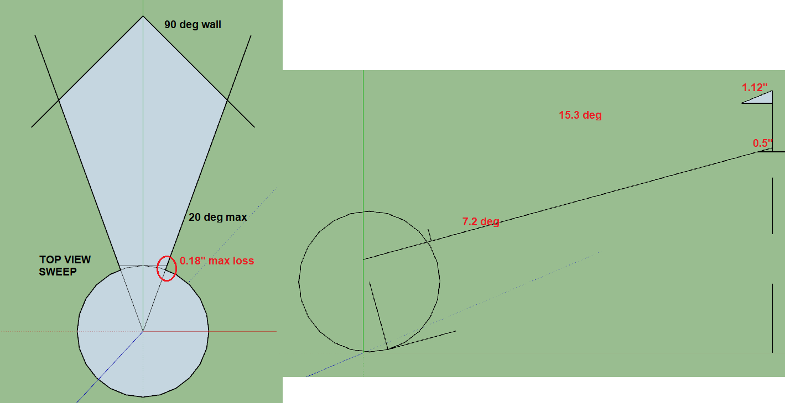
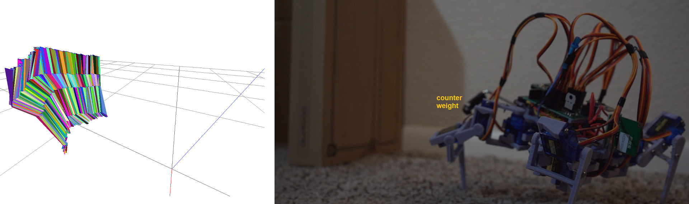

Oh my god I'm so annoyed with DHL right now, 3 different times they failed to deliver my phone ugh.

I'm just stuck too like I can't get it from some place because the places I pick either no longer exist or the delivery takes too long/the place is closed.

Then the support can't really help you because they do the same shit the support site does.

AHHHHHHHHHHHHHHHHHHHHHHHHHHHHHHHH

I'm just so angry about that, like I can't do anything about it, I need to just accept this loss and forget I ever ordered this damn thing.

Anyway I'm going to get some work done here, my sleep pattern is completely f'd now.

I don't care anymore, I have 2 weeks to prototype a new app thing and I can do that at my own discretion.

I know forgive me for my problems that don't matter against a literal war happening sorry I am privileged.

Anyway let's get something done here... more than just remaking a gait 5x.

Quick stuff

- [x] get new pitch angles
- [x] do a full scan and plot make sure it looks right
- [x] adjust it so a 90 deg wall looks like a wall
  - not really successful but tried

I really need to learn how to use this camera/the lense. Since it's using too low of an aperature where everything's blurry, doesn't need to be. It's not a macro shot of a flower or something.

The issue is when I use manual aperture the color is wrong... so yeah, I mean I'm a noob, I had a brief thing where I had to buy like every mm combo I could think of that got expensive, of course I bought second-hand no g-masters but yeah.

Damn the down angle is nuts not sure why

I need to check that from a front view it's still flat

The down 2 position dips too far to the left instead of just perfectly up/down

Alright... time to do some plotting/some math real quick

Then will move onto the linear acceleration/turn stuff will be neat to see like a course drift since the damn thing doesn't move straight

Well I got it plotted, it of course looks wrong/staggered from the body moving around, need to offset that.

I will use external measurements for the pitch, for sweep not sure... I should record a top view and that would give me the offsets.

It's like a tapering triangle I think, how does that look for a subtracting arc in math not sure yet.

I'm pretty happy with the Lidar's accuracy though, these tiles are 10" and it's beyond that for the 1ft.

A pro move would be to just click on the vertices on the chart and pull them backwards on a specific axis/freedom of movement, then you can definitely get your exact offset

But I'm a scrub so I won't do that, well... actually I will see if that's easy to do.

Nvm... that's not easy to do
https://stackoverflow.com/questions/34698393/get-mouse-clicked-points-3d-coordinate-in-three-js

Needs raycasting looks like (parrot speaks)

Ugh man these units are nasty

up2 3.13" -> 2.26" offset
up1 2.14" -> 1.64" offset
0.5" back level

Oof these offsets are not right hmm

I'm eyeballing it, the pitch looks good but the sweep needs work, I think it's a slope function. from a top view, I'll get a quick top view recording real quick

I have to keep making progress, I'm still distracted with my annoyance with DHL

20 degrees... oh... I just realized it's based on the arc of the robot swing around its center point

Well I can't really think right now, only do basic stuff, I want to post an update.

Heh... I have an idea, use your tools boy

It doesn't lose much though is the thing, the maximum is 0.18"

So pitch is the biggest problem

Actually I rotated the right part around the wrong axis, it rotates on the lower peg, modified math

Ehh... idk I need to work on this, one of the tasks I have to do is simplify this mesh for the collision/box bounding

Ehh... this sucks... it should show a 90 degree, straight up-and-down wall

Anyway I need to move on

OMG... I just broke one of the servos... I hide it from my cat in this drawer so he doesn't chew on it. Ugh... or not? What the heck... the servo was just flopping around...

No it's stripped I hear it pop. Ugh I'm so spent... idk can I keep going?

Screw it let's go crack another. Why are these servos so nasty out of the box, they're greasy as hell.

Ugh I have to check the servo is at the right position

Alright leg fixed, looks right, had a thought (ooh) will use the light blinks to indicate distance so I don't have to grab data, robot can be free.

### starting on linear acceleration
- [ ] fix gaits
  - [x] forward
  - [ ] backward
  - [x] left
  - [ ] right
- [x] update sampling offets with measurements
  - means since the ToF sensor does not rotate about the same axis the measurements are off
- [ ] track the distance traveled using acceleration summing as it walks/moves
- [ ] plot the world using simple 3D boxes when an obstacle is found
- [ ] transmit data from robot to web interface by ESP for ThreeJS plotting
- [ ] actually do navigation and mapping
  - means I have a known physical world layout
  - I get something similar

I'm watching a video of it walking. It looks like when it pulls forward not only does it go forward it also goes sideways some which the other direction kinda cancels out.

So I will have to track both x and y linear accelerations and then the rotation will track sweep

I have to confirm if it turns on a dime

No it does not, it moves forward some and left or something... it's like an inch square of "displacement"

That's the thing, I need external checks on progress, like if I know a wall is to my right, I should be able to turn that way measure for it, and turn back to where I was and confirm it's there.

I will see how bad it is excluding the drift.

I just realized... I think the sweep dimensions change when the robot is in different layouts... with regards to the bends of the legs... idk it doesn't make sense to me why the chart looks the way it does.

I'm writing the linear Y sampling right now to track forward walking, hopefully that's remotely accurate

Whoa that's pretty cool, it looks like it moves 2" per motion

wtf the values are negative? hmm

oh snap lots of data

Lol power loss at 12:55 AM noooooo

Well let's see if I can continue working in the darkness, ooh backlit keyboard nice

Oh man... I refreshed the spreadsheet lol gone... asked me to turn on offline thought it was good

Gone... dust in the wiiiiiiinnnndddd

Back up at 1:44 AM
Forgot I had a meeting tomorrow with a video streaming provider.

Ahh man I am spent though, going to put that data in a spreadsheet

Ehh I did this wrong, I need to only do it for one gait not all 5 in a row

