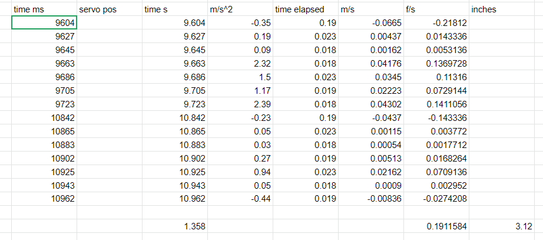
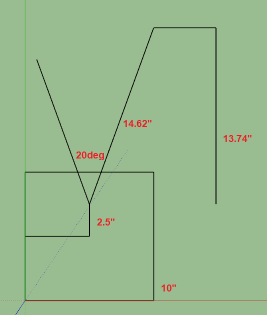

Well the first attempt was not good for the linear accel.

I just sampled the entire forward walk gait which isn't always moving forward...

So the next time I'll isolate it.

I think I analyzed the math right but I only came up with 0.3" instead of 2" for the 2.5s sample

Not a good sign... second attempt not getting same values

need to do a test where I just manually move the robot through the air known distance/time and then see if it matches reality.

I don't know if I'm fudging numbers or what but I was able to get something close

What I don't undersatnd is the initial elapsed time... I have time stamps but the first one is 0... so for this initial sample is it 0 or does it have some elapsed time... seems stupid

The rest of them you subtract current - previous

My external world measurement is putting the robot near/over a tape measure and measuring how far it pulled the Lidar sensor's plate forward... it's just over 2in so this is not right but close.

Well I'm going to start printing that Pinephone webcam holder thing I designed in the mean time.

Oh crap I actually don't have enough time between now and the meeting. I'll print the test print.

Well I need to get serious with this project and wrap it up.

Even if it sucks and is very inaccurate will be "completely finished" as far as its intent.

I will make a better one and go further into the IMU and math stuff/work on those separately.

I will buy more expensive/better parts.

Let me do a turning one. I still have to turn this spreadsheet math into local math on the robot.

Oof... think my desktop SSD is dying it freezes often and then this nasty audio comes out brrrrrrrrrrrr

Alright so going to test the turning real quick

Then I will make a full basic navigation test and tracking rough position

The web connection is still rough... but maybe it'll be better if I'm not streaming data in real time like the IMU stuff I was doing before.

I did realize the timing is off now per movement, it used to be 0.029 per deg but I gotta update that to use the actual ms values

So the turning deg that I got is -35.56 deg (turn left)

Externally is that correct? Externally it actually rotates 37.5 deg

I guess to make it more accurate can add tolerance with regard to actual vs. expected in case it slips or whatever.

Still antsy right now waiting for the DHL delivery, I have no idea when it's going to arrive is the problem.

Man... I'm not doing well focusing/making progress I slept poorly

- [ ] fix gaits
  - [x] forward
  - [ ] backward
  - [x] left
  - [ ] right
- [x] update sampling offets with measurements
  - means since the ToF sensor does not rotate about the same axis the measurements are off
- [x] track the distance traveled using acceleration summing as it walks/moves
  - it's off by an inch or so, but turning is also off by 2 deg so...
- [ ] plot the world using simple 3D boxes when an obstacle is found
- [ ] transmit data from robot to web interface by ESP for ThreeJS plotting
- [ ] actually do navigation and mapping
  - means I have a known physical world layout (control)
  - I get something similar (application)

Have to scan at least 14.62" (20 deg) away to make sure 10" cube can get through

That's 13.74" away from the sensor face

