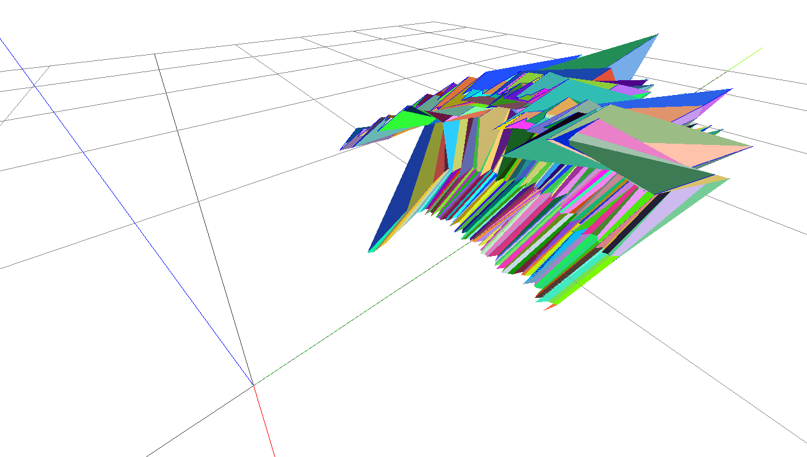
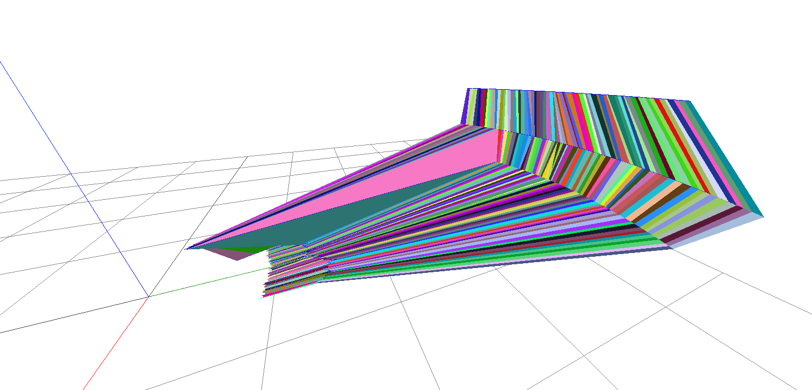
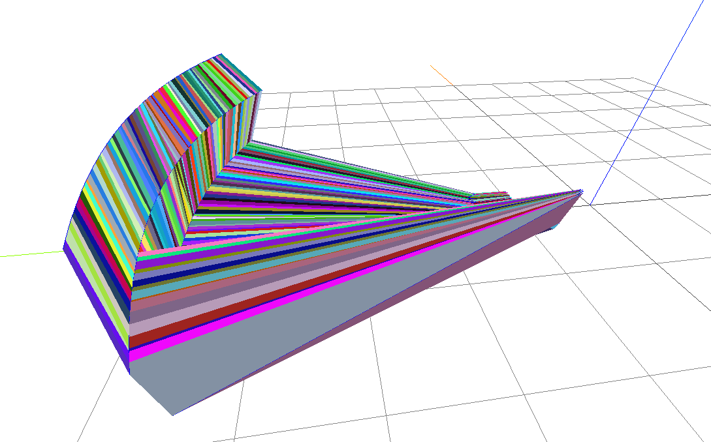
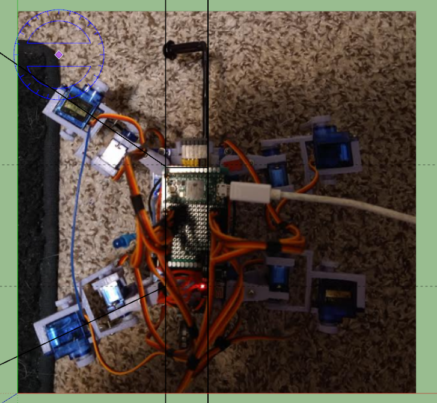

7:11 PM
Alright just recently woke up, have to stay up till tomorrow night. I will commit to getting a lot of progress on this project done, fresh brain, let's go.

Yesterday I was trying to figure out what the minimum scan distances should be to make sure the robot does not miss something due to its blind spots.

I took an empty space scan for an idea of what to expect when there's nothing in front of the robot at least two 10" cube lengths.

Man it takes so much time to process these spreadsheets it still needs to be converted into math on the Teensy.

I've been thinking about plotting a line for the robot's movement in ThreeJS that'll be cool.

Hmm this plot looks odd... I wonder if the beam hit its leg or something, also for being in freespace the distances are close.

I'm going to visually check the angles to see if the ToF line of sight hits the leg or something.

wtf these dimensions don't make sense... it's open space and it's returning 1 or 2"... ugh

Also I think I know why it has a tendency to tip backwards the front-left leg is farther forward/not symmetrical with the back left leg... even so

It's odd, it's good for 6feet but it maxes out at 322mm

I also took out the high speed flag to not use the fastest eg. 20ms still having problems.

Idk if the sensor is bad or what, I bought three they're $10 each

I think it's just the open space, I'll try a different data type maybe that'll help ha

Still the same 322.44

Oh maybe I have to turn on long range mode.

Oh yeah says default mode is 1.2m and long range is farther.

I might have to switch betwee long range and high accuracy, I'm not sure how much better it is...

Hmm... no way high accuracy goes up to 200ms nope it's already slow as hell

Man... says 26 ft away for some measurements lol that's not right

Alright I will try default (33ms) but switch ToF sensors

Oh the allen wrench I'm using as a weight is shiny, the sensor is above this by about a quarter inch or more but let me see

Omg wtf... no difference still wrong values ugh

Let me try a new battery

No change wtf, well at least I socketed the ToF sensor

Ooh this looks better, they're like all maxed out at 322.44

Ehh I tried to go back to high speed but seeing too many non-near-infinity measurements so default measurement it is at 33ms so it got slower by like 50% more

Ahh man I gotta re-scan again oof, but that was a good find, if the measurements were bad would make this project even worse

Okay for context, I will time myself doing this process of getting the data, processing it in spreadsheet form and resulting in a plot

Start at 8:28 PM, I took a short break when I first started btw have not been working 100% so far

Okay 8:28 PM start

I just noticed it turns left more than right doing the sweep scan

I huge time chunk is used copy/pasting data from the single column to the 6 columns per tab (5)

Oh no some measurements are 0 hmm, I think I can assume they're 100% distance right, it's not possible to have 0 unless something literally runs into the face of the sensor

There is a minimum of 2.75" in front of the sensor due to the legs/counter weight

I could hardcode something where if a number is under that to set it at 2.75"

Ugh this sucks, I have another brand new sensor but I don't want to solder the pins... it's not really hard but yeah.

Ahh man this sucks... if most measurements are 322.44 (full) then if a couple are randomly 0 that's bad right...

8:39 PM getting coffee

8:42 PM

I'll just set values under 2.75 to be full range, looks like goes as high as 322.48

This is concerning how much data is bad when it's a full open scan

I'll bump the min distance up to 3" to be safe regarding that 2.75" allen rench

Also 322.48 is not correct that's 26 feet so I'll cap that to be 1.2m which is the default max range supposedly eg. 47in

I need to start making concrete progress

Ugh this is so annoying like I can't deal with shitty data like this and call this thing accurate, oh well once again get better components.

The one scanning the ground looks good no outlier values, surprising the lowest tilt measures 8in away from itself.

that means it's at least 10" total with regard to middle of the robot, ToF sensor is 2.5" away from body midpoint

Also the robot moves 2 inches forward at a time, I don't have the turning radius/bounds yet

I need to factor in a variable like "did I move" as in when it did forward motion the summed acceleration is greater than 0/expected distance covered from velocity/time

If it missed something and it's stuck, need to try and move by rotating, otherwise stop and send notification that it's stuck/flash blue LED

After this plot I will move on

I'm so like mentally burnt but I don't know how to stop/what to do to get away.

I don't really do vacations. I do wish I lived in a better place like I had land/I could just go outside and walk in the woods or something.

I'm always building something and I can't like focus on a video game where I get sucked into it and play the missions. I did for Cyberpunk 2077 in 2020. I have many games but yeah idk...

I don't know I don't have anything else though right now, just work and do hobbies. I'm still poor/can't escape my current situation unless our company succeeds/maybe exit or I just get a job again man I said no to Amazon Prime Air ahhhhhhh... I mean I doubt I could have gotten the job anyway (no degree, not a math heavy guy) but still.

OMG tab 1 done out of 5

I still remember driving out to the lake in Buffalo NY trying to figure out how I was going to escape my predicament (debt). Idk why but I seem to be a lucky person like things work out for me.

OMG done... now to plot

Whoa that looks cool, except for the outlier, nice arc going on

There is something wrong where it's hitting itself I'm thinking. Because there was nothing in front of it.

Look at that arc though so cool

I need to freeze the down one outer arc and look at it, or film it anyway.

End time is 9:21 PM

So about 40mins or so to process oof

I think it makes sense the left leg is the one that the sensor can run into more than the right ugh...

I don't want to lose more sampling area.

What I could do is lift the front-left leg and move it back before doing a scan.

It sucks because some stuff is going to change.

Although I don't think it can lift the front-left leg if it does it will fall over.

I think I need to move the front-left leg back anyway because it's not symmetrical.

Top-left leg is 34.4

Bottom is 25.4 lol

Oh man... this is going to screw up so much stuff fixing this.

But I have to do it, can't trust it if an open scan suggests it's running into something.

